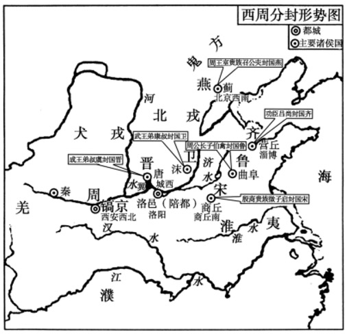
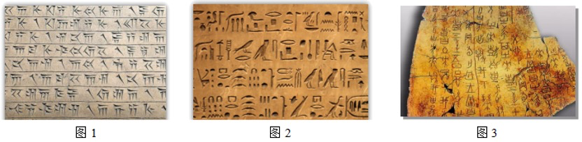
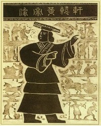

# TP00002

::: tip 基本信息

科目 : 历史

测试范围 : 中外历史纲要 (上)

测试主题/单元：第一单元/第一课 **中华文明的起源与早期国家**

要求 : 90%^

试题：T0000014-T0000035

:::

[T0000014] 中国新石器时代发现的文化遗存有1万多处，且分布广泛。距今5000多年，位于北方辽河上游的新石器时代晚期文化遗址是（  ）

A．良渚文化     B．仰韶文化        C．红山文化        D．河姆渡文化

[T0000015] 甲骨文是商朝后期统治者因占卜记事而刻在龟甲兽骨上的文字，这些甲骨上所记录的占卜文字即甲骨卜辞。卜辞记载内容丰富，包括祭祀征伐、田猎、农耕、畜牧社会生活、思想文化等。这说明，当时（  ）

A．原始汉字开始出现               B．王权具有神秘色彩

C．农业经济较为发达               D．血缘宗法制度建立

[T0000016] 中国新石器时代晚期，南方的良渚文化与北方的龙山文化都呈现出向更高社会阶段发展的迹象，这主要表现在（  ）

A．公共墓地出现  B．农业的产生      C．贫富分化加剧    D．文字的使用

[T0000017] 良渚文化的都邑城池、宫殿神庙、献祭神坛、权贵陵墓、大型聚落、水利工程、玉作坊群、玉制礼器乃至原始文字的发现，可以表明（  ）

A．三皇五帝的神话传说得到证实       B．良渚文化与仰韶文化南北呼应

C．远古时期国家的雏形已经出现       D．良渚文化是中华文明的起源

[T0000018] 2021年是某一文化遗址发现并命名一百周年，也是中国考古学诞生一百周年。作为新石器文化遗存的代表，该文化遗址地处黄河流域，典型器物是彩绘陶器，以粟等为主要栽培作物。这一文化遗址位于（  ）

A．长江流域     B．东北地区西南部  C．黄河中游地区    D．黄河下游地区

[T00000019] 在新石器时代的安徽含凌家滩遗址和辽宁西部的牛河梁遗址中都出土了随葬玉器，且玉器的种类非常相似，甚至玉人手臂并拢举于胸前的姿势也完全相同。这可用于说明（  ）

A．生产工具的重大突破              B．中原文化的向外辐射

C．古代文明的多元特点              D．南北文化的跨区交流

[T000020] 考古发现，甘肃省马家窑文化（距今五千多年）出土的彩陶精美华丽，制造者根据陶器器型的不同特点绘制了不同的装饰，纹饰与器型相得益彰。如偏高瘦的陶壶多用横线分层，逐层装饰；小型陶器的纹饰则绕器身一周，显得丰富繁丽。这说明，当时的制陶技术（  ）

A．已经发展至成熟定型              B．奠定我国艺术审美的基础

C．源于小农经济的产生              D．体现劳动人民的聪明智慧

[T0000021] 浙江嘉兴平湖市庄桥坟遗址从2003年开始发掘至今，出土了大量陶器、石器、玉器等。该遗址为大型聚落址，包括居住区、墓地和农业耕作区，有比较合理、明确的区划，墓葬也存在等级差异。据此可知，庄桥坟遗址属于（  ）

A．仰韶文化    B．河姆渡文化      C．红山文化        D．良渚文化

[T0000022] 根据西周初期分封形势图（下图）可知（  ） 

A．西周的封建统治主要依赖庄园经济  B．主要分封地区域经济发展水平较高

C．西周的统治中心仍在西部地区      D．设立齐鲁国主要是为了征伐淮夷

[T0000023] 周代初期，人们特别重视兄弟情感，《诗经》中有许多关于兄弟情感的政治伦理咏唱诗，《尚书》中也有诸多周王以诏策劝勉兄弟间要“友”“和”“合”的记载。上述现象出现的主要原因是（  ）

A．血缘宗法政治体系的形成         B．消除分封失衡产生的矛盾

C．鉴于前代兄弟不睦的教训          D．维护王权独尊地位的需要

[T0000024] 中国老话有“国之本在家”及“积家而成国”之说；梁启超亦曾指出：“吾中国社会之组织，以家族为单位，不以个人为单位，所谓家齐而后治国是也。”这都反映出在古代中国（  ）

A．个体从属于集体                B．血缘认知之持久

C．家庭是社会的细胞               D．宗法精神之重要

[T0000025] 距今约5000年的新石器时代晚期，在北方辽河上游的红山文化出土了精美的玉器，并且出现了较大规模的祭坛和神庙。在长江下游与它属于同一时期的文化遗存是（  ）

A．大汶口文化   B．龙山文化        C．河姆渡文化      D．良渚文化

[T0000026] 我们常常说“黄河是中华民族的母亲河”，但有学者认为，长江、辽河、珠江等也都应该是中华民族的母亲河。这一观点强调了中华文明的（  ）

A．多样性      B．多源性         C．统一性         D．开放性

[T0000027] 盟礼属于周代礼乐制度,是周与各诸侯国为解决冲突或保障共同利益而邀约神灵,向神灵立誓的活动。隐公三年,周王与诸侯盟礼时，“王贰于虢。郑伯怨王。王日:‘无之。’故周、郑交质。王子狐为质于郑,郑公子忽为质于周”。盟礼制度的变化说明（    ）

A．诸侯争端得到有效解决           B．旧有统治秩序受到挑战

C．礼乐制度在继承中发展           D．周王与诸侯王地位平等

[T0000028] 周朝《仪礼·丧服》：“诸侯之子称公子，公子不得祢先君；公子之子称公孙，公孙不得祖诸侯”。此规定旨在（  ）

A．构建礼乐文化实现利益调和        B．利用分封制度影响权力分配

C．强化等级观念维护统治秩序        D．缓和阶级矛盾达到长治久安

[T0000029] 新石器时代晚期良渚文化的墓葬，从迄今清理发掘的情况看，大型墓、中型墓、小型墓，无论是葬制还是随葬品，各种类型之间界限分明，差别很大。这从侧面反映了当时（  ）

A．存在聚族而居的村庄             B．社会等级分化较鲜明

C．大型墓的随葬品精美             D．生产力水平显著提高

[T0000030] 《左传·桓公二年》中记载：“故天子建国，诸侯立家，卿置侧室，大夫有贰宗，士有隶子弟，庶人、工、商，各有分亲，皆有等衰，”这反映了当时（  ）

A．统治秩序稳定 B．血缘关系复杂    C．社会等级森严    D．君主专制加强

[T0000031] 下列图1、图2、图3中的文字分别是古代西亚的楔形文字、古埃及的象形文字和古代中国的甲骨文。这表明在古代（  ）

A．各地文明之间相互借鉴明显        B．文字的产生都源于字母文字

C．各地文明的表现具有相似性 D．文字的书写材料都是相同的

[T0000032] 阅读材料，完成下列要求。

已知的“中国”一词的最早的文献记载：

皇天既付中国民，越厥疆土于先王肆。

——《尚书》

（译文：皇天将中国（天子所在的都城及附近地区）的土地与人民交给周武王治理。）

已知的“中国”一词的最早的文献记载：

唯武王既克大邑商，则廷告于天，曰：余其宅兹中国，自兹乂民。

——“何尊”底铸铭文

（译文：周武王攻克了大国商的王都以后，就举行了一个庄严的仪式报告上天；“我已经据有中国，自己统治了这些百姓。”）

封建自周公始，封建制度最大之功用有二：一日同化，一日分化。所谓分化者，概将同一的精神及组织，分布于各地，使各因其环境以尽量的自由发展。所谓同化者，概将许多异质的低度文化，醇化于一高度文化总体之中，以形成大民族意识。

——梁启超《先秦政治思想史》

(1)《尚书》与“何尊”分别属于几手史料，并说明其史料价值。

(2)据材料并结合所学知识，说明“封建制度”是什么制度，并简析此制度的作用。

[T0000033] 阅读材料，完成下列要求。

材料一 公元前4千纪始，东地中海青铜文明包括西亚、北非、南欧三个亚区。这三个亚区的共性也比较明显——均流行青铜人像或神像，随之流行的还有青铜牛、印章、护身符、双翼斧等。青铜人像或神像多与祭祀活动有关，早期形体较小，晚期出现一些真人大小的雕像。人像的身份有法老、国王、神袛、祭司、祈愿者、献祭者、武士等，体现了东地中海青铜文明浓厚的神灵信仰和宗教氛围

材料二 亚欧草原青铜文明自西而东可分为东欧、南西伯利亚-中亚、中国北方-蒙古高原三个亚区。这三个亚区青铜器的类别与形制存在一些差异，比如东欧流行双刀战斧、横签战斧、板斧等，南西伯利亚-中亚流行弓背刀、钩刺矛、喇叭口形耳环等，中国北方-蒙古高原则流行管斧、铃首刀、铃首剑等。不过，共性更为明显，比如武器十分发达，工具、装饰品比较常见，晚期都流行马具和鍑，还有动物装饰艺术。

材料三 公元前3千纪末期，中国进入青铜时代，纵观中原青铜文明可以发现，以容器为核心的特征始终未曾改变，只是在细节上发生一些变化。比如器类方面，夏代至西周早期，青铜容器以爵、斝、觚、尊、自、罍、觥、壶等酒器为主，形成了标识身份等级的爵觚制度、流行兽面纹、夔龙纹、凤鸟纹等传说类动物纹饰，罕见人物形象；西周中期至战国时期，青铜容器以鼎、鬲、簋、篮、敦、豆等食器为主，形成了秩序分明的鼎簋制度和编钟制度，流行窃曲纹、鳞纹、环带纹、蟠螭纹、蟠虺纹等抽象纹饰，偶见人物形象。中国青铜文明的另一个突出特征是青铜器铭文众多，尤其是有很多长铭文的青铜器。

——上述材料均摘编自白寿彝主编《中国通史》

(1)根据材料并结合所学知识，概括三种青铜文明的主要差异及其反映的文明内涵。

(2)根据材料并结合所学知识，分析三种青铜文明存在差异的原因。

(3)根据材料三并结合所学知识，概括中国青铜文明的主要特征。

[T0000034] 阅读材料，完成下列要求。

材料一“工匠”一词出现于春秋战国时期。《逸周书．文传解）中记载：“山林以遂其材，工匠以为其器"。东汉的《说文解字》中解释为“工者，巧饬也。百工皆称工、称匠。”《管子。立政》说道：“工事竞于刻镂，女事繁于文章，国之贫也……工事无刻镂，女事无文章，国之富也。”《考工记》中记录了大量有关器物制造的标准尺寸和技术要求，书中从零件制造、工艺应用、材料选择、规格要求以及成品检验等环节都进行了详尽叙述……被封建统治者、士大夫、官吏文人所鄙视的科学技术终究要发展，但是只能在农业、手工业生产实践的基础上，依靠匠人经验的缓慢积累而自发地发展。崇德尚贤、德艺兼修也成为中国古代工匠砥砺技艺、修身养性的专业职责与精神追求。

——摘编自赵薇（中国古代工匠精神特点及其价值追求》

材料二19世纪30年代，德国最初在制造业上采取偷师、模仿英法制造业的方式，假冒伪劣现象严重。1887年，英国在修改《商标法》条款时，带有侮辱性地规定，所有德国进口商品必须标明“德国制造”，19世纪90年代开始，德国在深刻反思的情况下开始学习美国，大力促进应用科学研究。德国工匠勤奋、严谨、有序、热情的工作态度无不体现着宗教追求，充满着理性精神的德国哲学渗透着德意志民族内向、深沉和善于思辨的民族品格。从1907年德国建立第一个旨在主张标准化和批量化生产设计组织——德意志制造联盟起，截至目前德国已经基本建立起了涵盖主要行业与产业的标准起草组织。一战后，德国相继出台了《反对限制竞争法》《企业基本法》等一系列法律法规，用以规范企业的治理结构和能力，并适时进行修订。德国著名的伍尔特集团，自1945年成立以来，始终如一地生产“螺丝"；这一单一产品，其产品在很多领域是不可替代的。德国鼓励技术工人移民，在德国工作的技术“工匠"，享受永久居留权。德国“工匠”培育的最主要渠道是职业教育，有近80%的年轻人接受不同形式的职业教育，而且职业教育几乎覆盖所有职业。在工匠精神的影响下，德国在机械、钢铁、电气、化工等领域打下深厚根基，“德国制造”声名显赫。

——摘编自徐春辉《德国“工匠精神”的发展进程、基本特征与原因追溯）

(1)根据材料一并结合 所学知识，指出古代中国工匠精神产生及发展的特点。

(2)根据材料二并结合所学知识，概括近代德国工匠精神形成的原因，并分析其影响。

[T0000035] 阅读材料，完成下列要求。

材料一 轩辕黄帝像

材料二 1937年4月5日国共两党首次在同一地点、同一时间来祭拜黄帝：

……维我黄帝，受命于天；开国建极，临治黎元。始作制度，规距百工，诸侯仰化，咸与宾从。置历纪时，造字纪事；宫室衣裳，文物大备。丑虏蚩尤，梗化作乱；爱诛不庭，华夷永判……

——国民党《祭黄帝陵文》

懿维我祖，命世之英。涿鹿奋战，区宇以宁。……频年苦斗，备历险夷，匈奴未灭，何以家为？各党各界，团结坚固；不论军民，不分贫富。民族阵线，救国良方；四万万众，坚决抵抗。民主共和，改革内政；亿兆一心，战则必胜。还我河山，卫我国权……

——共产党《祭黄帝陵文》（毛泽东）

(1)根据材料一并结合所学知识，说明中华民族奉黄帝为文明初祖的原因并概括其历史影响。

(2)根据材料二对比国共两党的祭文在形式和内容上的异同。请结合时代背景分析国共两党共同祭拜黄帝的原因和作用。

出处：5.docx