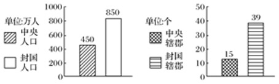

# TP00004

::: tip 基本信息

科目 : 历史

测试范围 : 中外历史纲要 (上)

测试主题/单元：**西汉与东汉——统一多民族封建国家的巩固**

要求 : 80%^

试题：T0000050-T0000066

:::

[T0000050] 阅读如图“西汉初期中央和封国力量的对比”，判断其反映的社会问题

)A．诸侯国势力强大威胁着中央王朝     B．王国数量大大增加

C．推恩令加强了中央对地方的控制     D．西汉王朝四分五裂

[T0000051] 从《史记》到《清史稿》的二十五史，列有孝友传、忠义传、列女传、卓行传、死节传等等，其中记录的忠孝类、操守气节类的人才连篇累牍，几乎每一部正史都有。这一现象的思想文化因素是

A．墨家提倡“兼相爱，交相利”

B．古代正统思想的影响

C．“学而优则仕”风气的形成

D．道学家重视道德操守

[T0000052] 董仲舒提出“罢黜百家、独尊儒术”，儒学成为官方正统思想是在哪个时期（  ）

A．西汉武帝时期                   B．东汉光武帝时期

C．文景之治时期                   D．开元盛世时期

[T0000053] 从西汉中后期开始，一些被册封的诸侯王在年龄已符合就国规定的情况下往往延缓就国。他们居留京师，何时就国以皇帝的意志为准。这一现象反映出西汉

A．削藩政策的成功践行

B．集中主要力量解决边患问题

C．朝廷与王国矛盾解决

D．地方的管理体制发生了变化

[T0000054] 东汉中后期，宦官专权和外成干政的局面交替出现，即“宗室权落，外戚兴起：外戚势衰，而宦官又盛”。出现这一现象的根源是

A．外戚与宦官交替专权              B．皇帝依靠外戚掌权治国

C．君主专制制度的弊端              D．皇帝年老昏庸造成乱象

[T0000055] 西汉初期，统治者以黄老之学为治国理政的指导思想，在经济恢复、国力增强和社会稳定的同时，汉也出现了地方"王国问题"和中央外戚专政的现象。这些现象的同时出现导致汉

A．文化上再现了百家争鸣局面        B．政治上具备了解决边患能力

C．治国理政的指导思想发生改变       D．经济上要求强化经济管理力度

[T0000056] 汉代儒学出现过一股风气，认为谁的章句越多，谁的学问就越大。例如为《尚书》注解的秦恭（西汉信都人），仅是解释《尧典》篇名二字的意义就写了十余万言。这种风气导致最高统治者屡次下令“减省章句”。据此可知

A．这种风气有利于儒学的发展壮大     B．统治者开始取缔儒学的正统地位

C．汉代儒生们进行不懈的理论创新     D．此时儒学呈现出空疏烦琐的景象

[T0000057] 钱穆曾喻秦汉文化“犹如此室的四周遍悬万盏明灯，打碎一盏，其余犹亮”下列关于两汉科技成就的说法，正确的是（  ）

A．在农学上先后出现了《氾胜之书》和《神农本草经》

B．张仲景撰写专著《黄帝内经》，被后世誉为“医圣”

C．东汉蔡伦发明造纸术，使纸成为主要的书写材料

D．《九章算术》在中国数学史乃至世界数学史上占有重要地位

[T0000058] 学者认为古代中国的政治主体对任何外界事物都要将其纳入“一”的框架，面对有悖于的秩序，就会激发出改造与整合它使之归于“一”的冲动。古代中国有悖于“一”这个秩序的制度是

A．郡县制       B．郡国并行制      C．三省六部制      D．内阁制

[T0000059] 西汉初年，私人铸币没有完全禁绝，钱币形制繁杂且重量不足，引起物价上涨。吴王刘濞采铜铸钱，富同天子。后来汉武帝将铸币权收归中央，统一铸造五铢钱。汉武帝此举是为了( )

A．削减封国封地 B．中央控制经济    C．刺激商业贸易    D．推行盐铁官营

[T0000060] 汉武帝时期,为了对盐、铁行业进行整顿和治理,采取的措施是（ ）

A．将铸币权收归中央               B．盐铁官营

C．抑制工商业者发展               D．均输平准

[T0000061] 孔孟主张重义轻利，不是不要利，而是要看取利是否符合义的道德标准，董仲舒把它发展到极端，只能谈义，不能讲利，只能追求三纲五常的道义，不能谋求自身利益的功利。据此分析可知，董仲舒的新儒学（  ）

A．适应了君主专制集权加强的需要    B．发展了先秦儒学为民请命的初衷

C．继承了孔孟的仁政和礼义的思想    D．使儒学成为人们道德自律的准则

[T0000062] 在文学发展历程中，有类作品形式上是“楚辞”式的，去掉了所有的特殊方言；内容上是“诗经”式的，内涵却在扩大；句式上，每句字数没有限制，不严格地押韵，但确实有韵。下列古代文学家中，其文学作品最符合此特征的是

A．司马相如

B．杜甫

C．苏轼

D．关汉卿

[T0000063] 《史记·匈奴传》记载：“元狩四年（公元前119年），渡河自朔方以西至令居，置田官，吏卒五、六万人，地接匈奴以北"。军屯士兵的生产工具和耕牛由国家供给，然而西北地区自然条件恶劣，降雨量年平均不足250毫米，屯田亩产远远低于内地郡县。据此可知汉代屯田（  ）

A．改善了西北的地理环境           B．解决了西汉的边疆危机

C．增加了国家的财政负担           D．浪费了军民的物质资源

[T0000064] 历史学家顾颉刚说：“秦始皇的统一思想是不要人民读书，他的手段是刑罚的裁制；汉武帝的统一思想是要人民只读一种书，他的手段是利禄的诱引。结果，始皇失败了，武帝成功了。”要理解其中关于秦始皇的评论，可能需要依据

A．统一文字、焚书令、秦朝速亡

B．统一度量衡、修筑长城、秦朝速亡

C．焚书令、秦朝速亡、科举制度

D．焚书令、秦朝速亡、后世没有采用该手段

[T0000065] 阅读下列材料，回答问题。

材料一 “封建亲戚，以藩屏周”。

——《左传》

材料二 丞相绾等言：“诸侯初破，燕、齐、荆地远，不为置王，毋以镇之。请立诸子，唯上幸许。”始皇下其议于群臣，群臣皆以为便。廷尉李斯议曰：“周文武所封子弟同姓甚众，然后属疏远，相攻击如仇雠，诸侯更相诛伐，周天子弗能禁止。今海内赖陛下神灵一统，皆为郡县，诸子功臣以公赋税重赏赐之，甚足易制。天下无异意，则安宁之术也。置诸侯不便。”始皇曰：“天下共苦战斗不休，以有侯王。赖宗庙，天下初定，又复立国。是树兵也，而求其宁息，岂不难哉！廷尉议是

——《史记·秦始皇本纪》

材料三 徐天麟在《两汉会要》中说：”汉祖龙兴，取周秦之制而兼用之，其亦有意于矫前世之弊矣。”

(1)材料一中“封建”指的是什么时期实行的什么制度？

(2)材料二中王绾与李斯争论的焦点是什么？秦始皇采纳了谁的建议采取的措施是什么？

(3)材料三中的汉祖取“周秦之制”指的是什么制度？此制度带来了什么问题？汉武帝是如何解决的？

(4)根据材料和所学知识，试比较西周和秦朝地方政治管理制度的异同。

[T0000066] 西汉初年和“与民休息”政策

材料一 曹参之相齐，……治道贵清静而民自定……其治要用黄老术，故相齐九年，齐国安集，大称贤相。参为汉相国，清静极言合道。然百姓离秦之酷后，参与休息无为，故天下俱称其美矣。

——《史记》

材料二 汉兴，接秦之敝，诸侯并起，民失作业而大饥馑。凡米石五千，人相食，死者过半……天下既定，民亡盖臧，自天子不能具醇驷，而将相或乘牛车。

——《汉书·食货志》阅读材料分析

(1)根据材料一指出汉初统治者采取的政策。

(2)根据材料二并结合所学指出汉初统治者采取该政策的背景

