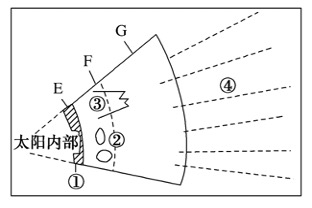
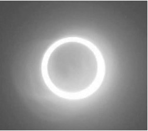
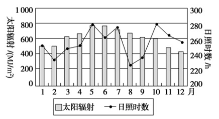
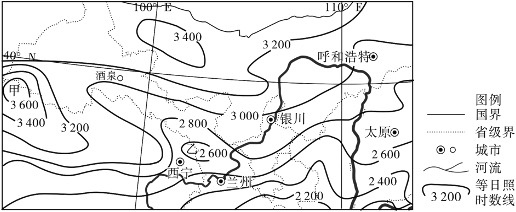

# TP00009

::: tip 基本信息

科目 : 地理

测试范围 : 高一上册

测试主题/单元：**太阳对地球的影响**

要求 : 80%^

试题：T0000177-T0000188

::: 

太阳辐射对地球表面许多地理现象和过程有着重要影响，对人类的生存与发展意义重大。据此完成1～2题。

[T0000177] 下列地理现象的形成与太阳辐射有关的是(　　)

①火山爆发　②大气环流　③水循环　④板块运动⑤天然气形成

A．①②③    B．②③⑤

C．①③④    D．②④⑤

[T0000178] 太阳辐射的主要作用是(　　)

①促进地球上水、大气运动和生物活动、变化的主要动力 ②产生“磁暴”现象的原动力 

③人类生产、生活的主要能量来源 ④太阳内部核反应的能量来源

A．①②        B．③④

C．①③        D．②④

《汉书·五行志》记载：“西汉河平元年(公元前 28 年)，三月已末，日出黄， 有黑气大如钱，居日中央。”读“太阳结构示意图”，完成3～4题。

[T0000179] 图中太阳的大气层 E、F、G 分别代表(　　)

A．色球、光球、日冕 B．光球、色球、日冕 

C．日冕、光球、色球 D．光球、日冕、色球

[T0000180] “黑气”在图中出现的位置是(　　)

A．①      B．②      C．③      D．④

[T0000181] 下列不是太阳活动对地球影响的是 (　　)

A．干扰电离层，影响有线电短波通信      B．发生磁暴现象，指南针不能正确指示方向 

C．美丽的极光现象              D．许多地方的气候异常，如降水增多

下表为北半球年太阳总辐射量随纬度的分布表。可能总辐射：考虑了受大气削弱之后到达地面的太阳辐射。有效总辐射：考虑了受大气和云的削弱之后到达地面的太阳辐射。读表完成6～7题。

| 纬度               | 64°N  | 50°N  | 40°N  | 30°N  | 20°N  | 0°    |
| ------------------ | ----- | ----- | ----- | ----- | ----- | ----- |
| 可能总辐射量(W/m2) | 139.3 | 169.6 | 196.4 | 216.3 | 228.2 | 248.1 |
| 有效总辐射量(W/m2) | 54.4  | 71.7  | 98.2  | 120.8 | 132.7 | 108.8 |

[T0000182] 影响可能总辐射量的主导因素是(　　)

A.纬度       B.地形    C.大气环流     D.洋流 

[T0000183] 赤道地区可能总辐射量和有效总辐射量差异较大，主要原因是(　　)

A.云层厚，保温效应强，到达地面的可能总辐射量大

B.阴雨天气多，削弱作用强，到达地面的有效总辐射量小

C.臭氧含量多，吸收的紫外线多，到达地面的可能总辐射量大

D.大气透明度高，吸收太阳辐射多，到达地面的有效总辐射量小

2020年6月21日，我国西藏至台湾一带地区可观测日环食现象。日环食是日食的一种，发生时太阳的中心部分黑暗，边缘仍然明亮，形成光环。这是因为月球在太阳和地球之间，但是距离地球较远，不能完全遮住太阳而形成的。右图为日环食示意图。据此完成8～9题。

[T0000184] 日环食发生时，肉眼可见的太阳边缘明亮光环是太阳大气层的(　　)    

A.平流层        B.日冕层       C.色球层       D.光球层

[T0000185] 日环食发生时(　　)

A.太阳黑子增多          B.太阳耀斑减少

C.太阳辐射减弱          D.地球出现磁暴

如图示意我国拉萨地区多年平均太阳辐射与日照时数年内变化，读图完成10～11题。

[T0000186] 下列说法正确的是(　　)

A．太阳辐射与日照时数呈正相关       B．太阳辐射与日照时数呈负相关

C．拉萨日照时数春季最高          D．拉萨5～7月太阳辐射最丰富

[T0000187] 拉萨8月与1月太阳辐射相差较大的主导因素是(　　)

A．太阳高度      B．日照时数     C．天气状况      D．植被覆盖

年日照时数是指太阳直接辐射地面时间的一年累计值，以小时为单位。下图示意我国某区域年日照时数分布图。据图完成12题。

[T0000188] 图中兰州与酒泉年日照时数差异明显，主要原因是(　　)

A.纬度差异      B.经度差异     

C.海拔差异       D.云量差异

 

[T0000232] 阅读图文材料，回答下列问题。

材料一　下图为我国多年平均年太阳辐射总量(亿焦耳/平方米)分布示意图。

材料二　太阳能光伏电池是通过光电效应或者光化学效应直接把光能转化成电能的装置。有专家预测今后3～5年内，我国太阳能光伏产业市场前景相当广阔。

(1)说出图中等值线a所代表的数值大小，并分析在该等值线内的区域多年平均年太阳辐射总量较少的主要原因。（6分）

 

 

 

(2)简述图中P地年太阳辐射总量比Q地多的主要原因。（4分）

 

 

 

(3)分析我国太阳能光伏产业市场前景广阔的原因。（6分）

 

出处：9.docx