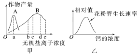

# TP000010

::: tip 基本信息

科目 : 地理

测试范围 : 高一上册

测试主题/单元：**地球的历史**

要求 : 80%^

试题：T0000189-T0000216

::: 

[T0000189] 下图为某正常地层剖面结构示意图。读图，完成下列小题。

1、图中化石形成的地质年代正确的是(  )

A.大型哺乳动物化石——中生代 B.恐龙化石——前寒武纪 C.甲化石——新生代   D.三叶虫化石——古生代

[T0000190] 图中甲化石的名称及其所处时代地球的演化特点是(  )

A.藻类化石——重要的铁矿形成时期     B.鱼类等脊椎动物化石——形成联合古陆

C.鸟类化石——联合古陆解体        D.小型哺乳动物化石——剧烈的地壳运动

近年来，我国农田生态环境不断好转，黑龙江、吉林、江西、四川等省区的稻田里均发现了古老的生物“中华鲎虫”。据研究，鲎虫最早出现在距今2亿年前，比恐龙还要久远。下表为地质年代简表，下图鲎虫照片。据此完成下面小题。

[T0000191] 鲎虫最早出现在(  )

A.二叠纪     B.三叠纪     C.侏罗纪     D.白垩纪

[T0000192] 推测鲎虫生存环境可能是(  )

A.热带雨林     B.亚热带湿地    C.温带草原     D.寒带苔原

读某地剖面示意图,完成下面小题。

[T0000193] 图中地层中动物化石经历的演化过程是(  )

A.海生无脊椎动物—爬行动物—脊椎动物    B.海生无脊椎动物—脊椎动物—爬行动物

C.爬行动物—海生无脊椎动物—脊椎动物    D.爬行动物—脊椎动物—海生无脊椎动物

[T0000194] 石炭—二叠纪是地质史上最重要的成煤时期,由此可推知当时的环境特点为(  )

A.干燥,冷热多变  B.全球气候分带明显  C.湿润,森林茂密    D.寒冷,冰雪广布

众所周知,安阳是中国八大古都之一。安阳的殷墟作为商朝后期都城遗址,出土了大量以青铜器为代表的文化遗存。其中,亚长牛尊(下图)是现今为止,殷墟发现的唯一一件牛形青铜器,它也是安阳殷墟博物馆的镇馆之宝。该镇馆之宝的原型是喜暖湿环境的圣水牛,已灭绝,在河南省安阳殷墟遗址中发现了大量圣水牛骨骼。据此完成下面小题。

[T0000195] 河南安阳发掘出圣水牛骨骼的地层形成于(  )

A.寒武纪     B.白垩纪     C.侏罗纪     D.第四纪

[T0000196] 关于圣水牛生活时期黄河流域环境特征的推测正确的是(  )

A.温暖湿润,风沙肆虐 B.寒冷干燥,草原广布 C.温暖湿润,湖沼遍布  D.寒冷干燥,植被稀疏

[T0000197] 圣水牛灭绝的原因可能是(  )

A.气候转冷、人类过度捕猎 B.外来天敌、生态系统失衡 C.地动山摇、火山地震爆发 D.出现磁暴、太阳黑子爆发

鱼类是一种较低等而种类繁多水生脊椎动物,在晚古生代大量繁衍。两栖动物(图乙)是从水生过渡到陆生的脊椎动物,具有水生脊椎动物到陆生脊椎动物的双重特性。它们既保留了水生祖先的一些特征,如生殖和发育仍在水中进行,用腮呼吸等;同时幼体变态发育为成体时,获得了陆地脊椎动物的许多特征,如用肺呼吸,具有五趾型四肢等。根据材料,完成下面小题。

[T0000198] 晚古生代中期,一些鱼类逐渐进化为两栖类,主要原因是(  )

A.海洋面积小于陆地面积,以适应地球环境的变化

B.陆地的气候变得干旱,水源稀少,以适应干燥气候

C.海洋面积大于陆地面积,以适应地球环境的变化

D.海洋面积缩小,以适应地球环境的变化

[T0000199] 晚古生代是地质历史上重要的成煤期,与此相关的地球环境特征是(  )

A.裸子植物极度兴盛,形成了茂密的森林    B.蕨类植物繁盛,形成了茂密的森林

C.被子植物高度繁盛,草原面积扩大      D.气候变暖,冰川范围缩小,海平面上升

[T0000200] 晚古生代晚期,气候变得干旱,水源稀少。其对动物的影响表现为(  )

A.两栖动物进化为爬行动物       B.爬行动物进化为鸟类

C.爬行动物进化为哺乳动物       D.无脊椎动物进化为脊椎动物

山东地下大峡谷位于临沂市沂水县城西南,是我国北方少见发育的典型岩溶地貌,石灰岩形成于2.3亿年前的中生代三叠纪。景区周边还有绚烂夺目的萤火虫水洞以及地下画廊景观,下图为萤火虫水洞景观图。据此完成下面小题。

[T0000201] 岩溶景观在我国最典型的分布区是(  )

A.云贵高原     B.东北平原     C.塔里木盆地    D.青藏高原

[T0000202] 山东省临沂市的沂水县在中生代三叠纪时期的地理环境为(  )

A.湿热的森林    B.暖湿的浅海    C.干热的荒漠    D.寒冷的高山

猛犸象又名长毛象,生活在第四纪寒冷时期,它的灭绝被视为一个冰期时代结束的标性事件。下图为猛犸象复原图。据此完成下面小题。

[T0000203] 猛犸象生存的地质年代是(  )

A.前寒武纪     B.古生代     C.中生代     D.新生代

[T0000204] 与猛犸象生存的寒冷时期相适应的地理现象有(  )

A.全球海平面上升  B.爬行动物恐龙盛行 C.生物向低纬度迁移  D.陆地冰川范围缩小

地球有悠久的过去，还有着漫长的未来。生物的出现和进化只是其中的一小段，而人类的历史更是短暂的一瞬，所以我们要珍惜生命，爱护动植物。据此回答下面小题。

[T0000205] 下列动物化石，存在于古生代地层的是(  )

A.A        B.B        C.C        D.D

[T0000206] 按由早到晚的年代顺序排列，正确的是(  )

A.蕨类植物→被子植物→裸子植物    B.三叶虫→鱼类→恐龙

C.元古宙→古生代→太古宙       D.哺乳动物→爬行动物→两栖动物

[T0000207] 地球历史上两次重要的全球性生物大规模灭绝的时期是(  )

A.古生代中期和古生代末期       B.中生代中期和中生代末期

C.古生代末期和中生代末期       D.古生代末期和中生代中期

足迹化石是动物在湿度、黏度、颗粒适中的地表留下足迹后，逐渐干燥硬化再被沉积物掩埋所形成的化石。2020年4月，河北省宣化区发现约1.5亿年前的大型恐龙足迹化石群，恐龙足迹有4300多个，涉及大量植食性恐龙和肉食性恐龙。下图为河北省宣化区大型恐龙足迹化石图。据此完成下面小题。

[T0000208] 足迹化石常见于地质时期的(  )

A.高原边缘     B.山坡地带     C.河湖沿岸     D.沙漠腹地

[T0000209] 足迹化石的形成过程中常伴随着(  )

A.地壳上升     B.地壳下降     C.板块挤压     D.岩石重熔

[T0000210] 宣化恐龙足迹形成时，该地(  )

A.气候干旱     B.地形复杂     C.土壤贫瘠     D.植被茂盛

地质记录中的断代是指沉积岩层的地质记录并不总是连续的。图1为地质年代表，图2为甲、乙两地地层示意图。据此完成下面小题。

图1

图2

[T0000211] 地质年代划分的主要依据有(  )

A.生物演化     B.地层深度     C.岩石类型     D.地形类型

[T0000212] D岩层形成时代最可能是(  )

A.二叠纪     B.三叠纪     C.侏罗纪     D.白垩纪

[T0000213] 根据甲地岩层分布可推断出乙地(  )

A.V与X出现断代  B.X与Y出现断代  C.Y与Z出现断代   D.没有出现断代

| **序号** | **1**  | **2**  | **3**  | **4**  | **5**  | **6**  | **7**  | **8**  | **9**  | **10** | **11** | **12** |
| -------- | ------ | ------ | ------ | ------ | ------ | ------ | ------ | ------ | ------ | ------ | ------ | ------ |
| **选项** |        |        |        |        |        |        |        |        |        |        |        |        |
| **13**   | **14** | **15** | **16** | **17** | **18** | **19** | **20** | **21** | **22** | **23** | **24** | **25** |
|          |        |        |        |        |        |        |        |        |        |        |        |        |

[T0000214] 阅读图文材料，完成下列要求。

2022年9月29日，中国科学院南京地质古生物研究所科研人员在云南澄江动物群化石中，发现了全球最古老的有颌类牙齿化石。其中，奇迹秀山鱼是当前发现的最古老的有颌鱼类。奇迹秀山鱼生活在4.4亿年前，科研人员表示，奇迹秀山鱼等一批古鱼类化石的发现，是鱼类登陆并最终演化为人的关键证据。下图为奇迹秀山鱼复原立体图。

（1）奇迹秀山鱼生活在______（填地质年代），其生活环境为______；奇迹秀山鱼属于______（填“脊椎”或“无脊椎”）动物。

（2）奇迹秀山鱼生活的地质年代后期，气候变干，水源稀少，一些______（填“两栖”或“爬行”）动物慢慢进化为______（填“两栖”或“爬行”）动物，此时，______植物开始出现。

（3）列举三种与奇迹秀山鱼生活在同一时期的动物。

[T0000215] 读“岩层与化石示意图”，完成下列问题。

（1）A、B、C岩层中最老的是____岩层，最年轻的是____岩层。

（2）地点3缺失B岩层，有可能是当时地点3发生了地壳____（抬升/下沉）。

（3）若地点1的A岩层含有煤炭，则C地层形成时期，当地的古地理环境为____（温暖湿润/寒冷干燥）的____（陆生/海洋）环境。

（4）下列关于地球形成与演化的叙述，正确的是(  )

A.原始地球形成时就有了海洋和陆地

B.地球生物由海洋向陆地扩展是以两栖动物出现为标志

C.喜马拉雅山形成于中生代

D.石炭纪时期蕨类植物繁荣，是重要的成煤时期

（5）若A地层中发现了大量的鱼类化石，但没有发现爬行动物化石，则该地层很有可能形成于地质年代中的____代____纪。

[T0000216] 读“A、B两地地层对比图”,回答问题。

(1)地层是具有______顺序的______状岩石,化石的本质是__________。

(2)一般情况下,上图化石中,含有最高级、最复杂生物的是______所代表地层中的化石,理由是______________________________________________________________________________。

(3)图中A地甲、乙、丙三个地层中的化石明显不同,根据这些化石的类型和特点可以了解A地的_________________________等。

(4)将图中同一时代的地层连线,并简述连线的依据。

(5)图中A、B两地的地层有明显差异,其原因可能是_______(  )

①A处地层上升②A处地层下沉③B处地层上升④B处地层下沉

A.①③      B.①④      C.②③      D.②④

 

出处：12.docx

