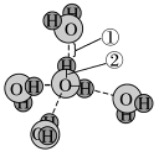
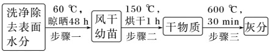
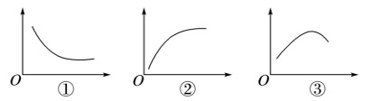
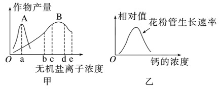
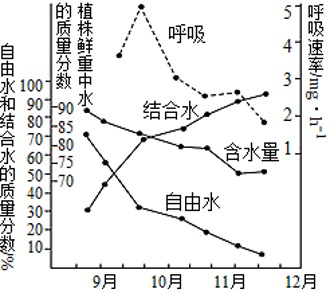

# TP00011

>科目：生物
>
>测试形式：选择题、简答题
>
>测试主题：**细胞中的无机物**
>
>RAW：16
>
>试题：T0000216-T0000231

[T0000216] 下列有关细胞中的水和无机盐的叙述,正确的是(  )

A.水分子以自由水和结合水两种形式存在

B.结合水是多种离子良好的溶剂 

C.大多数无机盐以化合物的形式存在

D.无机盐含量多,具有重要的生理功能

[T0000217] 下列有关生物体内水的叙述，正确的是(  ) 

A.晾晒失去的主要是自由水，烘干失去的主要是结合水

B.不同生物的细胞内含水量完全相同 

C.结合水是细胞内良好的溶剂 

D.冬季植物体内自由水含量相对增高，以增强抗寒能力

[T0000218] 豌豆的种子有圆粒和皱粒。圆粒种子含淀粉多，成熟时能有效地保留水分。而皱粒种子含蔗糖多，在成熟时由于失水而皱缩。下列有关叙述错误的是(　　)

A．细胞内的水有自由水和结合水两种形式

B．圆粒种子保留的水分主要是结合水

C．皱粒种子失去的水分主要是自由水

D．种子储存前要晒干的主要目的是防止霉变

[T0000219] 如图所示为水分子结构示意图，根据所学知识判断，下列说法正确的是(　　)

A．水之所以是良好的溶剂，是因为结构①这种弱引力的存在

B．结构②使水分子成为极性分子，从而使水具有较高的比热容

C．水在细胞中多以自由水形式存在，在生命活动中承担重要作用

D．细胞中结合水的含量是不断变化的，结合水越多，细胞代谢越旺盛

[T0000220] 磁共振技术可应用于临床疾病诊断。因为许多疾病会导致组织和器官内水分发生变化，这种变化恰好能在磁共振图像中反映出来。下列有关叙述错误的是(　　)

A．构成人体的不同组织和器官含水量不同

B．水是细胞内良好的溶剂

C．水分子的化学性质与其结构无关

D．发生病变的器官，代谢强度可能会发生改变

[T0000221] 无机盐对生物体的生命活动起着重要作用。下列叙述正确的是(　　)

A．血液中Ca2＋含量太低，动物会出现抽搐等症状，说明无机盐对于维持细胞酸碱平衡非常重要

B．人输液时用生理盐水而不是蒸馏水，这说明无机盐在维持细胞的正常形态和功能中具有重要作用

C．无机盐在细胞中含量很少，所以属于微量元素

D．哺乳动物体内Na＋含量增加，会导致肌肉酸痛、无力

[T0000222] 某医生在对离体蛙心进行实验中发现，用不含钙和钾的生理盐水灌注蛙心，收缩不能维持。用含少量钙和钾的生理盐水溶液灌注时，蛙心可持续跳动数小时，实验说明钙盐和钾盐(　　)

A．是细胞中某些复杂化合物的重要组成部分

B．对维持生物体的生命活动有重要作用

C．对维持细胞的形态有重要作用

D．为蛙心的持续跳动提供能量

[T0000223] (2023·北京西城高一期末)植物缺钾会引起叶片边缘出现枯黄的现象。下表是某课外小组探究钾对植物生长影响的培养液配方，下列相关叙述不正确的是(　　)

| 组别 | 培养液类型 | 培养液所含主要成分的质量浓度/(mg·L－1) |           |      |      |
| ---- | ---------- | -------------------------------------- | --------- | ---- | ---- |
| KNO3 | CaCl2·2H2O | MgSO4·7H2O                             | (NH4)2SO4 |      |      |
| 甲   | 完全培养液 | 25 000                                 | 150       | 150  | 134  |
| 乙   | 缺素培养液 | 0                                      | 150       | 250  | 134  |

 

A.Mg2＋是合成叶绿素必需的无机离子

B．设置甲组的目的是作为实验的对照组

C．若营养液的浓度过高会导致植物萎蔫

D．该方案能达到探究钾对植物生长影响的目的

[T0000224] 仓储小麦等种子或粮食要纯净干燥、颗粒完整，但有时候储存不当会生出一种小虫子，这种小虫子叫赤拟谷盗。它们一生都不需要“饮水”，也吃不到含水丰富的食物，可它们仍能正常生活，其原因是(　　)

A．赤拟谷盗的生命活动不需要水

B．赤拟谷盗体内储存着供其一生用的水

C．赤拟谷盗的细胞内结合水比自由水含量高

D．赤拟谷盗在新陈代谢中产生水

[T0000225] “有收无收在于水，收多收少在于肥。”某生物兴趣小组以玉米幼苗为实验材料进行了如下探究实验。下列叙述中，错误的是(　　)

A．步骤一损失的水在细胞中主要以游离形式存在，是细胞内的良好溶剂

B．步骤二损失的水主要与细胞内其他物质相结合，在细胞内的含量相对稳定

C．步骤三损失的主要是无机盐，它们在细胞中主要以离子形式存在

D．干旱环境中生长的玉米，其细胞中结合水与自由水的比值相对较高

[T0000226] 结合下列曲线，分析有关无机物在生物体内含量的说法，错误的是(　　)

A．曲线①可表示植物越冬过程中，体内水相对含量的变化

B．曲线②可表示细胞代谢速率随自由水与结合水比值的变化

C．曲线①可表示人一生中体内自由水与结合水的比值随年龄变化的曲线

D．曲线③可表示一粒新鲜的玉米种子在烘箱中被烘干的过程中，其内无机盐相对含量的变化

[T0000227] 为探究干旱胁迫对不同种源赤皮青冈幼苗叶片自由水和结合水含量的变化，某科研小组开展了相关研究，结果如表(CK：对照组；T1：轻度干旱胁迫；T2：中度干旱胁迫；T3：重度干旱胁迫)。下列说法错误的是(　　)

| 地区          | 指标       | CK    | T1    | T2    | T3    |
| ------------- | ---------- | ----- | ----- | ----- | ----- |
| 浙江庆元      | 自由水含量 | 47.94 | 48.38 | 40.61 | 30.15 |
| 结合水含量    | 25.60      | 28.47 | 30.63 | 38.97 |       |
| 自由水/结合水 | 1.87       | 1.70  | 1.33  | 0.77  |       |
| 湖南洞口      | 自由水含量 | 51.61 | 49.79 | 39.17 | 31.08 |
| 结合水含量    | 19.75      | 24.26 | 26.23 | 32.43 |       |
| 自由水/结合水 | 2.61       | 2.05  | 1.49  | 0.96  |       |

 

A.随干旱胁迫加剧，叶片中的部分水分失去流动性和溶解性

B．随干旱胁迫加剧，叶片中自由水含量均下降

C．随干旱胁迫加剧，叶片中细胞代谢均逐渐减弱

D．随干旱胁迫加剧，幼苗对低温的适应能力可能逐渐增强

[T0000228] 图甲表示A、B两种无机盐离子处于不同浓度时与作物产量的关系；图乙表示钙对某种植物花粉管生长的影响。下列相关叙述中，不正确的是(　　)

A．据图甲可知，B的浓度为b时，对提高作物的产量最有利

B．据图甲可知，B的浓度为d时，虽然对提高产量有利，但会造成肥料的浪费

C．据图乙可知，适宜浓度的钙有利于花粉管的生长

D．据图乙可知，钙对花粉管生长速率的影响随浓度变化而变化

[T0000229] 下列有关水和无机盐的叙述，不正确的是(  ) 

① 参与运输营养物质和代谢废物的水为自由水  

② 生物体内许多化学反应需要水的参与，结合水是细胞结构的组成成分之一

③ Mg2+是叶绿素、血红蛋白等分子的组成成分  

④ 无机盐有维持细胞内酸碱平衡的作用   

⑤ 自由水与结合水的比例与新陈代谢的强弱关系不大  

⑥ 缺铁会引起儿童佝偻病

A.① ④ ⑤         B.④ ⑤ ⑥         C.③ ⑤ ⑥         D.② ③ ⑤

[T0000230] 冬小麦一般在9月中下旬至10月上旬播种，翌年5月底至6月中下旬成熟。在越冬时，细胞内的生理代谢会发生改变以提高抗寒能力。翌年，农民在储存小麦种子前，需将刚收获的小麦种子晒干后，才收进粮仓存放。图表示冬小麦在不同时期含水量和呼吸速率的变化。请回答下列问题：

(1)9～12月，植物细胞线粒体的代谢活动强度变化是（        ）。

(2)植物的含水量随气温下降而下降的原因可能是（        ）。

(3)在10～12月，植物的自由水与结合水含量的比值逐渐减小，原因是（        ）。据此推测，植物的抗寒能力的大小与该比值大小的关系是（        ）。(填“呈正相关”“呈负相关”或“无关”)。

(4)农民晒种时小麦种子失去的主要是以（        ）的形式存在于细胞中的水，当把种子晒干后放在试管中点燃，直至燃成灰烬，此过程中失去的水分主要是（        ），灰烬的主要成分是（        ）。

[T0000231] 清朝扬州八怪之一的郑板桥有诗云：“东北人参凤阳梨，难及潍县萝卜皮”。潍县青萝卜甜脆多汁，稍有辣味，膳食纤维丰富，具有较高的营养价值和保健功能。请回答下列问题：

(1)青萝卜细胞中含量最多的化合物是（        ），青萝卜种子萌发初期，结合水与自由水的比值（        ）(填“上升”“不变”或“下降”)。

(2)青萝卜甜脆多汁，是由于含水量较高，糖等多种物质溶解于水中。水作为良好溶剂的原因是（        ）

青萝卜有助于消化，原因是其含有较多的膳食纤维。

(3)在青萝卜生长发育过程中，需要供给足够的营养，如果钾供应不足，叶片边缘变褐色，肉质根不能正常膨大，这说明无机盐具有（        ）的功能。

[T0000231] 下列是无土栽培营养液的配方，配方：NH4NO3、KNO3、CaCl2·2H2O、MgSO4、螯合铁溶液、微量元素溶液。请回答下列问题：

(1)为使作物正常生长，还需补充含（        ）等元素的化合物。

(2)有些无机盐离子可重复利用，有的不能重复利用，可重复利用的无机盐离子缺乏时，老叶先表现出缺乏症，不可重复利用的无机盐离子缺乏时，幼叶先表现出缺乏症。请设计实验证明Mg是可重复利用的元素。

实验材料：若干长势相同的玉米幼苗、蒸馏水、含有植物必需元素的各种化合物。

实验步骤：

①配制完全培养液和（        ）培养液，分别放入两组培养瓶中，并编号A、B。

②将（        ）分别栽培在上述两种培养液中。

③放在适宜条件下培养一段时间，观察（        ）。

实验现象：在完全培养液中的玉米幼苗生长正常，

（        ）。

## 测试结果

### 要求：

### 状况：

### 补充：
