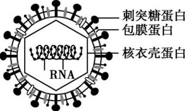
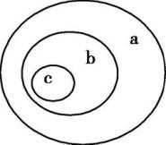
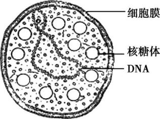
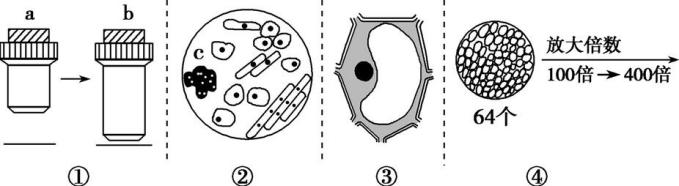
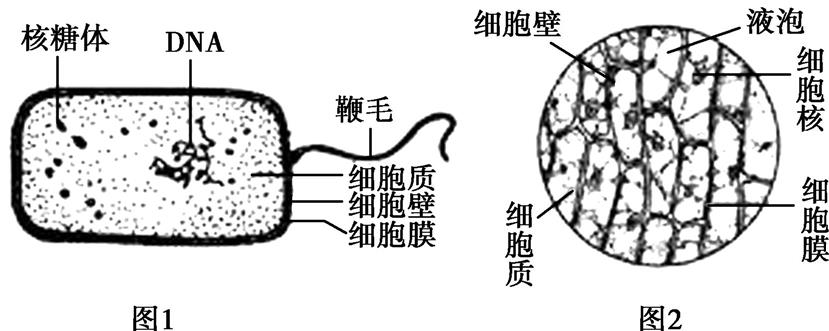
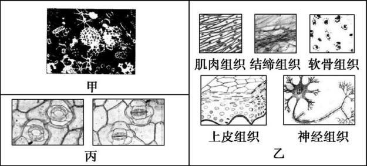
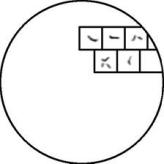

# TP00012

::: tip 基本信息

科目 : 生物

测试范围 : 高一上册

测试主题/单元：

要求 : 80%^

试题：T0000232-

::: 

[T0000232] (2020北京西城八中高三自我检测二)如果把细胞搅碎,细胞将死亡;如果把病毒搅碎,病毒也将失去活性。这说明(　　)

A.细胞和病毒的化学成分被破坏

B.细胞和病毒的细胞结构特点一致

C.单细胞生物和病毒对环境的适应能力很差

D.完成正常的生命活动依赖于一定的结构基础

[T0000233] 2020年初,我国湖北及世界部分地区暴发了由新型冠状病毒引发的肺炎,这种病毒传染性极强,经科学家对分离出的病毒进行研究,确定它的具体结构如下图。下列说法正确的是(　　)

A.新型冠状病毒与T2噬菌体一样,遗传物质不稳定,容易发生突变

B.刺突糖蛋白可能与宿主细胞特异性受体的识别和介导病毒进入细胞有关

C.研究发现,新型冠状病毒在体外环境中可存活5天,说明它的生命活动可以离开细胞

D.新型冠状病毒与细胞膜上的特定位点结合进而入侵细胞,说明细胞膜有控制物质进出的功能

[T0000234] 2020北京十五中高三期中)新型冠状病毒和乙肝病毒的遗传物质分别是RNA和DNA,这两种病毒均	(　　)

A. 不含蛋白质和糖类　　　　B. 具有完整的细胞结构

C. 含有A、T、C、G四种碱基　　　　D. 需在宿主细胞内增殖

[T0000235] 若以图甲代表与生命系统相关概念的范围,其中正确的是	(　　)

图甲

| 选项 | a          | b    | c    |
| ---- | ---------- | ---- | ---- |
| A    | 生物大分子 | 细胞 | 组织 |
| B    | 个体       | 种群 | 群落 |
| C    | 生态系统   | 群落 | 种群 |
| D    | 系统       | 组织 | 器官 |

[T0000236] 从生命系统的结构层次分析,下列叙述正确的是	(　　)

A.因为细菌是单细胞生物,所以研究细菌,只能研究其细胞层次和个体层次

B.高等动物和高等植物都具有器官和系统的生命系统结构层次

C.生命活动的承担者蛋白质不是生命系统的结构层次

D.一个分子,既不是生命系统的结构层次,也不是其他系统的结构层次

[T0000237] (2020北京丰台高三期末)下列关于结核杆菌的叙述正确的是　	(　　)

A.以RNA为遗传物质,能够发生遗传变异和进化

B.是一种胞内寄生菌,新陈代谢类型为自养厌氧型

C.含有质粒,可以作为基因工程运载体和诱导动物细胞融合

D.没有线粒体,但有呼吸作用和生物合成等代谢有关的酶系

[T0000238] (2019北京东城普通校联考)大肠杆菌和酵母菌细胞中都存在的生命活动是	(　　)

A.线粒体内膜上O2和[H]结合生成水

B.mRNA通过核孔从细胞核进入细胞质

C.以亲代DNA为模板合成子代DNA

D.纺锤丝牵引染色体移向细胞两极

[T0000239] 美国科考团在南极湖泊下方深水无光区发现了生活在此的不明类型细菌,并获得了该未知细菌的DNA,以下叙述正确的是	(　　)

A.该细菌没有高尔基体,无法形成细胞壁

B.该细菌中没有染色体,只能进行无丝分裂

C.该细菌细胞中的嘌呤数不一定等于嘧啶数

D.该细菌的生命活动主要由其DNA分子执行

[T0000240] (2018北京丰台期末)支原体肺炎是由支原体(结构如图所示)引起的急性呼吸道传染病。下列有关叙述正确的是(　　)

!

A.核糖体和细胞膜构成生物膜系统

B.DNA通过半保留复制形成两个DNA分子

C.支原体可通过有丝分裂的方式大量增殖

D.遗传信息的流向是RNA→DNA→RNA→蛋白质

[T0000241] 2020北京大兴期末)2018年中国科学院首次人工创建了自然界不存在的生命——人造单染色体酵母,其与天然酵母细胞形态结构、功能相似,但仅含有一条“超级染色体”。下列关于人造单染色体酵母的叙述正确的是	(　　)

A.没有以核膜为界限的细胞核

B.遗传信息储存在RNA中

C.葡萄糖为其直接能源物质

D.在核糖体中合成蛋白质

[T0000242] 下面有关细胞和细胞学说的说法,不正确的是	(　　)

A.理论思维和科学实验的结合是促进细胞学说建立和完善的重要方法

B.细胞学说使动植物结构统一于细胞水平,有力地证明了生物之间存在亲缘关系

C.自然界中出现多种多样的细胞是由于不同细胞的遗传信息执行情况不同

D.原核细胞和真核细胞均有细胞膜、细胞质,且均以DNA作为遗传物质

[T0000243] 对下列图示的生物学实验的叙述,正确的是	(　　)

A.若图①表示将显微镜镜头由a转换成b,则视野中观察到的细胞数目增多

B.若图②是显微镜某视野下洋葱根尖的图像,则向右移动装片能观察清楚c细胞的特点

C.若图③是在显微镜下观察细胞质流动,发现细胞质的流动方向是顺时针,则实际上细胞质的流动方向是逆时针

D.当图④视野中的64个组织细胞变为4个时,视野明显变暗

[T0000244] 细胞是生物体的基本结构和功能单位,而自然界中生物种类繁多,就所学生物知识回答以下问题:

(1)下列生物中,与引起“发热伴血小板综合征”的“新型布尼亚病毒”病原体有明显区别的是　　　　(填序号)。 

①大肠杆菌　②发菜　③蓝细菌　④酵母菌　⑤霉菌　⑥HIV　⑦水绵　⑧SARS病原体

(2)研究人员对分别取自3种不同生物的部分细胞(甲、乙、丙)进行分析、观察和实验,获得的结果如表(表中“√”表示“有”,“✕”表示“无”)。

|      | 核膜 | 光合作用 | 核糖体 | 细胞壁 |
| ---- | ---- | -------- | ------ | ------ |
| 甲   | √    | √        | √      | √      |
| 乙   | √    | ✕        | √      | ✕      |
| 丙   | ✕    | √        | √      | √      |

①甲、乙、丙3种细胞最可能取自哪类生物?

甲:　　　　,乙:　　　　,丙:　　　　。(填编号) 

A.洋葱　B.兔子　C.蘑菇　D.蓝细菌

②细菌的细胞结构(图1)和洋葱表皮细胞结构(图2)在光学显微镜下比较,最主要的区别是　　　　　　　　,这说明细胞具有　　　　性。 

[T0000245] 分析下列三个实验,回答问题:

实验一:在载玻片上滴一滴池塘水并加少许棉纤维,然后盖上盖玻片,先后用显微镜的低倍镜和高倍镜观察,所看到的图像如图甲。

实验二:用显微镜观察人体的组织切片,看到的图像如图乙。

实验三:用显微镜观察植物叶表皮,看到的图像如图丙。

(1)实验一所看到的图像中的生物,有病毒吗?为什么?　															  　。因为病毒　　　 　(填“有”或“无”)细胞结构,所以说生物的生命活动有的可以不需要细胞参与,你认为对吗?请说明理由:　

​														　　　　　　　　　　　　　　　　　　　　　　　　　　　　　　　　　。 

(2)通过实验一与实验二中的图甲与图乙的比较,你能得出什么结论?　				

　　　　　　　　　　　　　　　　　　　　　　　　　　　　　　　　　　　。 

(3)从图甲、图乙、图丙中看到的细胞形态相同吗?　　　。这说明了　				

　　　　　　　　　　　　　　　 　　。 

(4)实验三(即图丙)看到的是叶表皮的保卫细胞的两种不同形态,同样,红细胞呈两面凹的圆饼状、神经细胞伸出的突起有的长1米左右,以上这些事实说明: 			　。 

[T0000246] 每年的冬季,流感疫情都会进入一个流行期。但由于人们接种了甲流疫苗后,甲型H7N9病毒不再是最占上风的毒株了。请分析回答问题:

(1)病毒是非细胞形态的生命体,它的主要生命活动必须在细胞内实现。病毒与细胞在起源上的关系是人们很感兴趣的问题,目前主要存在两种观点:

①生物大分子→病毒→细胞;②生物大分子→细胞→病毒。

根据上述资料并结合所学的相关知识分析,你支持第　　　　　种观点,其依据是:　												　　　　　　　。 

(2)细菌细胞壁的主要成分是肽聚糖,青霉素能抑制肽聚糖的合成,从而起到抑制细菌生长的作用。艾滋病病人能否通过注射青霉素抑制病毒的增殖?　　　　　,为什么?　					　　　　　　　　　　　　　　　　。 

(3)如图表示在低倍显微镜视野中观察到的细胞,请据图回答:

①图中表示的细胞是　　　　　(填“动物”或“植物”)细胞,将装片向　　　　　方移动可将上图所示视野中细胞移到视野正中央。 

②大部分动植物体是不透明的,不能直接在显微镜下观察,一般要经过特殊处理,如将标本做成很薄的切片。但酵母菌、水绵、洋葱表皮等材料却可以直接做成装片在显微镜下观察,这主要是因为它们　　　　　　　　　　。 

A.是单个或单层细胞　B.都带有特殊的颜色

C.是无色透明的　　　D.是活的细胞

出处：4.docx