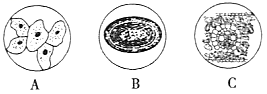

# TP00013

>科目：生物
>
>测试形式：选择题、简答题
>
>测试主题：**细胞的多样性和统一**
>
>RAW：11
>
>试题：T0000246-T0000263

[T0000246] 下列关于光学显微镜的结构和使用的叙述,错误的是(  )

A. 目镜越长,观察到的细胞数量越多	B. 物镜的放大倍数越大,视野越暗

C. 调节通光孔的大小可改变视野亮度	D. 移动装片和转动目镜可判断污物位置

[T0000247] 用光学显微镜观察人的口腔上皮细胞临时装片时，下列目镜和物镜组合中，放大倍数最大的是(  )

A. 目镜5×，物镜4×	B. 目镜10×，物镜10×

C. 目镜5×，物镜10×	D. 目镜10×，物镜40×

[T0000248] 如图a、b分别为甲、乙两种物镜下(由甲转换成乙)观察到的图像。下列有关叙述错 误的是(  )

A. 甲为低倍物镜，乙为高倍物镜

B. 转换物镜前应将装片向右上方移动

C. 转换物镜时应先将甲物镜取下

D. 若b中图像模糊，应调节细准焦螺旋

[T0000249] 原核细胞和真核细胞在结构上最大区别是(  )

A.有无核物质		B.有无细胞壁

C.有无核膜包被的细胞核	D.有无细胞器

[T0000250] 蓝细菌是一类进化历史悠久、能进行光合作用的大型单细胞原核生物。下列关于蓝细菌的叙述，错误的是(  )

A.蓝细菌细胞内没有染色质结构，遗传物质是DNA

B.发菜、念珠蓝细菌、颤蓝细菌、色球蓝细菌都属于蓝细菌

C.蓝细菌能利用光能进行光合作用，是因为含有藻蓝素和叶绿素

D.没有以核膜为界限的细胞核是蓝细菌与真核细胞的唯一区别

[T0000251] 两种细胞分别拥有如表所示的特征，由表可知，下列说法不正确的是(  )

| 项目             | 细胞Ⅰ | 细胞Ⅱ |
| ---------------- | ----- | ----- |
| 细胞壁           | 有    | 有    |
| 核糖体           | 有    | 有    |
| 细胞核           | 无    | 有    |
| 能否进行光合作用 | 能    | 否    |
| 能否进行细胞呼吸 | 能    | 能    |

A.细胞Ⅰ是原核细胞，可能是蓝细菌

B.细胞Ⅱ是真核细胞，可能是植物的根尖细胞

C.两种细胞的细胞壁组成成分不同

D.两种细胞都能进行细胞呼吸，一定都有线粒体

[T0000252] 下列有关原核细胞或原核生物的叙述，错误的是(  )

A.微生物都是原核生物

B.原核细胞没有由核膜包被的细胞核

C.原核细胞没有众多的细胞器

D.某些原核生物可以进行光合作用

[T0000253] 下列叙述正确的是(  )

A.酵母菌和白细胞都有细胞骨架

B.发菜和水绵都有叶绿体

C颤蓝细菌、伞藻和色球蓝细菌都有细胞核

D.黑藻、根瘤菌和草履虫都有细胞壁

[T0000254] 下列关于原核生物和真核生物的叙述，错误的是(  )

A. 发菜细胞和哺乳动物成熟红细胞都没有线粒体

B. 大肠杆菌和酵母菌都具有双螺旋结构的DNA

C. 蓝细菌和水绵都能进行光合作用且捕获光能的色素种类相同

D. S型肺炎链球菌的膜和水稻叶肉细胞的细胞壁都含有多糖

[T0000255] 某同学用电子显微镜观察蓝藻和高等植物的叶肉细胞，发现两种细胞在结构上有异同。下列相关叙述正确的是(  )

A.两种细胞都有细胞壁，且成分相似

B.两种细胞的核糖体都游离在细胞质基质中

C.两种细胞在结构上的主要区别是有无核膜

D.两者都具有叶绿体，都能进行光合作用

[T0000256] 关于下列微生物的叙述，正确的是(  )

A.蓝细菌细胞内含有叶绿体，能进行光合作用

B.酵母菌有细胞壁和核糖体，属于单细胞原核生物

C.破伤风杆菌细胞内不含线粒体，只能进行无氧呼吸

D.支原体属于原核生物，细胞内含有染色质和核糖体

[T0000257] 下列关于真核生物、原核生物和病毒的叙述中有几项正确(  )

①乳酸菌、青霉菌、大肠杆菌都属于原核生物

②乳酸菌、酵母菌都含有核糖体和DNA

③T2噬菌体(一种病毒)的繁殖只在宿主细胞中进行,因为只有核糖体一种细胞器

④细胞没有叶绿体就不能进行光合作用

⑤有些细菌只含有RNA

A.1项	B.2项	C.3项	D.4项

[T0000258] 有关颤藻与黑藻细胞共性的叙述正确的是(  )

A.都有细胞核，且遗传物质都是DNA

B.都能进行光合作用，且场所都是叶绿体

C.都能进行有氧呼吸，有氧呼吸的主要场所不都为线粒体

D.都能合成蛋白质，但合成场所不一定都是核糖体

[T0000259] 下列有关生物体结构的说法正确的是(  )

A.真菌和细菌是原核生物

B.病毒无线粒体，只能进行无氧呼吸

C.原核细胞结构简单，所以不具有多样性

D.细菌细胞都没有由核膜包被的细胞核和染色体，但都有细胞壁、细胞膜、细胞质和环状DNA

[T0000260] 草履虫、衣藻、变形虫和细菌都是单细胞生物。尽管它们的大小和形状各不相同，但它们都有相似的结构，即都具有(  )

A.细胞膜、细胞质、细胞核、液泡	

B.细胞壁、细胞膜、细胞质、细胞核

C.细胞膜、细胞质、细胞核、染色体

D.细胞膜、细胞质、储存遗传物质的场所

[T0000261] 淡水水域被污染后出现富营养化，导致蓝细菌和绿藻等大量繁殖，会形成让人讨厌的水华，影响水质和水生动物的生活。束丝蓝细菌是我国淡水水体中常见的水华蓝细菌之一。回答下列相关问题：

(1)与束丝蓝细菌相比，绿藻细胞最显著的结构特点是具有（        ）属于（        ）（填“真核”或“原核”）生物；病毒与这两种生物的主要区别是（        ）

(2)束丝蓝细菌与绿藻都能进行光合作用，因此都属于（        ）（填“自养”或“异养"）生物。除叶绿素外，束丝蓝细菌含有的光合色素还有（        ）束丝蓝细菌与绿藻都以（        ）为遗传物质。

[T0000262] 如图分别是蓝藻（A图）和衣藻（B图）的结构模式图，请据图回答：

（1）A、B在结构上都具有（        ）（        ）（        ）等，由此看出细胞具有（        ）性。但是衣藻属于真核生物，因为（        ），由此看出细胞具有（        ）性。

（2）蓝藻细胞中含有（        ）和（        ）两种物质，能够进行光合作用。

（3）C图所示的生物是（        ）它在结构上不同于其他两种图示的显著特点是（        ）

[T0000263] 通常我们利用显微镜来发现和研究细胞结构。请回答下列问题:

（1）.如图是几种细胞或组织的示意图。

科学家依（        ）将细胞分为原核细胞和真核细胞,图中属于原核细胞的是（        ）(填标号)。图中能进行光合作用的是（        ）(填标号),A、B所示细胞的细胞器是（        ）

（2）.—个细小物体被显微镜放大50倍,这里“放大50倍”是指放大该物体的（        ）
(3).某同学在使用显微镜做实验时,先用一块洁净的纱布擦拭镜头,然后在一干净载玻片中央滴一滴清水,放入一小块植物组织切片,小心展平后,放在显微镜载物台正中央,并用压片夹夹住,在双眼侧视下,将物镜降至接近玻片标本时停止。用左眼朝目镜里观察,同时转动粗准焦螺旋,缓缓上升镜筒。请指出该同学操作中不正确的地方并改正（        ）

## 测试结果

### 要求：

### 状况：

### 补充：
