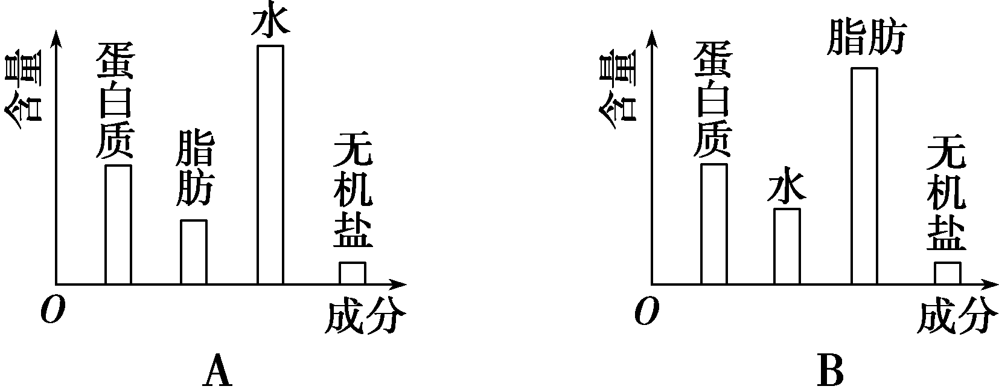

# TP00014

::: tip 基本信息

科目 : 生物

测试范围 : 高一上册

测试主题/单元： 细胞中的元素和化合物

要求 : 80%^

试题：T0000264-T0000297

::: 

[T0000265] 生物体总是和外界环境进行着物质交换，细胞生命活动所需的物质，归根结底是地从            获取的。因此，                                                                  。但是其各元素的相对含量却           。

[T0000266] **生物界与非生物界的统一性与差异性**

（1）组成细胞的化学元素在无机自然界中都能找到，体现了生物界与非生物界的       性。

（2）细胞与非生物相比，各种元素的相对含量大不相同，体现了生物界与非生物界的       性。

[T0000267] **组成细胞的元素**

（1）元素分类

①大量元素：如                             等。

②微量元素：含量少，但不可缺少，和大量元素一样重要，如                   等。

③主要元素：                            6种。

④基本元素(细胞中含量最多的元素)：             4种。

鲜重下含量高低依次为：              ；干重下含量高低依次为：              。

⑤最基本元素：**C**，因为生物大分子都以       为基本骨架。

（2）特点：不同生物体内化学元素的种类            ，但含量            。

[T0000268] **组成细胞的化合物**

（1）组成细胞的元素来源于无机自然界，在细胞中大多数以       形式存在。

（2）组成细胞的化合物有两大类，即          和         ；前者包括         ；后者包括      

​                  ；其中含量较最多的两种化合物为          。细胞内含量最多的化合物：   。细胞内含量最多的有机化合物：        。占细胞干重最多的化合物：          。

[T0000269] **【实验】检测生物组织中的糖类、脂肪和蛋白质**

（1）原理

还原糖（如        、       、      ）可与      试剂反应生成                 ；

脂肪可被            染成       色；(染色后要用         洗掉浮色)

淀粉（多糖）遇   变   色；

蛋白质与          试剂产生             。

（2）材料选择（要求组织颜色              ，目的是                                  ）

①苹果、梨匀浆可用作                    待检样品。

西瓜        (能/不能)作为还原糖检测材料，因为西瓜汁呈        ，会掩盖实验现象；

甘蔗         (能/不能)作为还原糖检测材料，因为甘蔗中的蔗糖             。

②马铃薯匀浆可用作          待检样品。

③花生种子、花生种子匀浆可用作          待检样品。

④豆浆、鲜肝提取液、蛋清可用作           待检样品。若用蛋清需要         。

常见的还原糖：                     .常见非还原糖:             。

（3）斐林试剂与双缩脲试剂使用的区别：（使用对象、浓度、原理、用法、反应结果）

|                   | 使用对象 | CuSO4浓度(g/mL) | 原理 | 用法 | 反应结果 |
| ----------------- | -------- | --------------- | ---- | ---- | -------- |
| 斐林 		试剂 |          |                 |      |      |          |
| 双缩脲试剂        |          |                 |      |      |          |

（4）试剂组成及使用方法

①斐林试剂 组成：甲液：                   ；乙液：                  。

使用方法：           使用，            ；     加热。

②双缩脲试剂：组成：A液：                 ；B液：                  。

使用方法：先加             ，摇匀，再加少量              ，摇匀。

​       (需要/不需要)加热。若B液过量，反应液会呈    色，遮盖反应后的颜色。

实质：    条件下     与双缩脲试剂中的Cu2＋反应生成紫色络合物。

知识辨析:

[T0000270] 番茄和水稻根系吸Si元素的量有差异。(　　)

[T0000271] 在人体活细胞中氢原子的数目最多。(　　)

[T0000272] 地壳和活细胞中含量最多的元素都是氧元素，由此看出生物界和非生物界具有统一性。(　　)

[T0000273] C、H、O、N、P、S这6种元素是组成细胞的大量元素。(　　)

[T0000274] 氧元素是组成生物体的最基本元素，这是因为氧元素在生物体中含量最多。(　　)

[T0000275] 鉴定还原糖时，加入斐林试剂后产生砖红色沉淀。(　　)

[T0000276] 用双缩脲试剂检测蛋白质不需要加热。(　　)

[T0000277] 可用苏丹Ⅲ染液鉴定淀粉。(　　)

[T0000278] 细胞中的微量元素因含量极少从而不如大量元素重要。 (    )

[T0000279] 在沙漠植物仙人掌的活细胞中含量最多的化合物是蛋白质。(    )

[T0000280] 细胞中的一种元素的作用能被其他元素代替。(    )

[T0000282] (2022·陕西西安高一月考)关于玉米细胞和人体细胞中元素的组成及含量，下列叙述正确的是(　　)

A．玉米细胞鲜重中质量百分比最高的元素是C

B．人体细胞干重中质量百分比最高的元素是O

C．上述两种细胞鲜重中原子数量最多的元素均是H

D．P和S 分别是人体细胞中的大量元素和微量元素

[T0000283] 某人得了脂肪肝(即肝细胞中有过多的脂肪)，下图中能正确表示他的肝细胞中四种化合物含量的是(　　)

[T0000284] (2022·山东日照高一段考)下表表示活的植物细胞中a、b、c三种元素的含量百分比，下列说法正确的是　(　　)

| 元素 | a    | b    | c    |
| ---- | ---- | ---- | ---- |
| 含量 | 65%  | 18%  | 10%  |

A.表中b代表的元素应该是碳元素

B．在该植物细胞干重中，占比例最高的元素是a

C．人体细胞中的a、b、c三种元素含量百分比与该植物细胞中的完全相同

D．a、b、c三种元素在活细胞中含量最多，说明它们是构成细胞的最基本元素

[T0000285] (2022·四川成都高一月考)观察下图，下列叙述正确的是(　　)

A．若该图表示的是活细胞中的各化学元素的含量，则甲应该为C

B．若该图表示的是细胞的各化学元素占干重的百分比，则甲应该为O

C．若该图是已经完全脱水后的细胞中的化合物组成情况，则甲是蛋白质

D．若该图为活细胞的化合物组成情况，则甲中含有的元素为C、H、O

[T0000286] (2022·河北衡水高一月考)2014年诺贝尔生理学或医学奖获得者发现了大脑定位系统的神经细胞——位置细胞和网格细胞，其中网格细胞周期性地响应于空间环境而产生兴奋并发射信号，将空间组织成一个动态的导航网格。下列关于位置细胞和网格细胞的叙述，正确的是(　　)

A．位置细胞鲜重中质量百分比最高的元素是C

B．网格细胞干重中质量百分比最高的元素是O

C．位置细胞和网格细胞中含量最多的有机化合物是水

D．位置细胞和网格细胞中的元素种类基本相同

[T0000287] 庐山黄杨和金背松鼠体内细胞的某些元素含量(占细胞干重的质量分数：%)如下表所示，下列有关叙述正确的是(　　)

| 元素     | C     | H    | O     | N    | P    | Ca   | S    |
| -------- | ----- | ---- | ----- | ---- | ---- | ---- | ---- |
| 庐山黄杨 | 43.57 | 6.24 | 44.43 | 1.46 | 0.20 | 0.23 | 0.17 |
| 金背松鼠 | 55.99 | 7.46 | 14.62 | 9.33 | 3.11 | 4.67 | 0.78 |

A.依据表中N元素含量可推知，金背松鼠细胞中核酸含量比庐山黄杨多

B．依据表中O元素含量可推知，庐山黄杨的含水量比金背松鼠多

C．依据表中C元素含量可推知，干物质主要是有机物

D．这两种生物体内所含的化学元素的种类和含量差异均很大

核心点二　检测生物组织中的糖类、脂肪和蛋白质

[T0000288] (2022·山东济南高一检测)在生物组织中的还原糖、脂肪、蛋白质的鉴定实验中，关于实验材料的选择，下列叙述错误的是(　　)

A．可用斐林试剂甲液和乙液、蒸馏水来鉴定葡萄糖和蛋白质

B．花生种子含脂肪多且子叶肥厚，是用于脂肪鉴定的理想材料

C．选择实验材料时，应选择白色或无色的材料进行实验

D．甘蔗茎的薄壁组织、甜菜的块根等，都含有较多的糖且近于白色，因此可以用于还原糖的鉴定

[T0000289] 在对生物组织中还原糖、脂肪和蛋白质三种有机物进行检测的实验中，方法与结果正确的是　(　　)

A．大豆组织样液(2 mL)＋斐林试剂甲液(2 mL)＋斐林试剂乙液(2 mL)――→溶液呈紫色

B．苹果组织样液(2 mL)＋双缩脲试剂A液(2 mL)＋双缩脲试剂B液(2 mL)――→溶液呈橘黄色

C．花生子叶＋苏丹Ⅲ染液(2～3滴)――→脂肪颗粒呈红色

D．苹果组织样液(2 mL)＋斐林试剂(甲液、乙液各0.5 mL 混匀)――→产生砖红色沉淀

[T0000290] 某校生物兴趣小组进行了生物组织中还原糖检测的实验(如下图所示)，下列叙述正确的是(　　)

A．在实验材料选择方面，用梨匀浆比用植物叶片的效果要好

B．在制备生物组织样液时，加入石英砂的主要目的是促进还原糖的溶解

C．用于该实验的斐林试剂能用于检测蛋白质

D．由于斐林试剂不稳定，在使用斐林试剂时要先加入0.1 g/mL的NaOH溶液，后加入0.05 g/mL的 CuSO4 溶液

[T0000291] (2022·山东临沂高一期中)生命的物质基础是组成细胞的元素和化合物，右图中序号代表不同的化合物，面积不同代表含量不同，其中Ⅰ和Ⅱ代表两大类化合物。请据右图分析，下列叙述正确的是(　　)

A．若Ⅴ代表蛋白质，则Ⅶ代表核酸

B．细胞干重和鲜重中含量最多的化合物分别是Ⅴ和Ⅲ

C．医用生理盐水和葡萄糖溶液中的溶质分别属于Ⅳ和Ⅴ

D．不同生物组织细胞中各种化合物的含量差别很小

[T0000292] 先在1～6号试管中分别加入2 mL相应的溶液(1和2为花生子叶匀浆，3为麦芽糖溶液，4为蔗糖溶液，5和6为豆浆)；然后在1号和2号试管中再分别加入一定量的苏丹Ⅲ染液和双缩脲试剂后摇匀，3号和4号试管中加入一定量的斐林试剂后水浴加热2 min，5号和6号试管分别加入一定量的双缩脲试剂和蒸馏水后摇匀；最后观察实验现象。则下列有关分析正确的是(　　)

A．1号和2号试管的颜色分别为红色和蓝色

B．3号和4号试管的颜色分别为砖红色和无色，说明蔗糖属于非还原糖

C．5号和6号试管的颜色分别为紫色和白色，说明豆浆中含有蛋白质

D．丙组实验有对照组，是5号试管

[T0000293] 实验测得小麦、大豆、花生三种生物干种子中三大类有机物含量如下图所示，下列叙述不正确的是(　　)

A．选用花生子叶切片作为实验材料检测细胞中的脂肪颗粒时需要使用显微镜

B．用双缩脲试剂检测大豆种子研磨液中是否存在蛋白质时不需要加热即可呈紫色

C．向小麦种子的研磨液中加入斐林试剂，会出现砖红色沉淀

D．花生、大豆、小麦种子中都含有糖类、脂肪和蛋白质

[T0000294] 学校小卖部售卖某品牌牛奶，研究小组计划检测该牛奶成分是否合格。下列关于检测项目、方法和现象的描述，正确的是(　　)

| 项目 | 检测方法                                                     | 现象 |
| ---- | ------------------------------------------------------------ | ---- |
| ①    | 滴加3滴苏丹Ⅲ染液                                             | Ⅰ    |
| ②    | 依次滴加0.1 			g/mL NaOH溶液、0.01 			g/mL CuSO4溶液 | Ⅱ    |
| ③    | 0.1 			g/mL NaOH溶液、0.05 			g/mL CuSO4溶液等量混合后加入牛奶 | Ⅲ    |

A.项目③中还需水浴加热，才能完成检测   B．现象Ⅰ中显红色，说明牛奶中含有脂肪

C．如果牛奶中含有蛋白质，现象Ⅱ中显红色D．现象Ⅲ无砖红色沉淀说明牛奶不含还原糖

[T0000295] 淀粉是玉米籽粒的主要组成成分，占籽粒干重的70%左右，因此玉米籽粒的灌浆过程主要是淀粉合成和积累的过程。茎、叶等源器官制造的光合产物以蔗糖的形式运输到库器官(籽粒)，在一系列酶的催化作用下形成淀粉。催化蔗糖降解的酶是SS，SS催化籽粒淀粉合成反应的第一步。某科研人员对两株玉米品种(豫玉22号与费玉3号)籽粒蔗糖含量和SS活性的变化进行了研究，结果如下图所示。请回答下列问题：

(1)蔗糖________(填“能”或“不能”)与斐林试剂起反应，它的水解产物为________________________________________________________________________。

(2)若要鉴定SS的化学本质，可将SS溶液与________________混合，若出现紫色，则表明SS的化学本质是蛋白质。

(3)综合甲、乙两图分析费玉3号在20 d至40 d期间玉米籽粒合成淀粉的速率比豫玉22号要快的原因：__________________________________________________________________

________________________________________________________________________。

[T0000296] 为了研究在大豆种子萌发和生长过程中糖类和蛋白质的相互关系，某研究小组在25 ℃、黑暗、无菌、湿润的条件下进行实验，然后测定在不同时间种子和幼苗中相关物质的含量，结果如下图所示，回答下列问题：

(1)在观察时间内，图中可溶性糖含量的变化是________________________________。总糖含量的变化是____________，蛋白质含量的变化是___________________________________。

(2)如果在同样条件下继续培养，预测图中曲线的最终变化趋势是________________，其原因是___________________________________________________________________________

_________________________________________。

(3)在上述定量测定之前，进行了蛋白质含量变化的预实验，请填充实验原理；判断实验步骤中画线部分是否正确，并更正错误之处；写出实验结果。

①实验原理：蛋白质_________________________________________，__________________

______________________________________________________________________________________________其颜色深浅与蛋白质含量成正比。

②实验步骤：

Ⅰ：将三份等量大豆种子分别萌发1、5、9 d 后取出，各加入适量蒸馏水，研碎、提取、定容后离心得到蛋白质制备液。

Ⅱ：取三支试管，编号1、2、3，分别加入等量的萌发1、5、9 d 的蛋白质制备液。

Ⅲ：在上述试管中各加入等量的双缩脲试剂A液和B液按比例配制的混合液，振荡均匀后，在沸水浴中加

a热观察颜色变化。

b

a：___________________________________________________________。

b：____________________________________________________________。

③实验结果：________________________________________________。

[T0000297] 某兴趣小组对学校附近三家奶茶店所卖的珍珠奶茶进行了原材料及营养成分的检测，每组实验用的试管均是洁净的试管，实验结果记录如下表所示。

|                                                              | A店                         | B店                         | C店                         |
| ------------------------------------------------------------ | --------------------------- | --------------------------- | --------------------------- |
| 1.与等量新制斐林试剂混合均匀并加热                           | 少量砖红色 			沉淀 | 少量砖红色 			沉淀 | 少量砖红色 			沉淀 |
| 2.将0.1 			g/mL NaOH溶液和0.05 			g/mL CuSO4 			溶液等量混合均匀后滴加2滴 | 白色                        | 淡黄色                      | 淡黄色                      |
| 3.滴入一定量的__？__染液                                     | 橘黄色                      | 橘黄色                      | 淡橘黄色                    |

试探究：

(1)(生命观念)第1组实验中加热的最好方式是什么？第3组实验中“？”应填入什么？ 

(2)(生命观念)根据上表结果，三种奶茶中都含有什么物质？

(3)(科学思维)该小组认为三种奶茶中都没有蛋白质，此结论是否正确？判断的依据是什么？

出处：17.docx

