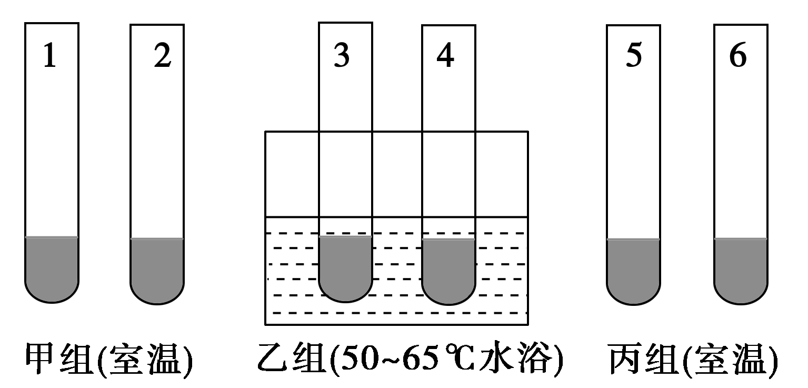
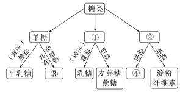
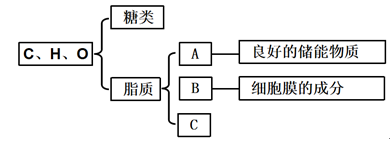

# TP00015

::: tip 基本信息

科目 : 生物

测试范围 : 高一上册

测试主题/单元：细胞中的糖类和脂质

要求 : 80%^

试题：T0000297-T0000313

::: 

[T0000297] 下列关于糖类化合物的叙述,正确的是(  )

A.多糖的单体不一定是葡萄糖 B.等质量的糖原比油脂贮能多

C.少数酶的组成结构中有葡萄糖 D.麦芽糖的水解产物为葡萄糖和果糖

[T0000298] 糖类是生命活动的主要能源物质,脂肪是细胞内良好的储能物质。下列叙述正确的是(  )

A.多糖和脂肪都是只由CHO三种元素组成的大分子有机物

B.蔗糖和麦芽糖都是动物细胞特有的二糖

C.脂肪、淀粉、糖原都是人体细胞内的储能物质

D.淀粉、糖原、纤维素都是由多个葡萄糖连接而成

[T0000299] 壳多糖是已知的含氮多糖，其广泛存在于虾、蟹、昆虫的外壳中。下列关于壳多糖和其他多糖的叙述，错误的是(　　)

A．多糖均含有C、H、O这三种元素

B．糖原只分布在动物的肝脏细胞中

C．纤维素能促进胃肠的蠕动和排空

D．壳多糖可用于制作人造皮肤

[T0000300] 如图为糖的分类示意图，下列相关叙述正确的是(　　)

A．图中①与②的区别为是否能够被水解

B．图中的③只代表葡萄糖

C．枯枝落叶中的纤维素经微生物分解可产生葡萄糖

D．图中的④都能与血液中的葡萄糖相互转化，以维持血糖浓度的相对稳定

[T0000301] 肥胖与长期糖摄入超标有关，培养健康的饮食习惯，控制高糖类副食的摄入，是防止肥胖发生的有效手段。下列认识正确的是(　　)

A．糖是细胞内主要的储能物质，常被形容为“生命的燃料”

B．糖在生产生活中有广泛的用途，某些糖可用于废水处理、制作人造皮肤等

C．糖类在供应充足的情况下，可以大量转化为脂肪，在糖类代谢发生障碍时，脂肪也能大量转化为糖类

D．糖尿病是一种常见的糖代谢异常疾病，病人饮食中不能含任何糖类

[T0000302] 下列各项不属于脂肪的生理作用的是(　　)

A．良好的储能物质

B．维持体温

C．缓冲减压，保护内脏

D．细胞膜的组成成分之一

[T0000303] 基于对脂质的组成及其功能的理解，下列有关脂质的叙述正确的是(　　)

A．磷脂是构成动物细胞膜的重要成分，同时还能够参与血液中脂质的运输

B．脂质的元素组成是C、H、O、N

C．维生素D能够促进人体对钙和磷的吸收，所以在补钙的同时需要补充一定量的维生素D

D．性激素是一种蛋白质类激素，它可以促进人和动物生殖器官的发育以及生殖细胞的产生

[T0000304] (2022·江苏金湖中学高一月考)常言道：“马无夜草不肥”，其实是有科学依据的。生物体内有一种被称为“BMAL1”的蛋白质，能促进脂肪堆积，这种蛋白质在白天减少，夜间增多。下列有关叙述正确的是(　　)

A．糖类和脂肪都是细胞中主要的能源物质

B．“BMAL1”在夜间可能会促进脂肪转化为糖类

C．脂肪不仅能储存能量，还具有保温作用

D．脂肪分子中氢的含量远远少于糖类

[T0000305] 下列概念与图示相符的是(　　)

A．a表示脂肪，b、c、d可分别表示三分子的脂肪酸

B．a表示固醇，b、c、d可分别表示脂肪、胆固醇、维生素D

C．a表示脂质，b、c、d可分别表示脂肪、磷脂、固醇

D．a表示固醇，b、c、d可分别表示胆固醇、性激素、几丁质

[T0000306] 如图是生物细胞中某种有机分子的结构式，下列相关叙述错误的是(　　)

A．这种物质在室温下往往呈固体形态

B．这种物质水解能产生合成磷脂的物质

C．构成脂肪的脂肪酸的种类和分子长短相同

D．人体皮下组织中含有丰富的这类物质

[T0000307] (2023·重庆江北区高一期末)低聚果糖是一种新型甜味剂，由 1分子蔗糖与1～3分子果糖聚合而成。低聚果糖甜度为蔗糖的0.3～0.6倍，不能被人体直接消化吸收，但能被肠道菌吸收利用，具有调节肠道菌群、促进肠道对钙的吸收、抗龋齿等保健功能。下列分析不正确的是(　　)

A．低聚果糖合成过程中会有水分子生成

B．低聚果糖可以作为糖尿病患者的甜味剂

C．低聚果糖与胆固醇的功能有相似之处，可有效防止骨质疏松症

D．低聚果糖具有抗龋齿功能，推测可能是因为其不能被口腔细菌利用

[T0000308] 根据下表中同质量的脂肪和糖类在彻底氧化分解时的差异进行分析，以下说法错误的是(　　)

| 物质 | 部分元素的比例 | 氧化分解 |            |      |
| ---- | -------------- | -------- | ---------- | ---- |
| C    | O              | 最终产物 | 产生的水量 |      |
| 脂肪 | 75%            | 13%      | CO2、H2O   | X    |
| 糖类 | 44%            | 50%      | CO2、H2O   | Y    |

A.相同质量条件下，脂肪比糖类在氧化分解时耗氧量多

B．脂肪中的H的比例是12%

C．相同质量的脂肪和糖类氧化分解时产生的水量X＞Y

D．脂肪中H的比例较高，氧化分解时释放的能量较少

[T0000309] 如图是油菜种子在发育和萌发过程中糖类和脂肪的变化曲线。下列分析正确的是(　　)

A．种子形成时，可溶性糖更多地转变为脂肪

B．种子萌发时，脂肪转变为可溶性糖，说明可溶性糖是油菜种子主要的储能物质

C．可溶性糖和脂质的化学元素组成完全相同

D．种子发育过程中，由于可溶性糖更多地转变为脂肪，种子需要的N增加

[T0000310] 科学研究表明：花生种子发育过程中，可溶性糖的含量逐渐减少，脂肪的含量逐渐增加；花生种子萌发过程中，脂肪的含量逐渐减少，可溶性糖含量逐渐增加。下列分析不正确的是(  )                                                       

A. 花生种子发育过程中，可溶性糖转变为脂肪，需要大量的N元素

B. 同等质量的花生种子和小麦种子，萌发过程中耗氧较多的是花生种子

C. 花生种子发育过程中，可溶性糖转变为脂肪，更有利于能量的储存

D. 花生种子萌发过程中，脂肪转变为可溶性糖，与细胞内糖类的氧化速率比脂肪快有关

[T0000311] 下图为生物组织中糖类和脂质的功能及分布的概念图,请据图回答下列问题:

(1)在糖类中,一般能被细胞直接吸收的是_____。常见的二糖有蔗糖、麦芽糖和乳糖,我们吃的红糖、白糖、冰糖的主要成分是_____。分布在人和动物的肝脏和肌肉中的多糖是_____。

(2)组成脂质的化学元素主要是C、H、O,而B中还含有_____元素。与糖类分子相比,脂质分子中氢的含量_____。

(3)在C类物质中, _____可参与血液中脂质的运输。

[T0000312] 如图分别表示动植物细胞中糖类和脂质的种类与关系，请回答下列问题：

(1)若图甲表示植物细胞中糖类的种类与关系图解，则a部分对应的糖是________。

(2)若图乙中①为良好的储能物质，则②表示______，其主要功能是____________________。

(3)动物细胞中某种脂质可以促进生殖器官的发育，则其应对应图乙中________(填序号)。

[T0000313] 根据下列生物学事实回答问题：

材料1：熊在入冬之前要吃大量的食物，在体内转化为脂肪储存起来，以便冬眠时分解利用维持生命活动。生活在南极寒冷环境中的企鹅，体内脂肪可厚达4 cm。

材料2：“瘦素”是最近由研究人员发现的一种重要激素。注射“瘦素”后，人的食欲会下降，从而对人体是否发胖起到至关重要的作用。

(1)材料1说明脂肪具有________、__________的作用。

(2)某校生物兴趣小组想利用以下材料设计实验验证“瘦素”能控制动物的食欲，起到减肥作用。

材料用具：大鼠若干只、普通饲料、一定剂量的“瘦素”溶液、生理盐水，其他所需条件均满足。

请写出实验思路、实验结果及结论。

实验思路：_______________________________________________________________________

________________________________________________________________________________

________________________________________________________________________________

_______________________________________________________________________________；

实验结果及结论：________________________________________________________________

_______________________________________________________________________________。

出处：18.docx