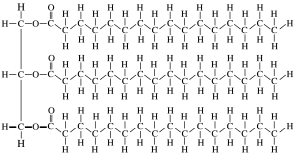
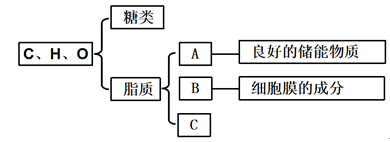

# TP00016

::: tip 基本信息

科目 : 生物

测试范围 : 高一上册

测试主题/单元：蛋白质是生命活动的主要承担者

要求 : 80%^

试题：T0000314-T0000330

::: 

[T0000314] 蛋白质作为生命活动的主要承担者，下列相关说法正确的是(  )

A.同蛋白质分子的化学元素种类相同

B.若氨基酸的种类、数目相同，则合成的蛋白质的功能相同

C.有些蛋白质能调节机体的生命活动，如性激素

D.高温能使蛋白质变性，使蛋白质的结构变得伸展、松散

[T0000315] 如图为3种氨基酸的结构式，相关叙述正确的是(  )

A.甘氨酸的R基为-CH2，丙氨酸的R基是-CH3
 B.由图可知不同氨基酸的R基不同，所以人体内氨基酸的R基有上百种
 C.R基中可以有氨基和羧基
 D.一分子谷氨酸中含两个羧基，羧基的结构式可表示为

[T0000316] 在下列分子中，属于组成生物体蛋白质的氨基酸是(　　)

A．①②④ 	B．①④⑤

zC．①③⑤ 	D．②③⑤

[T0000317] 组成生物体蛋白质的氨基酸中，酪氨酸几乎不溶于水，而精氨酸易溶于水，这种差异的产生取决于(　　)

A．酪氨酸的氨基比较多

B．两者R基组成不同

C．精氨酸的羧基比较多

D．两者的结构不同

[T0000318] 已知苯丙氨酸的分子式是C9H11NO2，那么该氨基酸的R基是(　　)

A．—C7H7O 	B．—C7H7

C．—C7H7N 	D．—C7H5NO

[T0000319] 如图表示二肽分子的结构，①②③④中代表肽键的是(　　)

A．① B．② C．③ D．④

[T0000320] 如图所示为某多肽化合物，关于其组成部分数目的判断，错误的是(　　)

A．1个氨基 	B．2个羧基

C．2个肽键 	D．3种R基

[T0000321] (2023·北京通州区高一期中)如图为人的两种功能不同的多肽类激素——催产素和抗利尿激素的结构示意图，数字表示氨基酸的序号，文字表示氨基酸的缩写，如半胱氨酸缩写为“半胱”。两种激素功能不同的原因是(　　)

A．连接氨基酸间的化学键不同

B．氨基酸种类不同

C．氨基酸结合方式不同

D．氨基酸数目不同

[T0000322] 科学家发现了组成人体的第21种氨基酸—硒代半胱氨酸，其化学式为C3H7NO2Se，下列说法错误的是(　　)

A．该氨基酸是非必需氨基酸，其R基为－CH3Se

B．各种氨基酸理化性质不同的原因在于R基不同

C．两个氨基酸分子通过肽键连接成二肽

D．两个硒代半胱氨酸分子脱水缩合过程产生的H2O中的氢来源于羧基

[T0000323] 在胰岛B细胞中先合成胰岛素原，胰岛素原再通过蛋白酶的水解作用，生成胰岛素(如图)。胰岛素原水解所需的水分子中的氢用于(　　)

A．形成—SH和—OH

B．形成—NH2和—COOH

C．形成—NH2、—COOH和—SH

D．形成—COOH和连接碳的—H

[T0000324] 某条多肽链由31个氨基酸构成，如图为其部分结构示意图，下列叙述不正确的是(　　)

A．该多肽的侧链基团有31种

B．该多肽至少有1个游离氨基

C．该多肽有30个肽键

D．该多肽形成过程中相对分子质量减少了540

[T0000325] 细胞受到冰冻时，蛋白质分子相互靠近，当接近到一定程度时，蛋白质分子中相邻近的巯基(—SH)氧化形成二硫键(—S—S—)。解冻时，蛋白质中的氢键断裂，二硫键仍保留(如图所示)。下列说法错误的是(　　)

A．结冰和解冻过程中蛋白质的相对分子质量均不变

B．在解冻以后蛋白质的功能可能会出现异常

C．巯基(—SH)一定位于氨基酸的R基上

D．抗冻植物可能具有较强的抗巯基氧化的能力

[T0000326] (2023·河北邢台高一期末)如图表示胰岛素分子中一条多肽链，其中有3个甘氨酸且分别位于第8、20、23位。下列叙述正确的是(　　)

A．图中所示多肽至少含有一个羧基和一个氨基

B．该多肽一定含有21种氨基酸

C．用特殊水解酶选择性除去图中的3个甘氨酸的过程需要破坏5个肽键

D．用特殊水解酶选择性除去图中的3个甘氨酸，形成的产物中只有4条多肽

[T0000327] 蛋白质是生命的物质基础，是生命活动的主要承担者，机体中的每一个细胞和所有重要组成部分都有蛋白质的参与。下列有关蛋白质的叙述错误的是(  )

A.蛋白质分子上氨基酸的序列和由此形成的空间结构构成了蛋白质结构的多样性

B.蛋白质可与糖类结合，分布于细胞膜外，在物质运输及细胞识别中起决定性作用

C.蛋白质与DNA结合形成的复合物在某些细胞中可以进行形态的变化，也可以进行复制

D.真核生物的细胞骨架是由蛋白质构成的网架结构，与细胞的运动、分裂、分化有关

[T0000328] 图1为某蛋白质的肽链结构示意图（其中数字为氨基酸序号），图2为部分肽链放大示意图，请据图回答下列问题：

（1）该化合物中的氨基酸种类不同是由____决定的，图2中该种结构有________种。

（2）该化合物由氨基酸脱去________个水分子形成，这种结合方式叫做________。氨基酸的结构特点是________。

（3）图2中肽键包含在________（填序号）结构中；该肽链至少有________个游离的羧基。

（4）假设有一个十肽，分子式为CxHyOzNmSn，组成该肽的氨基酸只有图2中的几种，则含有游离的氨基有________个。

（5）如果该多肽的肽链长度不变，组成它的氨基酸的种类和数目均不变，改变其中的氨基酸_________，就可以改变其性质。高温能够使蛋白质性质改变的原因是破坏了蛋白质的__________。

[T0000329] 我国科学家合成了一种具有镇痛作用而又不会像吗啡那样使病人上瘾的药物——脑啡肽，如图是该物质的结构简式。脑啡肽的合成采用的是蛋白质工程技术，这是生物发展在分子水平上的又一突破。请根据此化合物的结构分析回答下列问题：

(1)该化合物有________个氨基和________个羧基。

(2)该化合物是由________个氨基酸失去________分子水而形成的，这样的反应叫作____________，该化合物叫______肽。在形成时，相对分子质量减少了________。

(3)脑啡肽水解后可产生________种氨基酸，造成氨基酸种类不同的原因是_______________________________________________________________________________。

(4)其基本单位的结构通式为______________________________________________________。

[T0000330] 乙型脑炎是由脑炎病毒引起的急性传染病。一种三肽化合物N－S－K(其结构如图所示)能够抑制乙型脑炎病毒的活性，这为预防和治疗乙脑提供了一条研究途径。图中字母N、S、K分别是三种氨基酸的简称。请分析回答下列问题：

(1)图中虚线框⑤所示结构为________，箭头______(填序号)所指结构为肽键，图中有________个游离氨基，构成三肽的三种氨基酸在结构上的区别在于________________不同。

(2)为研究新合成的三肽“S－N－K”的抗病毒效果，研究者选取了若干只生理状况相同的小鼠平均分为四组，各组的处理方式和实验结果如表所示。

| 组别             | A组                   | B组                   | C组                  | D组  |
| ---------------- | --------------------- | --------------------- | -------------------- | ---- |
| 处理方式         | 注射适量N－S－K和病毒 | 注射等量S－N－K和病毒 | 注射等量缓冲液和病毒 | ？   |
| 八天后小鼠存活率 | 90%                   | 10%                   | 0                    | 100% |

①表中的“？”处的实验操作是________________。

②比较A、B两组的实验结果，可知______________影响三肽化合物的抗病毒效果。

出处：19.docx