# TP00017

::: tip 基本信息

科目 : 生物

测试范围 : 高一上册

测试主题/单元：输细胞的物质入和输出

要求 : 80%^

试题：T0000331-T0000353

::: 

[T0000331] 下列现象属于渗透作用的是

A．水分子通过细胞        B．蔗糖溶液通过细胞壁

C．K+通过细胞膜          D．水分子通过原生质层

[T0000332] 某同学设计渗透装置的实验如右图所示（开始时状态），烧杯中盛放有蒸馏水，图中猪膀胱膜允许单糖透过。倒置的长颈漏斗中先装入蔗糖溶液，一定时间后再加入蔗糖酶。该实验过程中最可能出现的是

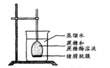

A．漏斗中液面开始时先上升，加酶后即下降

B．漏斗中液面先上升，加酶后继续上升，然后下降

C．加酶前后，在烧杯中都可以检测出蔗糖

D．加酶后可以在烧杯中检测出葡萄糖、果糖和蔗糖酶

[T0000333] 关于植物根系吸收矿质离子的叙述，正确的是

A．植物根系吸收各种矿质离子的速率相同

B．植物根细胞能逆浓度梯度吸收土壤中的矿质元素离子

C．土壤温度不影响植物根系对矿质离子的吸收

D．植物根细胞吸收矿质元素离子主要依靠渗透作用

[T0000334] 将人的红细胞放入4℃蒸馏水中，一段时间后红细胞，破裂主要原因是

A．红细胞具有水溶性         B．红细胞的液泡体积增大

C．蒸馏水大量进入红细胞     D．低温时红细胞膜流动性增大

[T0000335] 下列关于植物细胞质壁分离实验的叙述，错误的是

A．与白色花瓣相比，采用红色花瓣有利于实验现象的观察

B．用黑藻叶片进行实验时，叶绿体的存在会干扰实验现象的观察

C．用紫色洋葱鳞片叶外表皮不同部位观察到的质壁分离程度可能不同

D．紫色洋葱鳞片叶外表皮细胞的液泡中有色素，有利于实验现象的观察

[T0000336] 右图为显微镜下某植物细胞在30%蔗糖溶液中的示意图。

下列叙述中错误的是
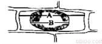
    A．若将细胞置于清水中，A仍保持不变

B．若该细胞置于40%蔗糖溶液中，B/A值将变小

C．B/A值能表示细胞失水的程度

D．A、B分别表示细胞和液泡的长度

[T0000337] 将某植物花冠切成大小和形状相同的细条，分为a、b、c、d、e和f组（每组的细条数相等），取上述6组细条分别置于不同浓度的蔗糖溶液中，浸泡相同时间后测量各组花冠细条的长度，结果如右图所示。假如蔗糖溶液与花冠细胞之间只有水分交换，则：
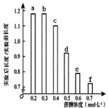
A．实验后，a组液泡中的溶质浓度比b组的高

B．浸泡导致f组细胞中液泡的失水量小于b组的

C．a组细胞在蔗糖溶液中失水或吸水所耗ATP大于b组

D．使细条在浸泡前后长度不变的蔗糖浓度介于0.4~0.5mol·L－1之间

[T0000338] 下列判断细胞死活的方法中，正确的是

A．将多种植物细胞置于一定浓度的蔗糖溶液中，能发生质壁分离的是活细胞，不能发生质壁分离的是死细胞

B．在高倍镜下观察，若发现细胞质流动，则表明细胞是活细胞

C．将某细菌与水绵一起制成临时装片，用极细的光束照射水绵，若发现细菌没有趋向 水绵照光部位，则说明细菌细胞为死细胞

D．洋葱根尖经解离后，若发现细胞被龙胆紫溶液染上了色，则表明根尖细胞在解离前已死亡

[T0000339] 以洋葱表皮细胞为材料，分别用0.3g/mL的蔗糖溶液、0.5g/mL的蔗糖溶液、0.3g/mL的尿素溶液及清水加以处理。*m*时开始用四种溶液分别处理洋葱表皮细胞；*n*时再一次用清水处理之前被处理过的洋葱表皮细胞，测得的洋葱表皮细胞原生质体体积的变化如右图所示，图中代表尿素处理结果的是
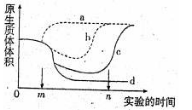
    A．a         B．b         C．c         D．d

[T0000340] 在“观察植物细胞的质壁分离和复原”实验中，对紫色洋葱鳞片叶外表皮临时装片进行了三次观察（如下图所示）。下列有关叙述正确的是

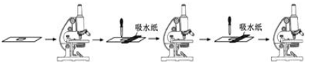

    A．第一次观察时容易看到紫色大液泡和较大的无色细胞质基质区域

B．第三次观察时可以发现液泡颜色逐渐变浅，体积逐渐变大

C．吸水纸的主要作用是吸除滴管滴加的多余液体，以免污染镜头

D．为了节约实验时间，通常可以省略第一次显微观察步骤

[T0000341] 右图为细胞膜的液态流动镶嵌模型示意图，有关其叙述正确的是

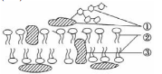

A．具有①的一侧为细胞膜的外侧

B．①与细胞表面的识别有关

C．②是组成细胞膜的基本支架

D．细胞膜的选择透过性与①的种类和数量有关

[T0000342] 关于动物细胞膜的叙述，错误的是

A．细胞膜含有糖脂和糖蛋白           B．细胞融合与细胞膜的流动性有关

C．ATP为CO2分子通过细胞膜提供能量 D．细胞膜上的大多数蛋白质是可以运动的13．在培养玉米的溶液中加入某种负离子，结果发现玉米根细胞在吸收该种负离子的同时，

对Cl－的主动吸收减少了，而对K＋的主动吸收并没有影响，原因是

A．该种负离子妨碍了能量的生成       B．该种负离子抑制了主动运输

C．该种负离子抑制了细胞呼吸         D．该种负离子载体和Cl－的相同

[T0000344] 关于植物细胞主动运输方式吸收所需矿质元素离子的叙述，正确的是

A．吸收不同矿质元素离子的速率都相同    

B．主动运输矿质元素离子的过程只发生在活细胞中

C．低温不影响矿质元素离子的吸收速率

D．叶肉细胞不能以主动运输的方式吸收矿质元素离子

[T0000345] 下列关于物质跨膜运输的叙述，错误的是

A．人体内红细胞、肾小管上皮细胞吸收葡萄糖的方式相同

B．线粒体产生的CO2以自由扩散的方式进入细胞质基质

C．海带细胞通过主动运输积累I一等溶质，因而不会在海水中发生质壁分离

D．将酶解法制备的原生质体置于蒸馏水中，会因渗透作用吸水而涨破

[T0000346] 物质的跨膜运输对细胞的生存和生长至关重要。
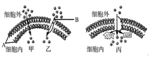

下图为几种物质跨膜运输方式的示意图，据图判

断下列叙述中，不正确的是

    A．组成细胞膜的A、B两种物质通常不是静止的

B．葡萄糖进入红细胞以图中甲物质跨膜运输方式进行

C．丙物质跨膜运输方式对于维持活细胞正常的生命活动具有重要意义

D．胆固醇跨膜运输以甲的方式进行是因为A物质的缘故

[T0000347] 下列过程中，不属于胞吐作用的是

A．浆细胞分泌抗体到细胞外的过程

B．mRNA从细胞核到细胞质的过程

C．分泌蛋白从胰腺的腺泡细胞到胞外的过程

D．突触小泡中神经递质释放到突触间隙的过程

[T0000348] 将三组生理状态相同的某植物幼根分别培养在含有相同培养液的密闭培养瓶中，一段时间后，测定根吸收某一矿质元素离子的量。培养条件及实验结果见下表：下列分析正确的是

| 培养瓶中气体 | 温度（℃） | 离子相对吸收量（%） |
| ------------ | --------- | ------------------- |
| 空气         | 17        | 100                 |
| 氮气         | 17        | 10                  |
| 空气         | 3         | 28                  |

A．有氧条件有利于该植物幼根对该离子的吸收

B．该植物幼根对该离子的吸收与温度的变化无关

C．氮气环境中该植物幼根细胞吸收该离子不消耗ATP

D．与空气相比，氮气环境有利于该植物幼根对该离子的吸收

[T0000349] 比较生物膜和人工膜（双层磷脂）对多种物质的通透性，结果如右图。据此不能得出的推论是
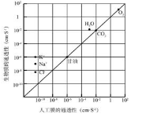
A．生物膜上存在着协助H2O通过的物质

B．生物膜对K+、Na+、Cl－的通透具有选择性

C．离子以协助扩散方式通过人工膜

D．分子的大小影响其通过人工膜的扩散速率

[T0000350] 撕去紫色洋葱外表皮，分为两份，假定两份外表皮细  

胞的大小、数目和生理状态一致， 一份在完全营养  

液中浸泡一段时间，浸泡后的外表皮称为甲组；另一份在蒸馏水中浸泡相同的时间，浸泡后的外表皮称为乙组。然后，两组外表皮都用浓度为0.3 g /ml 的蔗糖溶液里处理，一段时间后外表皮细胞中的水分不再减少。此时甲、乙两组细胞水分渗出量的大小，以 及水分运出细胞的方式是

A．甲组细胞的水分渗出量与乙组细胞的相等，主动转运

B．甲组细胞的水分渗出量比乙组细胞的高，主动转运

C．甲组细胞的水分渗出量比乙组细胞的低，被动运输

D．甲组细胞的水分渗出量与乙组细胞的相等，被动运输

**二．非选择题**

[T0000351] 下图为某学生进行某实验的基本操作步骤，请回答下列有关问题：

（1）你认为他做该实验的目的是_____________________________。

（2）B步骤主要观察的指标主要有_____________、_____________及细胞大小。

（3）请描述C步骤的操作方法：___________________________。

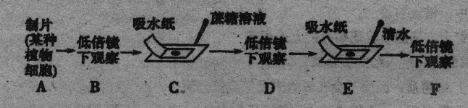

（4）某学生在F步骤观察时，发现质壁分离不能复原，最可能的原因是______________。

（5）若洋葱内表皮做实验材料，为了使实验现象更清楚，请简单写出设计思路：________。

[T0000352] 科研人员对哺乳动物成熟红细胞的细胞膜进行了相关研究。

（1）将红细胞置于_______中，细胞膜破裂释放出内容物，这时的红细胞仍然保持原本的基本形状和大小，这种结构称为红细胞影。科研人员为研究红细胞膜上相关蛋白质的功能，用不同的试剂分别处理红细胞影。结果如下：（“+”表示有，“－”表示无）

| 实验处理     | 膜蛋白名称 | 处理后红细胞影的形状 |           |          |            |      |            |
| ------------ | ---------- | -------------------- | --------- | -------- | ---------- | ---- | ---------- |
| 血影蛋白     | 锚蛋白     | 带3蛋白              | 带4.1蛋白 | 肌动蛋白 | 血型糖蛋白 |      |            |
| 试剂甲处理后 | －         | +                    | ＋        | ＋       | －         | ＋   | 变得不规则 |
| 试剂乙处理后 | ＋         | ＋                   | －        | ＋       | ＋         | －   | 还能保持   |

  由上述结果可以推测，对维持红细胞影的形状起重要作用的膜蛋白主要是___________。

（2）右图是红细胞膜上的Na＋、K＋—ATP酶的结构示意图。由图可以看出，构成细胞膜的基本支架是______。哺乳动物成熟红细胞膜上Na＋、K＋—ATP酶的主要功能是把红细胞________呼吸产生的ATP水解，通过______方式排出Na＋吸收K＋，从而维持红细胞内高K＋低Na＋的离子浓度梯度，由此可知Na＋、K＋—ATP酶具_______的作用。

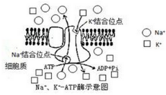

[T0000353] 研究表明，主动运输根据能量的来源不同分为三种类型，如右图中a、b、c所示，■、▲、○代表跨膜的离子或小分子。

（1）图中细胞质基质存在于____(填“P”或“Q”)侧，判断依据是________________。
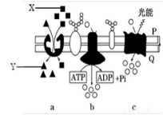

（2）主动运输的特点是______________________。

（3）b类型中，○所代表的离子或小分子转运所需的能量来源于

A．浓度差所造成的势能     

B．ATP直接提供能量

C．光能驱动              

D．细胞内物质合成时释放的能量

（4）下列生物中，最有可能采用c类型进行主动运输的是

A．噬菌体　　  B．细菌　　    C．果蝇　    D．小鼠

（5）有人认为小肠上皮细胞吸收葡萄糖的方式可能是主动运输或协助扩散。为了证实这一假设，进行以下实验探究：取甲、乙两组生长状况相同的小肠上皮细胞，分别置于适宜浓度的葡萄糖培养液中，甲组给予正常呼吸，乙组用细胞呼吸抑制剂处理。若小肠上皮细胞是以主动运输方式吸收葡萄糖，则一段时间后两组溶液中浓度降低的是________组。

出处:31.docx