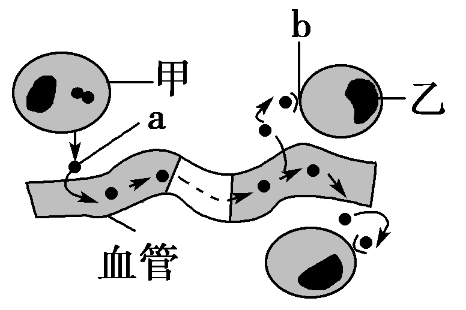
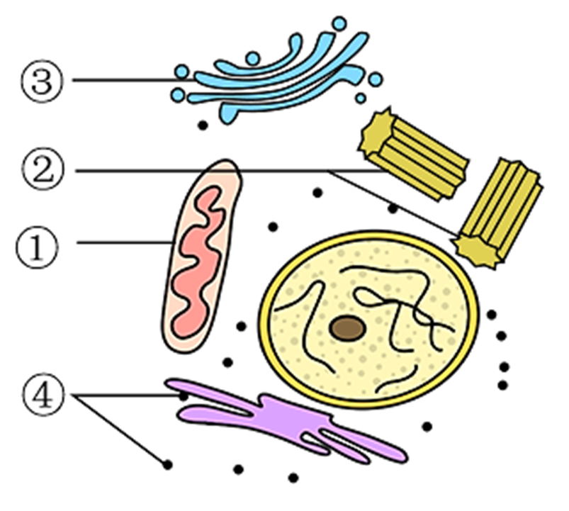
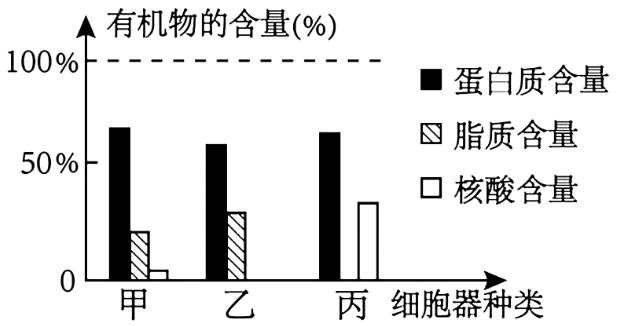
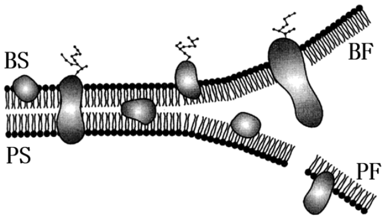
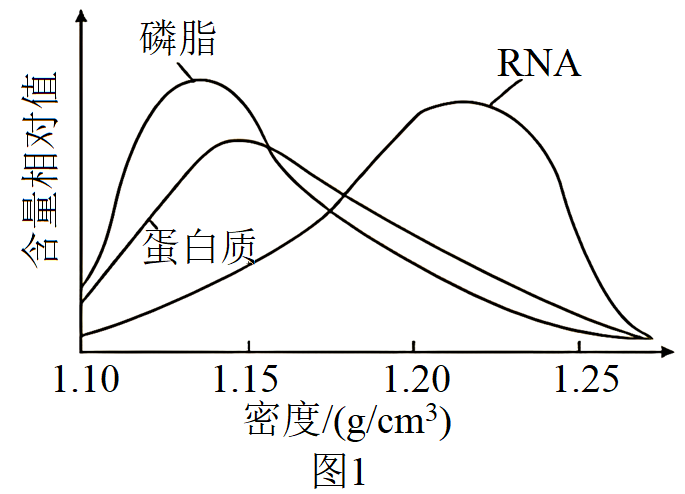
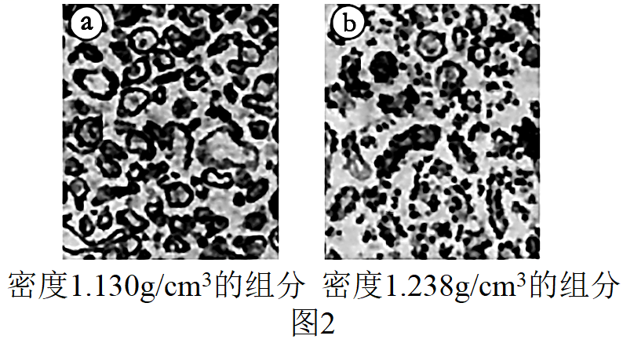
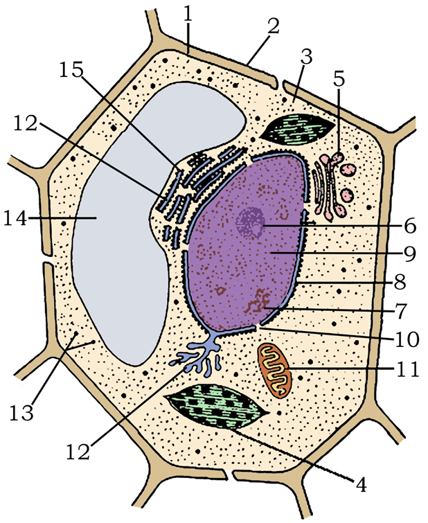
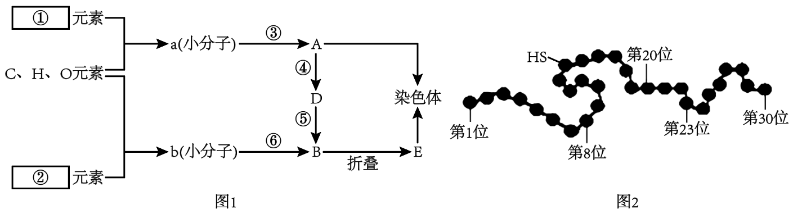
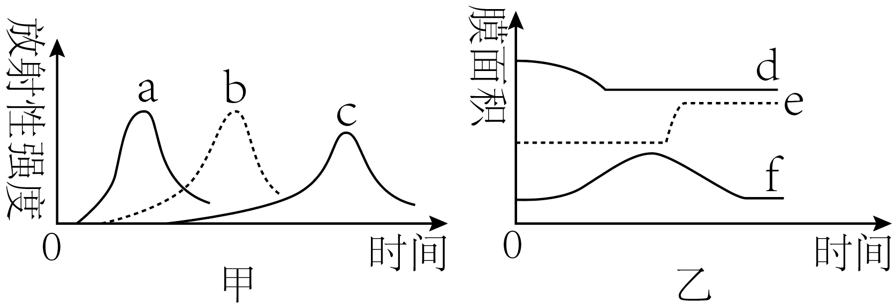
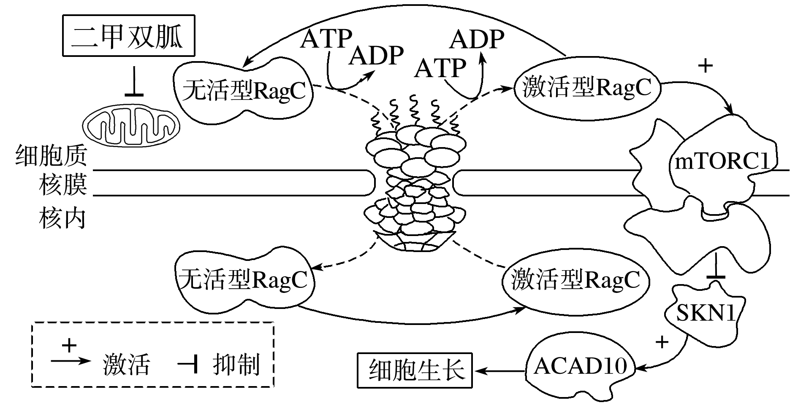

# TP00021

::: tip 基本信息

科目 : 生物

测试范围 : 高一上册

测试主题/单元：细胞的基本结构

要求 : 80%^

试题：T0000397-T0000420

::: 

[T0000397] 核孔是细胞核的重要结构，下列有关叙述正确的是（　　）

A．蛋白质、RNA等大分子可以通过核孔自由进出细胞核

B．蛋白质等大分子通过核孔进出细胞核穿过两层生物膜

C．细胞核中的 DNA可以通过核孔从细胞核到达细胞质

D．新陈代谢旺盛的细胞通常核孔的数量比较多

[T0000398] 施一公团队解析核孔复合物（NPC）高分辨率结构的研究论文，震撼了结构分子生物学领域。文中提到，真核生物最重要的遗传物质DNA主要位于核内，而一些最重要的功能蛋白和结构蛋白的合成却主要位于核外，因此真核生物细胞质和细胞核之间有一个双向通道，组成这个通道的生物大分子就是NPC．下列相关分析正确的是（  ）

A．NPC的数量与细胞代谢强度有关

B．蛋白质和小分子都可以随意通过NPC进出细胞核

C．附着有NPC的核膜与内质网膜、高尔基体膜直接相连

D．NPC是细胞核行使遗传功能的结构

[T0000399] 某同学利用黑藻细胞观察叶绿体和细胞质的流动。下列相关叙述错误的是 （　　）

A．临时装片中的叶片要随时保持有水状态	B．可在高倍显微镜下观察到叶绿体中的细微结构

C．可观察到黑藻细胞中的叶绿体分布在大液泡周围	D．显微镜下观察到的细胞质的流动方向与实际相同

[T0000400] 下列有关细胞结构与功能的叙述，错误的是（  ）

A．幼嫩的细胞与衰老的细胞相比，线粒体数量更多

B．吞噬细胞与神经细胞相比，溶酶体数量更多

C．哺乳动物成熟的红细胞与唾液腺细胞相比，高尔基体数量更多

D．性腺细胞与心肌细胞相比，内质网更发达

[T0000401] 下列生物学研究和科学方法对应错误的是（  ）

A．施莱登、施旺建立细胞学说——不完全归纳法

B．分离细胞中的细胞器—差速离心法

C．人鼠细胞融合实验同位素标记法

D．制作真核细胞的三维结构模型—模型建构法

[T0000402] 模型是人们为了某种特定目的而对认识对象的一种简化的概括性描述，以下有关生物模型的说法正确的是（　　）

A．根据章节中知识之间的联系构建的知识体系属于概念模型

B．利用废旧物品制作的真核细胞模型属于概念模型

C．分泌蛋白的合成和分泌示意图属于数学模型

D．真核细胞的三维结构模型和拍摄的细胞亚显微结构照片均是物理模型

[T0000403] 关于植物细胞结构和其包含的化学成分对应有误的是（  ）

A．核糖体——蛋白质和RNA

B．高尔基体——磷脂和糖被

C．内质网——磷脂和蛋白质

D．细胞壁——纤维素和果胶

[T0000404] 生物体的细胞之间存在信息交流，如图为细胞间信息交流的一种方式。下列叙述不正确的是（  ）

A．细胞膜参与了细胞间的信息交流

B．a可以表示某种信号分子，如胰岛素

C．a可以表示受体，其成分是多糖

D．甲表示内分泌细胞，乙表示靶细胞

[T0000405] 图中①～④表示某细胞的部分细胞器，有关叙述正确的是（  ）

A．该图一定是高倍光学显微镜下看到的结构

B．结构①不能将葡萄糖分解成二氧化碳和水

C．此细胞不可能是植物细胞，只能是动物细胞

D．结构①②③④中都含有大量磷脂

[T0000406] “采莲南塘秋，莲花过人头。低头弄莲子，莲子清如水。”这些诗句描绘了荷塘的生动景致，借采莲表达了对情人的爱慕与思念。下列叙述正确的是（  ）

A．莲与采莲人都具有细胞、组织、器官、系统这些生命系统的结构层次

B．荷塘中的所有鱼、所有莲各自构成一个种群

C．荷塘中的动物、植物和微生物构成生态系统

D．莲和池塘中的蓝藻都具有的细胞器是核糖体

[T0000407] 如图是人体某细胞亚显微结构示意图，下列说法正确的是（　　）

A．结构①与高等动植物细胞的有丝分裂密切相关

B．结构②和④都由一层膜构成，④能参与脂质的合成和运输

C．结构③是细胞核，它与结构⑤的形成有关

D．细胞中与呼吸作用相关的酶在结构⑥中合成

[T0000408] 用一定方法分离出某动物细胞的甲、乙、丙三种细胞器，测定其中三种有机物的含量如图所示。下列叙述正确的是（  ）

A．甲是线粒体，其内膜上蛋白质的种类和数量少于外膜

B．乙只含有蛋白质和脂质，一定与蛋白质的加工有关

C．合成分泌蛋白时，丙合成一段肽链后，再转移到粗面内质网上继续合成

D．乳酸菌细胞与该动物细胞共有的细胞器可能是甲和丙

[T0000409] 冰冻蚀刻技术是将在超低温下冻结的组织或细胞骤然断开，依照组织或细胞的断裂面制成复模，用于电镜观察的技术。科学家常用冰冻蚀刻技术观察细胞膜中蛋白质的分布和膜面结构。下图是正在进行冰冻蚀刻技术处理的细胞膜，有关分析错误的是（  ）

A．BF和PF侧均为磷脂层的疏水侧

B．因为 BS 侧分布有糖蛋白，所以 BS 侧表示细胞膜外侧

C．冰冻蚀刻技术冻结的细胞膜依旧具有一定的流动性

D．由图可知，蛋白质分子以不同的方式镶嵌在磷脂双分子层中

[T0000410] 请据图判断，下列关于生物膜的描述，正确的是（  ）

A．生物膜系统是对图中①②③④⑤⑥等结构的膜的统称

B．结构③在分泌蛋白形成前后，膜面积基本不变

C．用差速离心法研究分泌蛋白的合成、加工和运输过程

D．功能越复杂的生物膜，蛋白质的种类和数量就越多

[T0000411] 下列关于细胞核结构与功能的叙述，正确的是（  ）

A．单层核膜是细胞核的边界，利于核内环境的相对稳定

B．染色质由DNA和蛋白质组成，是遗传物质的主要载体

C．核孔可以调控蛋白质、DNA、RNA等出入细胞核

D．核仁是核内的椭圆形结构，主要与mRNA的合成有关

[T0000412] 翟中和院士曾说：“我确信哪怕一个最简单的细胞，也比迄今为止设计出的任何智能电脑更精巧”。下列关于细胞的基本结构及其功能的叙述，正确的是（  ）

A．动物细胞之间可通过胞间连丝进行物质运输和信息交流

B．细胞核是遗传信息库，是细胞代谢和遗传的控制中心

C．细胞膜内表面的糖类与蛋白质分子结合形成糖被参与细胞间信息传递

D．伞藻的嫁接实验可证明生物体形态结构取决于细胞质

[T0000413] 差速离心和密度梯度离心是分离细胞组分的常用方法。研究人员通过差速离心法从某哺乳动物肝脏中分离出破碎的细胞膜和呈小泡状的内质网，再通过密度梯度离心法进一步分离，并测定不同密度的组分中磷脂、蛋白质和RNA的含量，结果如图1所示。在显微镜下观察密度为1.130g/cm3和1.238g/cm3的组分，结果如图2所示。下列相关叙述正确的是（  ）

A．将肝脏细胞放在生理盐水中可获得各种细胞器和其他物质组成的匀浆

B．图1结果表明磷脂、蛋白质和RNA是细胞膜或内质网的重要组成成分

C．细胞膜和光面内质网主要在图2—a的组分中，核糖体主要在图2—b的组分中

D．若用该动物的成熟的红细胞进行相同的实验，可得到类似的实验结果

[T0000414] 某小组从成熟叶肉细胞中提取多种细胞器，并分析各种细胞器成分。下列叙述正确的是（　　）

A．若某细胞器含有DNA分子，则该细胞器能合成RNA分子

B．若某细胞器含有色素，则该细胞器能吸收、传递和转化光能

C．若某细胞器含有P元素，则该细胞器能参与细胞内囊泡的形成

D．若某细胞器含有ATP合成酶，则该细胞器能分解葡萄糖
[T0000415] 胆固醇在C-7位脱氢即得到7-脱氢胆固醇，7-脱氢胆固醇经紫外线照射可变成维生素D3，在动物体内胆固醇可转变为性激素等。下列有关叙述正确的是（　　）

A．胆固醇在血液中有运输功能，胆固醇还能促进人和动物肠道对Ca、P的吸收

B．7-脱氢胆固醇转变成维生素D3、胆固醇转变成性激素过程有生物大分子参与

C．胆固醇、维生素D3、性激素的元素组成为C、H、O，其都可用苏丹Ⅲ进行检测

D．动植物细胞中的胆固醇镶在磷脂双分子层表面、嵌入或贯穿磷脂双分子层，有利于调节膜的流动性

[T0000416] 青蒿素是目前最有效的疟疾治疗药物。疟原虫的强代谢会使红细胞形成腔窝或弹孔样的“坑洼”区，称之为“代谢窗”。青蒿素对代谢窗的结构和数量没有明显影响，它主要作用于疟原虫的膜结构，使其生物膜系统遭到破坏。以下叙述错误的是（　　）

A．青蒿素对人细胞膜没有明显影响

B．红细胞膜的主要成分是蛋白质和脂质

C．感染初期，疟原虫侵入的过程会使红细胞的细胞膜解体

D．青蒿素可破坏疟原虫的内质网、线粒体、细胞核等结构

[T0000417] 如图是某生物的细胞亚显微结构示意图，据图回答。

(1)图中[2]         的主要成分是         ，对细胞具有         和          的作用。

(2)图中[1]          的主要成分是                 。

(3)太阳能通过图中结构[ ]         中进行的光合作用后才能进入生物界。

(4)细胞进行生命活动所需的能量主要由[ ]         供给。

(5)如果该细胞是低等植物细胞，则图中还应该有的细胞器         。

(6)图中细胞内具有双层膜结构的除叶绿体和线粒体外，还有[ ]         。

(7)能用氨基酸合成蛋白质的场所是[  ]          。

(8)与某些 RNA 和核糖体的合成有关的结构是[  ]          。

[T0000418] 下图1是人体细胞中两种重要有机物A和E的元素组成及相互关系图，图2为一条肽链的局部放大图。回答下列问题：请据图回答：

(1)请在图中方框①、②中写出两种重要有机物A和E的元素组成①               ；②            。

(2)E具有多样性，如果其        序列改变或     的空间结构改变，就可能会影响其功能。A中的     储存着生物的遗传信息。

(3)⑥反应过程为         ，发生在细胞的         （结构）中，b的结构通式为              。

(4)染色体主要成分是             ，染色体与染色质的关系为                    。

(5)若图2表示多肽中有3个甘氨酸且分别位于第8、20、23位，现用特殊水解酶选择性除去这3个甘氨酸，形成的产物中有       条多肽，形成的产物（含甘氨酸）比原多肽多       个氧原子。

[T0000419] 下图是人体某组织细胞部分结构及生理过程的示意图。请据图回答：

(1)科学家发现囊泡能将物质准确运输到目的位置并“卸货”，是由于囊泡膜表面有特殊的“识别代码”，能识别相应受体。这种“识别代码”的化学本质很可能是         。

(2)溶酶体中的多种水解酶从合成到进入溶酶体的途径是：2→        →         →溶酶体（用数字表示）。

(3)图中过程⑥→⑨说明溶酶体具有        的功能。溶酶体内含有多种水解酶，为什么溶酶体膜不会被这些水解酶分解？尝试提出一种合理的假说：                                                   

                                                                                           。

(4)若图示细胞表示乳腺细胞，用同位素标记一定量的氨基酸培养乳腺细胞，测得与合成和分泌乳蛋白相关的一些细胞器上放射性强度的变化曲线如图甲所示，以及在此过程中有关的生物膜面积的变化曲线如图乙所示。图中曲线所指代的细胞结构相同的是__________。

A．c和f	B．c和d	C．a和e	D．a和d

(5)图中含有尿嘧啶的细胞器有                 。(填写图中1-5数字)

[T0000420] 二甲双胍的抗肿瘤效应越来越受到人们的广泛关注，它可以通过抑制某种细胞器的功能而抑制细胞的生长，其作用机理如下图所示（ATP为能源物质，水解为ADP的过程中释放能量）。请据图回答下列有关问题：

(1)细胞核的核膜是双层膜结构，其主要成分是            。核孔的作用是                     。

(2)据图分析，二甲双胍通过抑制         的功能，进而直接影响了                            的跨核孔运输，最终达到抑制细胞生长的效果。

(3)物质进出核孔是否具有选择性？      （填“是”或“否”）。RagC进出细胞核需经过      层生物膜。

(4)据图分析，分泌蛋白的运输是否可能受二甲双胍的影响？        （填“是”或“否”），原因是                                                                                                 。

出处：28