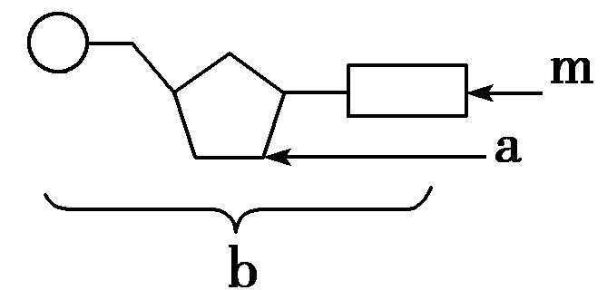
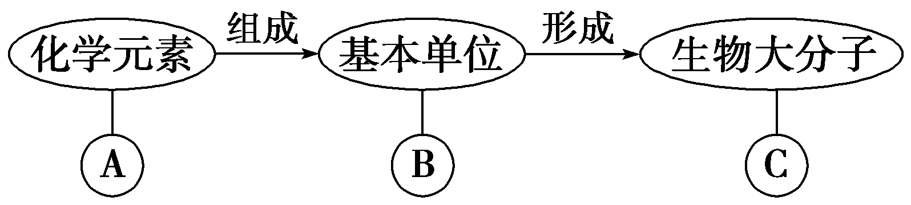
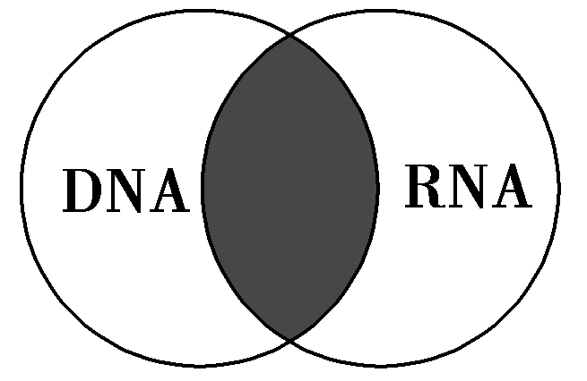
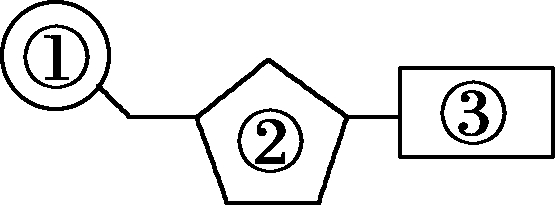
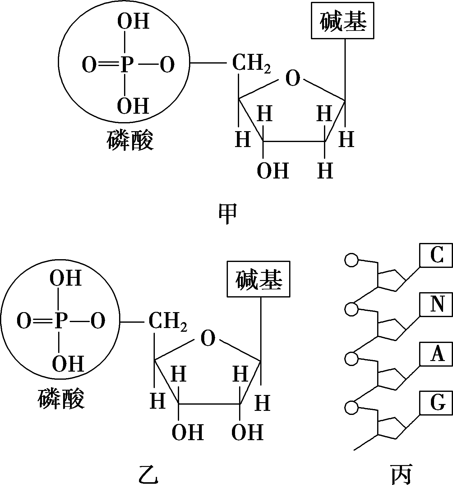
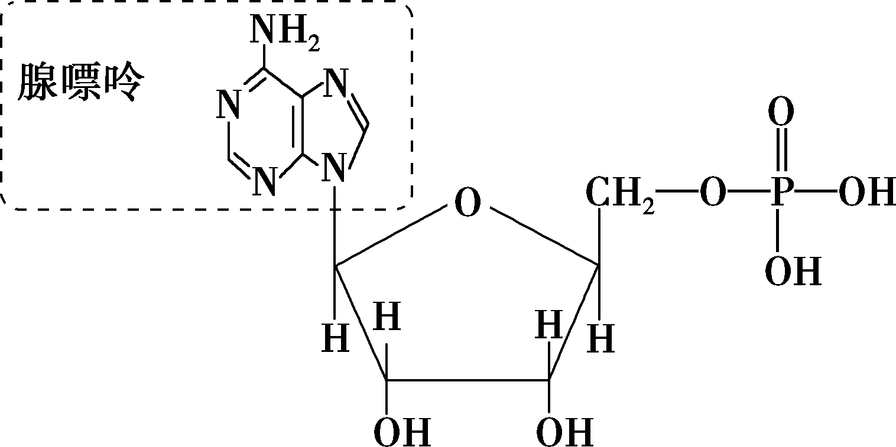
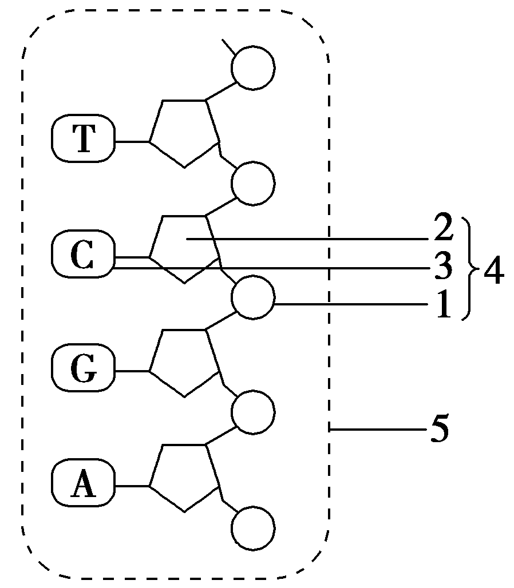
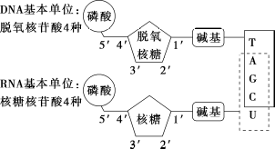
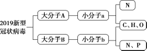

# TP00022

::: tip 基本信息

科目 : 生物

测试范围 : 高一上册

测试主题/单元：核酸是遗传信息的携带者

要求 : 80%^

试题：T0000421-T0000445

::: 

[T0000421] 核酸包括两大类：一类是                    ，简称             ；另一类是          ，简称     。 

[T0000422] 真核细胞的DNA主要分布在      中，                    内也含有少量的DNA。RNA主要分布在      中。 

[T0000423] 一个核苷酸是由一分子       、一分子         和一分子        组成的。根据         的不同，可以将核苷酸分为              (简称              )和                。 

[T0000424] DNA和RNA都含有的碱基是      、          和         ，DNA特有的碱基是      ，RNA特有的碱基是           。 

[T0000425] DNA水解的产物是            ，彻底水解的产物是          、             、              。

[T0000426] 有细胞结构的生物包括         生物和           生物，遗传物质是          ；没有细胞结构的病毒，遗传物质大多数是       ，少数是          。例如                                

[T0000427] 生物体内各种物质的元素组成：

纤维素：                 ；         脂肪：             ；

磷脂：                 ；     酶：                        ；

DNA：               ；    RNA：                   

ATP：                        。

[T0000428] DNA与RNA在化学组成上有什么异同点？

[T0000429] 核苷酸的排列顺序与遗传信息有什么关系？

[T0000430] 怎样理解生物大分子以碳链作为基本支架？

[T0000431] 下图是核苷酸的基本组成单位，下列叙述正确的是(　　)

A．若m为鸟嘌呤，则b一定是构成RNA的单体

B．若m为胸腺嘧啶，则a一定为脱氧核糖

C．若m为尿嘧啶，则RNA中不含有化合物b

D．若m为腺嘌呤，则b为腺嘌呤核糖核苷酸

[T0000432] 下图为有关生物大分子的简要概念图，下列叙述正确的是(　　)

A．若B为葡萄糖，则C在动物细胞中可能为乳糖

B．若C为RNA，则B为核糖核苷酸，A为C、H、O、N

C．若C具有信息传递、运输、催化等功能，则B可能为氨基酸

D．若B为脱氧核苷酸，则C只存在于线粒体、叶绿体、细胞核中

[T0000433] RNA的主要存在部位和所含的五碳糖分别是(　　)

A．细胞核、核糖　　　　　　	B．细胞质、核糖

C．细胞核、脱氧核糖 	D．细胞质、脱氧核糖

[T0000434] 下图表示DNA和RNA化学组成的比较概念图，图中灰色部分表示(　　)

A．脱氧核糖、鸟嘌呤、腺嘌呤、胞嘧啶

B．胸腺嘧啶、腺嘌呤、磷酸、胞嘧啶

C．核糖、脱氧核糖、磷酸、鸟嘌呤

D．胞嘧啶、鸟嘌呤、腺嘌呤、磷酸

[T0000435] 右图所示为核苷酸的结构模式图。下列关于核苷酸及核酸的叙述，错误的是(　　)

A!．核苷酸的种类可以根据图中的②和③进行判断

B．彻底水解DNA，可以得到一种①、一种②和四种③

C．在人的口腔上皮细胞中，含有两种②和四种③

D．如果某种核酸中含有T，则该核酸主要分布在细胞核中

[T0000436] 下列关于核酸和核苷酸的叙述，错误的是(　　)

A．核苷酸是由核酸连接而成的长链，是生物大分子

B．核苷酸是由C、H、O、N、P五种元素组成的

C．真核细胞的叶绿体和线粒体中含有少量核酸

D．组成DNA和RNA的腺嘌呤含有氮元素

[T0000437] 有关下列概念图的叙述，正确的是(　　)

＋＋→→

A．①表示的碱基有5种 	B．②表示的是核糖

C．④表示脱氧核苷酸 	D．④表示核糖核苷酸

[T0000438] 下图是构成核酸的两种核苷酸及它们形成的核苷酸链(N表示某种碱基)。下列有关叙述正确的是(　　)

A．动物细胞的核酸中碱基种类有8种

B．若丙中N为T，则丙的基本组成单位是乙

C．若丙中N为U，则不可储存遗传信息

D．颤蓝细菌的遗传信息储存在甲的排列顺序中

[T0000439] DNA指纹技术在案件侦破工作中有重要的作用，从案发现场提取的DNA样品可为案件侦破提供证据，这依据的生物学原理是(　　)

A．不同人体内的DNA所含的碱基种类不同

B．不同人体内的DNA所含的五碳糖种类不同

C．不同人体内的DNA的五碳糖和磷酸的连接方式不同

D．不同人体内的DNA所含的脱氧核苷酸排列顺序不同

[T0000440] 蛋白质和DNA是两类重要的生物大分子，下列对两者共性的概括不正确的是(　　)

A．组成元素含有C、H、O、N

B．由相应的基本结构单位构成

C．具有相同的空间结构

D．以碳链为骨架

[T0000441] 下列关于核酸的叙述，正确的是(　　)

A．人细胞中储存遗传信息的物质是RNA

B．核酸和蛋白质的组成元素相同

C．高温会破坏蛋白质和核酸分子中肽键

D．线粒体和叶绿体中都含有DNA分子

[T0000442] 下图是某核苷酸与核苷酸链示意图，据图回答问题：

甲

乙

(1)已知图甲分子结构式中的碱基是腺嘌呤。

①该核苷酸的生物学名称是________________。

②该核苷酸是构成哪一种核酸的原料？________。

  (2)图乙为一条核苷酸链示意图。

  ①图中所示2、4、5的名称分别是________、__________________________、________________。

②与另一种核酸相比较，此结构中特有的碱基中文名称是________________。

③通常由________条图示的核苷酸链构成一个分子，真核细胞中其主要分布在________中。

④人的细胞中，该物质的初步水解产物是__________________，彻底水解的产物中有含氮碱基________种。

[T0000443] 下图是DNA和RNA的组成结构示意图，下列有关说法正确的是(　　)

A．甲型H7N9流感病毒有5种碱基和8种核苷酸
B．主要存在于硝化细菌拟核中的核酸由5种碱基构成

C．病毒可以同时具有上述两种核酸

D．DNA彻底水解得到的产物中有脱氧核糖，而没有核糖

[T0000444] 下图表示2019新型冠状病毒(RNA病毒)中两种重要化合物的化学组成关系，下列相关叙述正确的是(　　)

A．图中大分子B由两条链组成

B．a与a之间通过氢键相连接

C．b的种类为4种

D．大分子B的彻底水解产物为b，一分子b由一分子核糖、一分子磷酸和一分子含氮碱基组成

[T0000445] 研究发现一种单链RNA分子“miR140”，科学实验中发现小鼠软骨细胞缺少这种RNA分子时软骨损伤严重，下列有关“miR140”分子的说法，错误的是(　　)

A．“miR140”分子中含有一个游离的磷酸

B．“miR140”分子中一定不含有糖类物质

C．“miR140”分子对生命活动有重要作用

D．“miR140”分子不是小鼠的遗传物质

[T0000445] 已知流感病毒只含有一种核酸，现欲探究H5N1亚型病毒的核酸是DNA还是RNA。某实验小组进行了如下实验：

材料用具：显微注射器、H5N1亚型病毒的核酸提取液、活鸡胚、DNA水解酶、RNA水解酶。

(1)选用活鸡胚的理由是_____________________________________

_________________________________________________________________

________________________________________________________________。

(2)选用DNA水解酶的理由是________________________________________

_________________________________________________________________

________________________________________________________________。

实验步骤：

①把H5N1亚型病毒核酸提取液分成相同的三组，分别用________________________________________________________________________

处理其中两组核酸提取液。

②取活鸡胚均分成A、B、C三组，用显微注射技术向A组注射H5N1亚型病毒的核酸提取液，再分别向B、C两组活鸡胚中注射有关物质。

③分别从培养后的活鸡胚中抽取出样品，检测是否产生H5N1亚型病毒。

预测实验结果及分析：

①A组样品检测中含有H5N1亚型病毒。

②若给B组活鸡胚注射的物质是___________________________________

________________________________________________________________________，且样品检测

无H5N1亚型病毒产生，则________是其遗传物质。

③若给C组活鸡胚注射的物质是____________________________________

________________________________________________________________________，且样品检测

无H5N1亚型病毒产生，则________是其遗传物质。

出处：20.docx