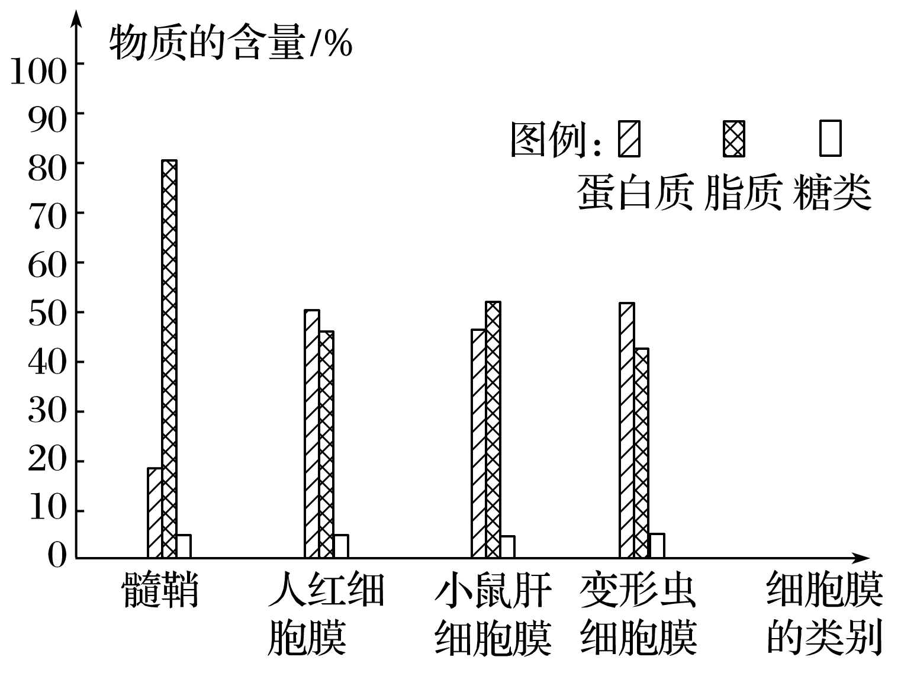
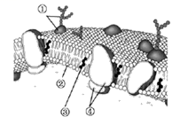
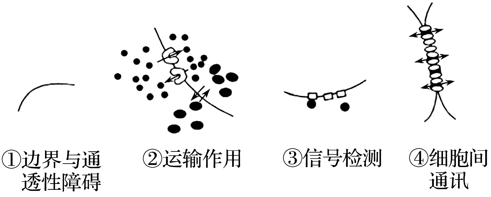
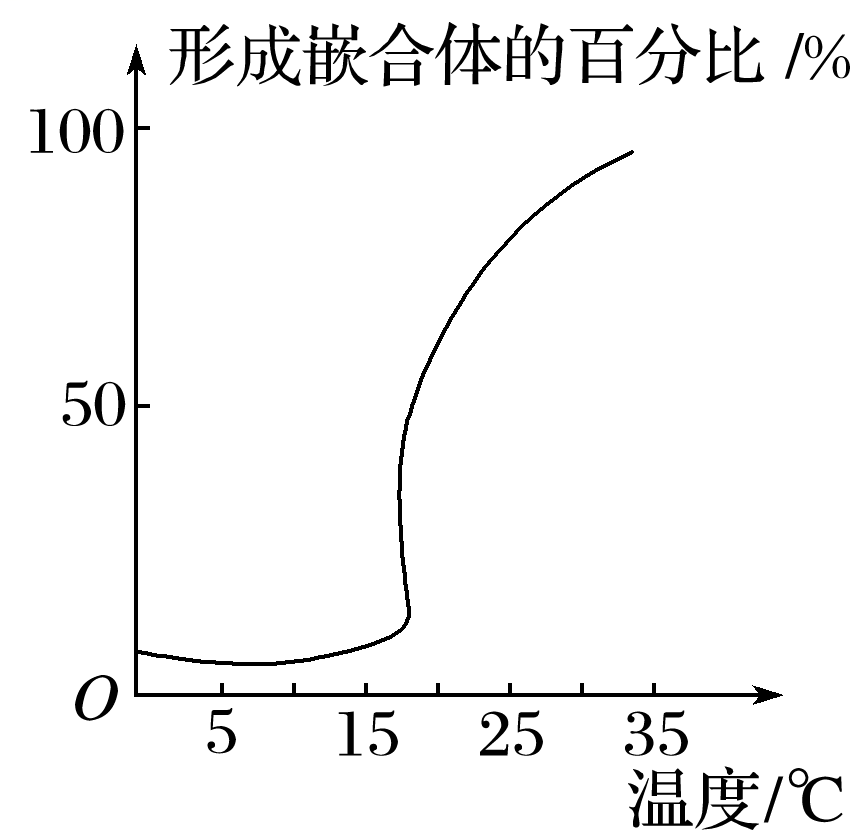
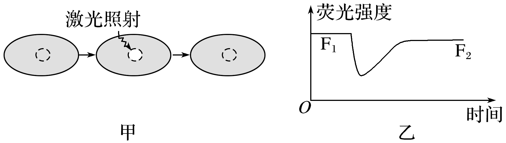
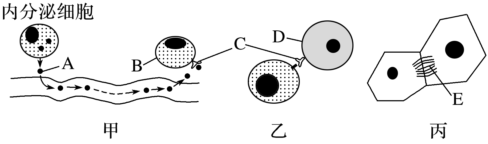

# TP00023

::: tip 基本信息

科目 : 生物

测试范围 : 高一上册

测试主题/单元：**第三章 第一节 练习**

要求 : 80%^

试题：T0000446-T0000459

::: 

[T0000446] 细胞膜具有控制物质进出细胞的功能。下列有关这一功能的解释，不正确的是(　　)

A．由于细胞膜的存在，致病的病毒、细菌等都不能进入细胞

B．细胞不需要或对细胞有害的物质一般不能进入细胞

C．细胞中的重要成分(如核酸等)不会流失到细胞外

D．细胞需要的营养物质可以进入细胞

[T0000447] 下列关于细胞膜功能的叙述，不正确的是(　　)

A．细胞间的信息交流，大多与细胞膜的结构有关

B．细胞间的信息交流使生物体作为一个整体完成生命活动

C．相邻两个细胞的信息交流只能靠细胞间直接接触

D．细胞膜保障了细胞内部环境的相对稳定

[T0000448] 如图表示细胞膜的部分亚显微结构模型，下列有关叙述正确的是（　　） 
!

A．罗伯特森在电镜下看到细胞膜清晰的“暗-亮-暗”三层结构中，

提出生物膜都由脂质—蛋白质—脂质三层结构构成

B．图中②③结构构成细胞膜的基本支架

C．糖类在细胞膜上只以①的形式存在

D．细胞膜的功能特点与结构②和③均有关

[T0000449] 细胞膜非常薄，使用高倍显微镜也难以看清它的真面目，人们对细胞膜化学成分与结构的认识经历了很长的过程。下列关于细胞膜成分和结构探索历程的叙述正确的是(　　)

A．欧文顿通过对膜成分的提取和化学分析提出膜是由脂质组成的

B．对细胞膜表面张力的研究推测出膜中附有蛋白质

C．尼科尔森提出电镜下观察到的细胞膜都由蛋白质—脂质—蛋白质三层结构构成

D．流动镶嵌模型认为细胞膜的磷脂分子和蛋白质分子都是可以运动的

[T0000450] 使用超滤膜可以彻底滤除掉水中的细菌、铁锈、胶体等有害物质，同时又保留水中原有的微量元素和矿物质，补充我们日常所需。超滤膜模拟的是细胞膜能(　　)

A．将细胞与外界环境分隔开的功能          B．控制物质进出细胞的功能

C．细胞膜的保护功能                      D．进行细胞间信息交流的功能

[T0000451] 科学家取哺乳动物或人的成熟红细胞放进蒸馏水中，造成红细胞破裂出现溶血现象，再将溶出细胞外的物质冲洗掉，剩下的结构在生物学上称为“血影”，那么，血影的主要成分有(　　)

A．无机盐、蛋白质      B．蛋白质、糖类      C．脂肪、蛋白质 	D．脂质、蛋白质

[T0000452] 右图表示不同的细胞膜组成成分的含量，图示能说明的是(　　)
!

A．构成细胞膜的主要成分是蛋白质、脂质和糖类

B．细胞膜中的脂质和蛋白质含量的变化与细胞膜的功能有关

C．细胞膜的功能越简单，所含蛋白质的数量越多

D．蛋白质在进行细胞间的信息交流中具有重要作用

[T0000453] 质膜的流动镶嵌模型如下图所示，①~④表示物质。

下列叙述正确的是（　　）

  !

A．①是亲水的，导致它只分布在膜的一侧

B．有些膜蛋白能识别来自细胞内的化学信号

C．脂双层的形成是由③的物理和化学性质决定的

D．此图为电子显微镜下观察到的细胞膜亚显微结构

[T0000454] 科学家通过实验发现：将分散的小鼠组织细胞和人组织细胞进行混合培养，同种细胞之间会出现“识别”现象，最终导致小鼠组织细胞黏连在一起，人组织细胞黏连在一起，对此现象合理的解释是(　　)

A．两种细胞膜所含的主要成分不一样            B．两种细胞膜的结构不一样

C．两种细胞膜上糖蛋白的种类不一样            D．两种细胞所需要的营养物质不一样

[T0000455] 下图表示细胞膜部分功能模式图。据图分析，下列说法错误的是(　　)

A．功能①在生命起源中具有关键作用

B．功能②表示进入细胞的物质对细胞都有利

C．胰岛素调控生命活动可用图中③表示

D．相邻的植物细胞可通过功能④进行信息交流

[T0000456] 磷脂是组成细胞膜的重要成分，这与磷脂分子的头部亲水、尾部疏水的性质有关。某研究小组发现植物种子细胞以小油滴的方式存油，每个小油滴都由磷脂膜包被着，该膜最可能的结构是(　　)

A．由单层磷脂分子构成，磷脂的头部向着油滴内

B．由单层磷脂分子构成，磷脂的尾部向着油滴内

C．由两层磷脂分子构成，结构与细胞膜完全相同

D．由两层磷脂分子构成，两层磷脂的头部相对

[T0000457] 人、鼠细胞融合实验中用带有不同荧光染料的抗体标记两种细胞的膜蛋白，一段时间后两种膜蛋白能在杂种细胞膜上均匀分布形成嵌合体。如图是相关实验结果的记录，据此不能得出的结论是(　　)

A．温度超过15 ℃，细胞膜流动性开始增强     B．该实验证明膜蛋白能够运动

C．温度对膜蛋白的运动有影响                D．融合时间越长形成的嵌合体越多

[T0000458] 荧光漂白恢复技术在细胞生物学中有着非常重要的应用，包括三个步骤：将绿色荧光蛋白共价结合在膜蛋白上，细胞膜呈现一定强度的绿色；激光照射淬灭(漂白)膜上部分区域绿色荧光，被照射部分荧光蛋白将不会再发出荧光；检测淬灭部位激光照射前后荧光强度的变化情况。实验过程如图甲，结果如图乙。下列说法错误的是(　　)

A．图乙结果说明细胞膜具有流动性

B．应用该技术可以测定膜上单个蛋白质的流动速率

C．降低实验温度，漂白区域荧光强度恢复到F2的时间将延长

D．理论分析，漂白区域恢复足够长的时间荧光强度F2仍小于F1

[T0000459] 以下是细胞间信息交流的三种形式，请据图回答问题：

(1)A是____________，需要通过______________的运输到达B________。

(2)C的化学本质是____________，它可以接受另一细胞发出的________。

(3)E是____________，能使植物细胞相互连接，也具有信息交流的作用。精子和卵细胞之间的识别和结合相当于甲、乙、丙中的图________。

(4)细胞膜含有______________________等成分，B细胞膜与D细胞膜的功能差异，主要与________成分有关。

(5)除信息交流外，细胞膜还具有__________________、________________________等功能。

出处:25.docx

