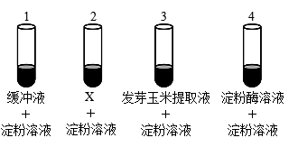
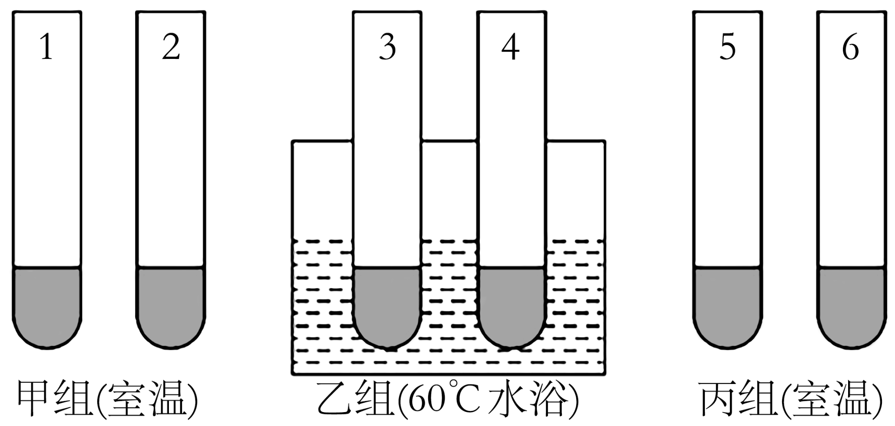
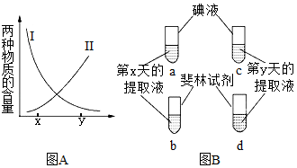

# TP00031

>科目：生物
>
>测试形式：选择题、简答题
>
>测试主题：**检测生物组织中的糖类、脂肪和蛋白质**
>
>RAW：39
>
>试题：T0000620-T0000630

[T0000620] 在还原糖、脂肪、蛋白质的鉴定实验中，对实验材料的选择，下列叙述正确的是（　　）

A．检测蛋白质时，双缩脲试剂的两种溶液需要临时等量混匀使用

B．甘蔗茎和甜菜块根都含有较多糖且近于白色，因此可用于还原糖的鉴定

C．检测花生种子中的油脂时，子叶切片经苏丹Ⅲ染色后，需用清水反复冲洗

D．常用梨、苹果等组织样液作为检测植物组织内还原糖的实验材料

[T0000621] 被彻底水解的蛋白质遇双缩脲试剂没有紫色反应。蛋白酶（其本质为蛋白质）可以彻底水解蛋白质,加热只是破坏蛋白质结构。为验证鸡蛋清中含有蛋白质,下列实验设计和结果预测,错误的是  （  ）

①需设置蛋白质标准液作为对照实验

②可对待测液先加入双缩脲试剂,然后加入蛋白酶,观察颜色变化来验证

③加热后凝固的蛋清,然后打碎制成匀浆,加入双缩脲试剂,无颜色反应

A．②	B．③	C．①③	D．②③

[T0000622] 下列关于细胞中物质鉴定的叙述，错误的是（  ）

A．将新鲜的苹果汁与斐林试剂混匀后，即可观察到溶液中出现砖红色沉淀

B．用双缩脲试剂检测生物组织中是否含蛋白质时，应先加A液，再加B液

C．检测花生子叶中的脂肪时，用苏丹III染色后需用酒精洗去浮色

D．利用颜色反应检测生物组织中的化合物时材料尽量选择白色或接近白色的

[T0000623] 生物组织中的有机物与某些化学试剂能发生特定的颜色反应，下列各项中不能通过颜色反应进行检测的是（  ）

A．用碘液检测小麦匀浆中的淀粉	B．用苏丹III染液检测花生种子中的脂肪

C．用斐林试剂检测番茄匀浆中的葡萄糖	D．用双缩脲试剂检测鸡蛋清中的蛋白质

[T0000624] 生物学研究兴趣小组对作物种子发育过程中有机物积累及转化进行动态监测。下列关于检测方法及出现结果的叙述，不正确的是（  ）

A．小麦种子加水浸泡→用小刀纵切→在切面滴加碘液→依据被染成蓝色检测淀粉

B．甜玉米籽加水研磨→离心取上清液→加斐林试剂→观察砖红色沉淀检测还原糖

C．花生种子切片→苏丹III染液染色→显微镜观察细胞内被染成橘黄色的脂肪颗粒

D．鸡蛋清加水加搅拌→加NaOH溶液→再加CuSO4溶液→依据紫色反应检测蛋白质

[T0000625] 玉米籽粒在发芽过程中淀粉含量会逐渐减小。某同学为了验证这是淀粉酶作用的结果，设计了如下实验：在1～4号试管中分别加入相应的提取液和溶液（如图所示），40℃温育30min后，分别加入适量碘液，观察试管内颜色变化。下列对实验方案及结果的评价，错误的是（  ）

A．设置试管1的意义是起对照作用

B．试管2中的X应为发芽前的玉米提取液

C．该实验不能使用斐林试剂检测实验结果

D．试管3中的颜色变化是蓝色较浅或不产生蓝色

[T0000626] 在1、3、5号试管中分别加入2mL蒸馏水，2、4、6号试管中分别加入2mL发芽的小麦种子匀浆样液，然后在1~4号试管中适量滴加斐林试剂，5、6号试管中合理滴加双缩脲试剂，摇匀。预期观察到的实验现象是（  ）

A．只有1、3、5号试管内呈蓝色	B．3组实验中甲组和乙组的实验结果相同

C．6号试管内呈紫色，其余试管内都呈蓝色	D．4号试管内呈砖红色，6号试管内呈紫色

[T0000627] 香蕉果实成熟过程中，果实中的储藏物不断代谢变化，香蕉逐渐变甜。图A中Ⅰ、Ⅱ两条曲线分别表示香蕉果实成熟过程中两种物质含量的变化趋势。现取成熟到第x天和第y天的等量香蕉果肉进行研磨，分别加入等量的蒸馏水中制成两种提取液，然后在a，b试管中各加5mL第x天的提取液，在c，d试管中各加5mL第y天的提取液（图B）。下列说法不正确的是（  ）

A．在a、c试管中各加入等量碘液摇匀后，可观察到两管均呈蓝色，但c管颜色较浅

B．在b、d试管中各加入等量斐林试剂摇匀后，可观察到两管均呈砖红色，d管颜色较深

C．现提供适量的斐林试剂的甲、乙液和蒸馏水可检测香蕉果肉是否含有蛋白质

D．图A中I、Ⅱ曲线所表示的物质的组成元素都含C、H、O

[T0000628] 请根据“生物组织中可溶性还原糖，脂肪、蛋白质的鉴定”实验，回答以下问题：

(1)现有无标签的稀蛋清、果糖、淀粉和蔗糖酶4种溶液各一瓶，实验室还有双缩脲试剂和斐林试剂，能将上述4种溶液分为两两一组的试剂是___试剂。其中不发生颜色反应的一组溶液可以用___试剂来区分，若水浴加热后出现___。则该溶液为___。

(2)鉴定黄豆组织中存在蛋白质时，先向试管内加入2mL黄豆组织样液，然后向试管内加入2mL双缩脲试剂A液，摇匀，再向试管内加入3—4滴双缩脲试剂B液，摇匀，为什么只加3—4滴双缩脲试剂B液而不能过量？（        ）

(3)鉴定花生子叶中存在脂肪的实验时，用体积分数为50%的酒精溶液的作用是（        ）

[T0000629] 市面销售的“糖心”苹果因其口感脆甜，深受市民喜爱。“糖心”苹果在成熟期甜度逐渐提高。为研究甜度增加的原因，某小组准备了斐林试剂、碘液、蒸馏水等试剂开展相关实验。回答下列问题：

(1)若需确定“糖心”苹果成熟期甜度提高与还原糖含量增加有关，应选用___________（填试剂名称）进行检测。该试剂使用时应注意（        ）

(2)若已确定果实甜度提高是由还原糖含量增加引起的，有人对还原糖的来源提出了两种不同的假设。假设1：淀粉转化成了还原糖；假设2：非糖物质转化成了还原糖。

为检验这两种假设，取成熟期第1天和第30天的苹果制成匀浆，分别加入试管A、B，并向两支试管中加入适量碘液，观察并记录A、B试管的颜色。

预测实验现象及结论：若（        ）则说明假设1成立；若（        ）则说明假设2成立。

(3)该实验小组还想继续通过实验检测苹果中是否存在蛋白质，在现有实验试剂的基础上，应先进行的操作是（        ）后再用于蛋白质的检测。如果（        ）说明苹果中存在蛋白质。

[T0000630] 根据检测生物组织中还原糖、脂肪和蛋白质的实验，回答下列问题：

(1)鉴定成熟苹果果肉中存在还原糖所用的试剂是（        ）该试剂与细胞内还原糖发生作用，形成（        ）沉淀，常见的还原糖有（        ）（答三种）。

(2)鉴定花生子叶中脂肪的实验中，能将脂肪染成橘黄色的是（        ）染液，用其染色后，要用（        ）冲洗浮色。

(3)鉴定黄豆组织中存在的蛋白质时，向组织样液中加入双缩脲试剂A液摇匀，再向组织样液中加入双缩脲试剂B液摇匀。其中双缩脲试剂B液的量只有3～4滴，而不能过量，为什么？（        ）

(4)相关实验注意事项：

①斐林试剂极不稳定，其甲液和乙液需分别配置，用时要（        ）等量混匀。

②双缩脲试剂分为A液、B液，使用时要（        ）

## 测试结果

### 要求：

### 状况：

### 补充：
