# TP00034

::: tip 基本信息

科目 : 生物

测试范围 : 高一上册

测试主题/单元：太康县第二高级中学2022--2023学年上学期第一次月考生物试题

要求 : 80%^

试题：T0000660-T0000684

::: 

[T0000661] 新冠肺炎是由新型冠状病毒引起的传染性疾病世界卫生组织（WHO）将新型冠状病毒命名为2019-nCoV。新冠肺炎疫情警示人们要养成良好的生活习惯提高公共卫生安全，下列相关叙述错误的是（    ）
A. 2019-nCoV只能在活细胞内进行增殖
B. 2019-nCoV仅含有核糖体这种细胞器
C. 高温可破坏病原体结构，煮沸处理餐具可杀死病原体
D. 戴口罩可以减少病原微生物通过飞沫在人与人之间传播

[T0000662] 关于下列a、b、c、d四种生物的叙述，不正确的是(　　)

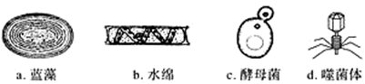

A. a和d不具有以核膜为界限的细胞核
B. a和b都能进行光合作用
C. a、b、c、d都能独立繁殖和代谢
D. a属于原核生物，b、c属于真核生物，d属于病毒

[T0000663] 如图表示低倍显微镜下观察到的人血涂片的一个视野，下列说法正确的是（    ）

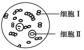

A. 圆饼形细胞Ⅰ必须经过染色才能观察到
B. 显微镜下可看到细胞Ⅰ的细胞壁、细胞膜、细胞质等
C. 转动转换器，在高倍镜下观察细胞Ⅱ时视野可能变亮
D. 为放大观察细胞Ⅱ的形态结构，需先将涂片向右下方移动

[T0000664] 如图所示为生命系统的结构层次，下列叙述正确的是（　　）

①→②→器官→③→个体→④→⑤→⑥→⑦
A. 酵母菌和乳酸菌只属于结构层次①
B. 一间充满生机的温室属于结构层次④
C. 草原上的所有动物属于结构层次⑤
D. 绿色开花植物无结构层次③

[T0000665] 下面是用显微镜观察时的几个操作步骤，要把显微镜视野下的标本从图中的A（10×物镜）转为B（40×物镜），下列有关说法正确的是（　　）

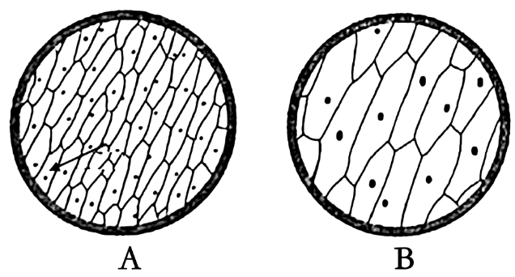

A. 若A中视野范围中看到64个细胞，换成B后看到16个细胞
B. 换成B后应使用细准焦螺旋进行调节
C. 若在A中看到模糊的物像，换成B后就可以看到清晰的物像
D. 若B中的细胞是A中箭头所指细胞，则应是将A的玻片往右上方移动后观察到的

[T0000666] 细胞内的生物大分子是由单体连接成的多聚体。下图中甲、乙、丙为细胞内三种重要的大分子物质，a和b为其组成单位(T2噬菌体属于DNA病毒)，请结合此图判断，下列叙述正确的是（    ）

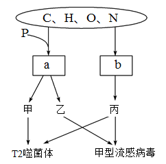

A. 在人体细胞内，a共有4种
B. 细菌细胞中含有甲、乙、丙，其中甲是遗传物质
C. b可与双缩脲试剂发生紫色反应
D. b种类、数目和排列顺序决定了丙的多样性

[T0000667] 油菜种子成熟过程中部分有机物的变化如图所示，将不同成熟阶段的种子匀浆后检测，结果正确的是（ ）

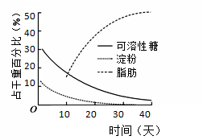

选项

| 选项 | 取样时间 | 检测试剂   | 检测结果 |
| ---- | -------- | ---------- | -------- |
| A    | 第10天   | 斐林试剂   | 不显色   |
| B    | 第20天   | 双缩脲试剂 | 不显色   |
| C    | 第30天   | 苏丹Ⅲ试剂  | 橘黄色   |
| D    | 第40天   | 碘液       | 蓝色     |

A. A	B. B	C. C	D. D

[T0000668] 如图表示一个由200个氨基酸构成的蛋白质分子，下列叙述正确的是（    ）

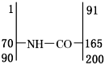

A. 该分子中含有198个肽键结构
B. 这200个氨基酸中至少有200个氨基
C. 合成该蛋白质时相对分子质量减少了3582
D. 该蛋白质中至少含有3个游离的氨基

[T0000669] 生命科学研究中常用“建模”的方法表示微观物质的结构，图中甲~丙分别表示植物细胞中常见的三种大分子有机物，每种有机物都有其特定的基本组成单位。则与下图中甲〜丙对应完全吻合的是哪一组(   )

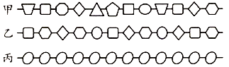

A. DNA、RNA、纤维素	B. 多肽、RNA、淀粉
C. DNA、蛋白质、糖原	D. 核酸、多肽、糖原

[T0000670] 鉴定尿中是否有蛋白质常用加热法来检验。结合如图蛋白质加热过程中的变化，据此判断下列有关叙述正确的是（　　）

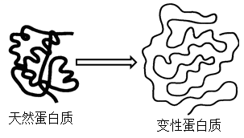

A. 沸水浴加热后，构成蛋白质的肽链充分伸展并断裂
B. 食盐作用下析出的蛋白质也发生了变性
C. 变性后蛋白质可与双缩脲试剂产生紫色反应
D. 蛋白质肽链的盘曲和折叠被解开后，其特定功能并未发生改变

[T0000671] 由1分子磷酸、1分子碱基和1分子化合物a构成的化合物b如图所示。下列相关叙述正确的有（　　）

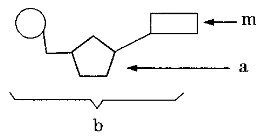

①若m为腺嘌呤，则b肯定为腺嘌呤脱氧核苷酸
②若a为核糖，则b为DNA的基本组成单位
③若m尿嘧啶，则DNA中不含b这种化合物
④组成化合物b的元素有C、H、O、N、P 5种
⑤若a为核糖，则人体细胞内由b组成的核酸主要分布在细胞核中
⑥幽门螺杆菌体内含的化合物m共4种
A. 1个	B. 2个	C. 3个	D. 4个

[T0000672] 如图是细胞内几种有机物及其功能的关系图，m1、m2、m3、m4分别是有机物M1、M2、M3、M4的组成单位。下列说法正确的是

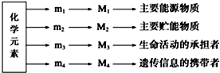

A. 在SARS病毒体内，将M4彻底水解，得到5种碱基
B. M3种类的不同，一定是因为m3的种类、数量和排列顺序的不同
C. M3具有物质运输、催化、调节、免疫等多种功能
D. 相同质量的M1和M2被彻底氧化分解，则M1的耗氧量多

[T0000673] 科学家使用巯基乙醇和尿素处理牛胰核糖核酸酶（牛细胞中的一种蛋白质），可以将该酶去折叠转变成无任何活性的无规则卷曲结构。若通过透析的方法除去导致酶去折叠的尿素和巯基乙醇，再将没有活性的酶转移到生理缓冲溶液中，经过一段时间以后，发现核糖核酸酶活性得以恢复。下列叙述不正确的是
A. 胰核糖核酸酶空间结构的形成与肽链的盘曲、折叠方式等有关
B. 这个实验说明环境因素能影响蛋白质的空间结构而影响其功能
C. 巯基乙醇和尿素处理均破坏了胰核糖核酸酶中的肽键导致变性
D. 胰核糖核酸酶和胰蛋白酶的单体中至少有一个氨基和一个羧基

[T0000674] 如图所示是一种叶绿素分子（图甲）和血红素分子（图乙）的局部结构简图。下列说法错误的是（　　）

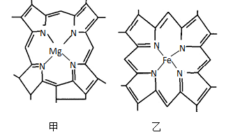

A. Mg和Fe分别是绿色植物和人体生命活动不可缺少的元素
B. 植物缺Mg会影响叶绿素的合成，进而影响植物的光合作用
C. 上图说明细胞中的无机盐主要以化合物形式存在
D. 血红素参与构成的血红蛋白是由多个氨基酸经脱水缩合形成的起运输作用的蛋白质
[T0000675] N个氨基酸组成了M个多肽，其中有Z个是环状肽，据此分析下列表述错误是（    ）
A. M个多肽一定含有的元素是C、H、O、N，还可能含有S
B. M个多肽至少含有的游离氨基数和游离羧基数均为M-Z
C. 将这M个多肽完全水解为氨基酸，至少需要N-M+Z个水分子
D. 这M个多肽至少含有N-M+Z个O原子

[T0000676] 假如蛋白酶1作用于苯丙氨酸（C9H11NO2）羧基端的肽键，蛋白酶2作用于赖氨酸（C6H14N2O2）两侧的肽键。某四十九肽分别经酶1和酶2作用后的情况如图，下列叙述正确的是（　　）

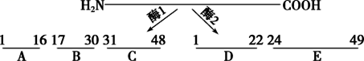

A. 此多肽中含2个赖氨酸
B. 苯丙氨酸位于四十九肽的17、31、49位
C. 短肽D、E与四十九肽的氧原子数相同，N原子数减少2个
D. 适宜条件下酶1和酶2同时作用于此多肽，可形成5条短肽

[T0000677] 如图表示细胞间信息交流的三种方式，下列相关叙述错误的是（　　）

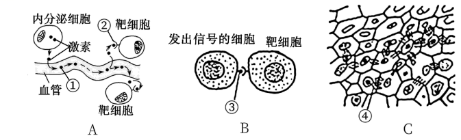

A. 图C中植物细胞依靠胞间连丝交流信息，但不能进行物质交换
B. 精子和卵细胞受精时要发生图B所示的信息交流方式
C. 图A、图B中靶细胞表面上的受体与信号分子结合，从而接收信息
D. 胰岛素调节过程中，信息交流方式与图A所示相同

[T0000678] 在流动镶嵌模型提出后，研究人员又提出了脂筏模型：脂筏是质膜上富含胆固醇和鞘磷脂的微结构域，其中的胆固醇就像胶水一样，对鞘磷脂亲和力很高，并特意吸收或排除某些蛋白质，形成一些特异蛋白聚集的区域，结构模型如下图所示，下列叙述不正确的是（　　）

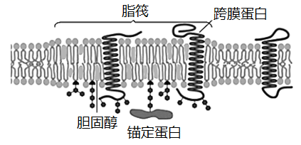

A. 质膜的基本支架是磷脂双分子层
B. 脂筏的存在不影响膜的流动性
C. 破坏胆固醇会导致脂筏结构解体
D. 脂筏可能与细胞间的信息传递有关

[T0000679] 如图为细胞间信息交流的三种方式，下列有关叙述错误的是（    ）

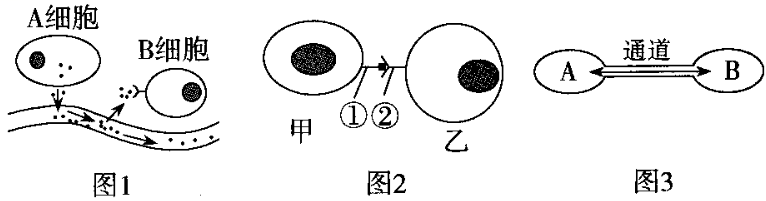

A. 图1中的B细胞和图2中的乙细胞都可称为靶细胞
B. 细胞分泌的化学物质(如激素)是通过图2方式传递信息的
C. 精子和卵细胞受精时要发生图2所示的信息交流方式
D. 图3体现了细胞通过通道传递信息，如高等植物细胞之间通过胞间连丝传递信息

[T0000680] 如图表示细胞间信息交流的两种方式，下列相关说法不正确的是（    ）

A. ①是与膜结合的信号分子，②是膜上接收信号的受体
B. A细胞是发出信号的细胞，B细胞是接收信号的细胞
C. 高等植物细胞之间有不同于图中所示的信息交流方式
D. 细胞与细胞之间的信息交流都必须依赖于膜上的受体

[T0000681] 如图是几种生物或细胞的结构模式图，请据图回答：

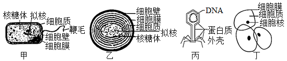

（1）最有可能属于病毒的是_____，病毒的生活和繁殖必须在_____内才能进行。
（2）图中能进行光合作用的是_____，能完成此生理过程是因为其细胞内含有藻蓝素和_____，因此它是一类营（填“自养”或“异养”）生活的生物。
（3）图中甲、乙属于_____细胞，它们的DNA位于_____中。甲、乙在结构上不同于丁细胞的最显著特点是_____。
（4）甲、乙、丁细胞的统一性表现在均有细胞质_____、_____、和_____。

[T0000682] 请根据下列结构模式图回答问题

（1）图中属于真核细胞的是_________（填标号），判断依据是___________ 。
（2）图中能进行光合作用的是___（填标号），在它们的光合作用色素中都有__， 图中能表示生命系统个体层次的是_______（填标号）。
（3）图中的C属于____（“原核”或“真核”）细胞，它的遗传物质主要位于______。若用目镜为5×和物镜为10×的显微镜观察，其为一个面积是0.16平方毫米的正方形，如果换成物镜为40×再观察，其面积将是___平方毫米。
（4）图E生物的化学组成有______,该生物要依赖_才能生活。图中可以引起＂赤潮＂的生物是（    ）、_____。
（5）若在低倍镜下发现有一异物，当移动装片时，异物不动，转换高倍镜后，异物仍可观察到，此异物可能存在于________。

[T0000683] 如图分别表示生物体内某些物质的结构模式图，据图回答下列问题：

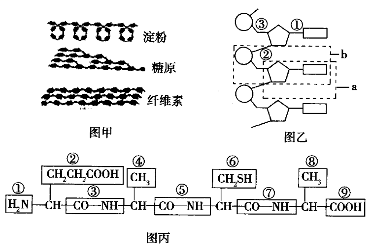

（1）图甲中的三种物质都是由许多单糖连接而成的，其中属于动物细胞中的物质是____，其基本单位是______。
（2）若图乙所示化合物为RNA，其基本组成单位是______，可用图中字母____表示，各基本单位之间是通过_____（填“①”、“②”或“③”）连接起来的。
（3）图丙所示化合物的名称是______，是由______种氨基酸经_____过程形成的，该化合物中有_____个羧基。图中含有肽键的是_______（填序号）。

[T0000684] 神经肽Y是由36个氨基酸分子组成的一条多肽，其与动物的摄食行为和血压调节具有密切关系。如图是人体中神经肽Y的部分氨基酸组成（各氨基酸残基用3个字母缩写表示）和谷氨酸（Glu）的结构简式，请回答下列问题：

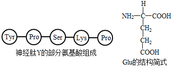

（1）连接Tyr和Pro的化学键称为_______________，这样的化学键在神经肽Y中有_______________个。
（2）组成神经肽Y的氨基酸中含有2个Glu，则神经肽Y含有的游离羧基至少有_______________个。
（3）若组成鱼和人的神经肽Y的氨基酸种类和数目相同，但两者的结构存在一定的差别，那么造成这种差别的原因可能是______________________________。
（4）从鱼体内提纯神经肽Y并喂养小鼠后，小鼠的摄食行为和血压没有发生变化，原因是____________________。

出处;41 