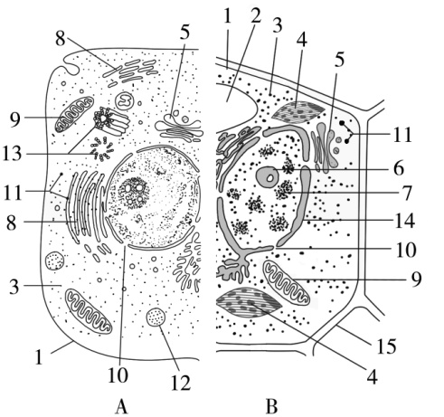
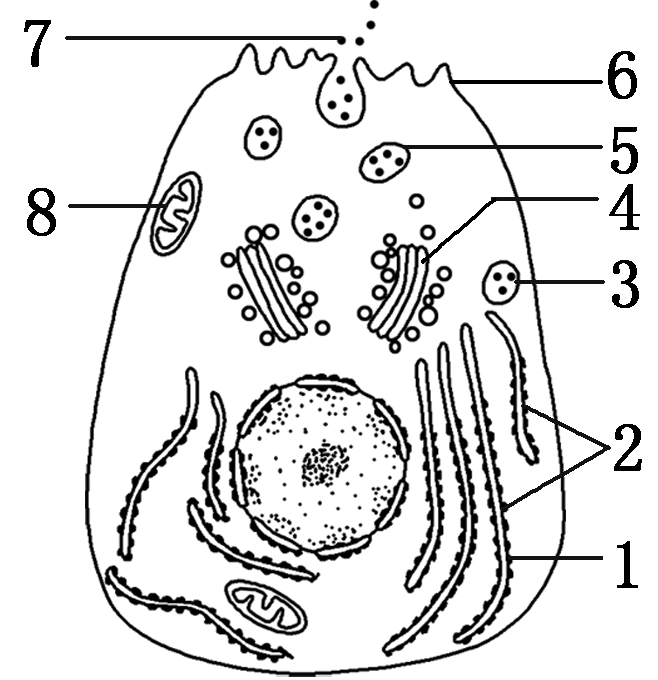
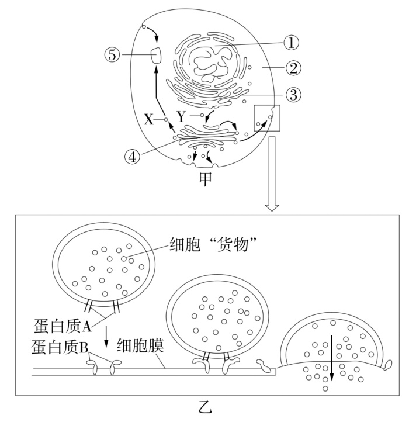
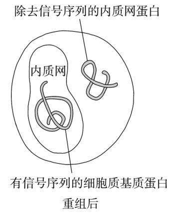
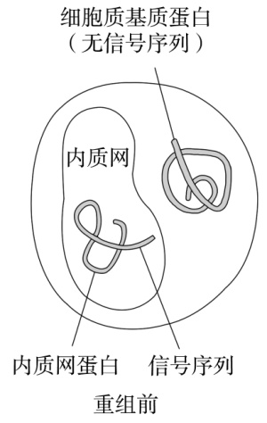

# TP00035

::: tip 基本信息

科目 : 生物

测试范围 : 高一上册

测试主题/单元：细胞器之间的分工合作

要求 : 80%^

试题：T0000685-T0000698

::: 

[T0000685] 被喻为植物细胞的“养料制造车间”“蛋白质的加工、分类和包装的‘车间’及‘发送站’”“生产蛋白质的机器”的依次是(　　)

A．叶绿体、高尔基体、核糖体

B．叶绿体、液泡、核糖体

C．线粒体、内质网、高尔基体

D．叶绿体、高尔基体、内质网

[T0000686] 郁金香“海宝”是荷兰一位郁金香育种者历时20年培育而成的，其花朵呈鲜橙色，十分鲜亮夺目，其亮丽的颜色主要是由下列哪种结构决定的(　　)

A．叶绿体　　　　　　	B．液泡

C．线粒体 		D．细胞质

[T0000687] “分子伴侣”在细胞中能识别正在合成的多肽或部分折叠的多肽，并与多肽的一定部位相结合，帮助这些多肽折叠、组装或转运，但其本身不参与最终产物(蛋白质)的形成。根据所学知识推测“分子伴侣”主要存在于(　　)

A．核糖体 		B．内质网

C．高尔基体 		D．溶酶体

[T0000688] 为了研究豚鼠胰腺腺泡细胞内分泌蛋白的形成和分泌过程，研究人员向胰腺腺泡细胞内注射一定量3H标记的亮氨酸后，追踪观察放射性在细胞内的分布情况，正确的结果是(　　)

A．培养一段时间后，细胞膜外能观察到3H标记

B．内质网是首先观察到3H标记的细胞器

C．高尔基体是首先观察到3H标记的细胞器

D．3H标记先出现在高尔基体后出现在内质网

[T0000689] 下列关于细胞器与对应功能的叙述，错误的是（　）

A.内质网：参与物质合成和物质运输

B.高尔基体：分泌蛋白的加工、分类、包装和发送

C.线粒体：有氧呼吸的主要场所，可根据代谢需要集中分布于某一区域

D.溶酶体：合成水解酶，降解失去功能的细胞组分

[T0000690] 硅肺是工矿企业常见的职业病，其发病原因是当人的肺部吸入大量硅尘后，硅尘会破坏溶酶体膜，导致其内部的酸性水解酶进入细胞质基质（pH7.2左右），破坏细胞的其他结构，最终导致肺部功能受损。下列分析正确的是（　）

A.溶酶体广泛存在于原核细胞和真核细胞中

B.溶酶体仅能分解“外来”的“非己”物质或结构，如侵入细胞的病毒、细菌

C.当酸性水解酶释放到细胞质基质中时，酶的活性会下降

D.溶酶体中的酸性水解酶是溶酶体自身合成的

[T0000691] 科学家在研究蚕丝腺细胞的亚显微结构时，取得的数据如下表。研究结果表明，凡高产品种，蚕丝腺细胞中粗面内质网特别发达，这一事实能够说明（　）

| 粗面内质网含量 | n    | 2n   | 3n   |
| -------------- | ---- | ---- | ---- |
| 蚕丝产量       | p    | 1.5p | 2p   |

A.蚕丝蛋白在粗面内质网上合成

B.蛋白质在核糖体上合成

C.粗面内质网与蚕丝蛋白的加工、运输有关

D.高尔基体与蛋白质分泌有关

[T0000692] ［不定项选择］下列关于细胞器之间协调配合的说法，正确的是（　）

A.原核细胞细胞器种类少，因此无法正常进行各项生命活动

B.细胞中一种细胞器的功能，不能被另一种细胞器替代

C.内质网的膜成分可以直接成为高尔基体膜的一部分

D.高尔基体在细胞内与其他结构相联系，相当于“交通枢纽”

[T0000693] 蓖麻毒素是一种分泌蛋白，它能使真核生物的核糖体失去活性。蓖麻细胞分泌蓖麻毒素的过程是需要通过高尔基体以囊泡的形式将蓖麻毒素运输至液泡，在液泡中加工成成熟的蓖麻毒素，再被分泌至细胞外。下列说法错误的是（　）

A.蓖麻毒素使核糖体失去活性会阻碍细胞合成蛋白质

B.蓖麻毒素的加工需要内质网、高尔基体和液泡的参与

C.成熟的蓖麻毒素可独立穿出液泡膜进而分泌至细胞外

D.蓖麻毒素在液泡中成熟可以防止其破坏自身核糖体

[T0000694] 叶绿体和线粒体是细胞内的“能量转换站”。下列关于叶绿体和线粒体的叙述，正确的是（　）

A.线粒体和叶绿体均依靠内膜折叠来增大膜面积

B.线粒体和叶绿体的基质中均含有染色质、RNA和核糖体

C.观察细胞质的流动，可利用细胞质中的叶绿体的运动作为标志

D.破伤风杆菌分泌外毒素（一种蛋白质）离不开线粒体的供能

[T0000695] 下图为动物、植物细胞二合一亚显微结构模式图，请据图回答：

（1）图中表示动物细胞亚显微结构的是　　　　（填“A”或“B”）部分，因为该部分有［　］ 　  　，没有［　］ 　 　　、［　］ 　　　、［　］ 　　　　。

（2）若图中的动物细胞是心肌细胞，则细胞中数量显著增多的细胞器是［　］ 　　　。与动物细胞有丝分裂有关的细胞器是［　］ 　　　。

（3）B中含有色素的细胞器是［　］ 　　和［　］ 　	　　。若B为植物根尖成熟区细胞，则应该没有［　］ 	　　。

[T0000696] 在一定时间内使用某种动物细胞吸收放射性同位素标记的氨基酸，经检查发现放射性同位素先后出现在图中[2]、[1]、[3]、[4]、[5]、[6]、[7]部位。请据图回答下面的问题：

(1)图中[1]、[4]、[6]分别代表的结构是____________、____________、____________。

(2)图中[7]是________，是由[2]________合成的，请举[7]的一个具体实例，如______________。

(3)[1]的功能是______________________。[3][5]都叫________，分别由图中的__________和__________形成。

(4)[4]的功能是_________________________。

(5)[7]的合成、加工、运输过程所需的大量能量由[　　]________供给。

(6)由此可以看出，细胞内的生物膜在____________和____________上有一定的连续性。

[T0000697] 2013年诺贝尔生理学或医学奖授予了三位科学家，因为他们解开了调控运输物在正确时间投递到细胞中正确位置的分子原理，也就是细胞通过囊泡精确地释放被运输的物质。甲图表示细胞通过形成囊泡运输物质的过程，乙图是甲图的局部放大。不同囊泡介导不同途径的运输，图中①～⑤表示不同的细胞结构。请分析回答以下问题：

（1）甲图中囊泡Y由［　］ 　　　经“出芽”形成，到达［　］ 　　　　并与之融合。

（2）乙图中的囊泡能够精确地将细胞“货物”运送到相应位置并分泌到细胞外，据图推测其可能的原因是　　　　　　　　　　　，此过程体现了细胞膜具有　　　　　　的功能。

（3）细胞除了可以通过形成囊泡运输物质之外，离子和较小的分子可以通过跨膜运输选择性地进出细胞，细胞膜具有选择透过性的结构基础是　　　	　。

[T0000698] 正常细胞中进入内质网的蛋白质含有信号序列，没有进入内质网的蛋白质不含信号序列。科研小组除去内质网蛋白的信号序列后，将信号序列和细胞质基质蛋白重组，重组前和重组后蛋白质在细胞中的分布如下图所示。请回答下列问题：

    

（1）根据图示结果可知，核糖体上合成的蛋白质能否进入内质网取决于　　　　　　　　，该实验说明信号序列对所引导的蛋白质　　

　　（填“有”或“没有”）特异性。

（2）真核细胞中，与分泌蛋白合成和加工相关的具膜细胞器有　　　　　　　　。研究发现，核糖体合成的分泌蛋白有信号序列，而从内质网输出的蛋白质不含信号序列，推测其原因可能是　　　　　　　　　　　　　　　　　。分泌蛋白能通过囊泡运输的方式分泌到细胞外，这体现了细胞膜的　　　　　　　　的功能。

（3）葡萄糖激酶在葡萄糖转化为丙酮酸的过程中具有重要的催化功能，在核糖体上合成的葡萄糖激酶没有信号序列，则细胞中葡萄糖激酶分布的场所是　　　　　　	　　。

出处：26.docx