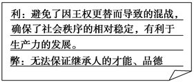
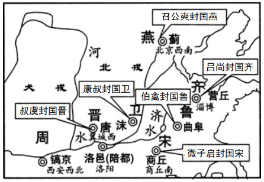
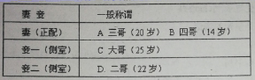

# TP00036

>科目：历史
>
>测试形式：选择题、简答题
>
>测试主题：**夏、商、西周的政治制度**
>
>RAW：44
>
>试题：T0000699-T0000736

[T0000699] （2020·湖北武汉高一期末）下表是对于同一历史事件的不同记载，解读下表可知，在当时

注：益，即伯益，禹时期的贤能之人

A．分封制引发诸侯纷争	B．血缘继承原则逐渐得到确立

C．皇帝制危害政权稳定	D．“家天下”和平取代“公天下”

[T0000700] （2020·嫩江市高级中学高一月考）记好笔记是学好历史的前提，下图是某同学的笔记片断，请指出其试图探索的历史主题是

A．禅让制

B．分封制

C．王位世袭制

D．科举制

[T0000701] （2020·河北易县中学高一期中）商汤，姓子名汤。商的祖先契助大禹治水有功封于商地，商汤时建都于亳（今河南商丘）。后逐渐强大起来，又夏桀残暴无道，遂起兵征讨夏，大败夏军，建立商朝。以下对材料的解读正确的是

A．商汤灭夏是经过牧野之战	B．商在中原建立了稳固的政权

C．商的祖先因为军功被分封于商地	D．商王实现了权力的高度集中

[T0000702] （2020·北京市平谷区第五中学高一月考）商朝的国家管理结构是

A．禅让制	B．科举制	C．行省制	D．内外服制度

[T0000703] （2020·广东惠州高一期末）商周时期，征服者居住于有山溪之险的中央区域，称为乡，乡里的居民需要服兵役。被征服者则居住于四周的平坦区域，一般情况下不用服兵役。区别对待的目的可能是

A．维护中央集权	B．打击地方势力

C．加强君主专制	D．保障农业生产

[T0000704] （2020·河南省信阳市第六高级中学高二月考）迄今为止，在殷墟发现的近15万片带字甲骨中，其中除极少数为商王室记事之用外，其余的上至“国之大事”的祭祀战争，下至风雨的有无、出入的吉凶等，商王无不求之于占卜，一切依从占卜的结果而行事。这表明商代

A．王权受到神权制约	B．行政效率十分低下

C．神权政治色彩浓厚	D．社会秩序相对稳定

[T0000705] （2020·江西上高二中高一期末）《礼记》记述了贵族朝会的列位礼节：天子南向而立；三公，中阶之前；诸侯，阼阶（东台阶）之东；诸伯，西阶之西；诸子，门东……九夷，东门外；八蛮，南门外。与此相关的政治制度是

A．分封制	B．三公九卿制

C．郡县制	D．郡国并行制

[T0000706] （2020·巴东县第二高级中学高一月考）周武王灭商后，封商纣王之子武庚于殷地，称邶国。史书记载“殷民大悦”。后武庚叛乱被杀，原来属于武庚的封地被一分为二，一部分封给未参加叛乱的纣王之兄微子启，国号宋（见如图）。这样做的目的是

A．强化血缘认同	B．维护社会稳定

C．实现贵族平等	D．加强直接管理

[T0000707] （2020·云南高一期末）“封建制度”中“封建”的原始含义，即“封”土而“建”国，“封”之本义起始于“丰”字，在甲骨文与金文中，其字形状如“植树于土堆”，故“封”是“疆界”“田界”之意。“建”乃由“封”而来，指“建国立法”。这一制度在古代最早应指

A．世袭制	B．宗法制	C．礼乐制	D．分封制

[T0000708] （2020·湖南宁乡一中高一开学考试）费孝通先生曾将中国古代的某一制度描述为“差序格局”，即“以己为中心，按照……有差等的次序形成的关系网络”。这种差序格局的结构方式普遍存在于中国传统社会之中。其中，父子、兄弟关系是最基本的层次，是“差序格局”的模板，其他各个层次都从这里获得其构造原则，如同乡关系、师徒关系、君臣关系等。据此可知，“差序格局”

A．产生于儒家三纲五常思想

B．可能阻滞社会结构的更新

C．使先秦血缘政治得以延续

D．成为社会等级的表现形式

[T0000709] 周幽王当政时，为博宠妃褒姒一笑，竟在没有敌寇的情况下，命令城防举烽火。结果，诸侯以为自己的天子遇到了大敌，纷纷率兵救难勤王。即使到了春秋中叶，还出现过“诸侯城周”的勤王举动。这反映了分封制使

A．周王拥有绝对权力

B．周朝有效控制边疆

C．宗法等级秩序森严

D．权力中心意识明确

[T0000710] （2020·漠河县高级中学高二月考）商代的甲骨文目前仅集中出现于殷墟一地，而周朝的青铜铭文则遍布四面八方。这表明在周朝

A．各地的经济文化联系显著加强

B．汉字开始成为一种成熟的文字

C．青铜器广泛应用于日常生活

D．贵族阶级丧失了文化话语权

[T0000711] 白寿彝在《中国通史》中认为，（西周）所有新建的封国都是少数周族的贵族统治多数被征服族人，其土既非周人所有，其民也与周人不类，这些新来者的统治地位，如果没有坚强的武力作其后盾是支持不住的。这表明

A．分封具有武装殖民性质	B．血缘关系是分封制基础

C．新来统治者遭坚决反对	D．周朝军事实力非常强大

[T0000712] （2020·江苏启东中学高一开学考试）周人经过克殷之战和周公三年东征，消灭了许多地方势力，造成了广大地区的权力真空，周得以“制五等之封，凡千百七十三国”。这说明分封制

A．以政治权力重构为前提

B．从西周时期开始实行

C．确立周代基本政治原则

D．稳定西周的统治范围

[T0000712] （2020·漠河县高级中学高二月考）周代等级层次纷繁，社会统治权力亦层层相叠压，周王的地位虽然至高无上，但直接臣属于他的仅限于诸侯及周王朝的公卿一级，各国诸侯虽然不敢觊觎周王之位，但很少有与周王同心同德者。这表明周代

A．权力体系内部蕴含分裂的因素

B．天子尚未拥有国家的最高权力

C．家国同构促进周代稳定与发展

D．血缘关系与政治关系紧密结合

[T0000713] （2020·长春市第二实验中学高二期末）《左传》中有“楚子问鼎之大小轻重”的记载，《战国策》等书也有齐、秦等国试图从周天子手中夺鼎的记录，上述记载折射出春秋战国时期

A．贵族政治难以为继	B．西周王室权威动摇

C．分封体制走向瓦解	D．诸侯纷争局面形成

 

[T0000714] （2020·海南枫叶国际学校高一期末）《中国人史纲》中说：“封建制度最重要的问题是权力的继承……但父亲遗留下来的如果是一个不能均分的宝座，或是一个不能均分的世袭爵位，只能由一个儿子继承时，问题就发生了。必须有适当的方法解决，才可以保持国家和家族的完整。”西周时“适当的方法”是指

A．分封制	B．宗法制	C．世袭制	D．禅让制

[T0000715] （2020·四川省泸县第一中学高一月考）商代的王位继承，既有传子者，也有传弟者。继承制度的不确定，极易造成统治阶级内部争权夺利的斗争，不利于王朝稳定。为改变这一局面，西周统治者实行了

A．禅让制

B．嫡长子继承制

C．分封制

D．王位世袭制

[T0000716] （2020·嘉祥县第一中学高一期末）观察下表，在西周时期，有资格继承王位的是

A．A	B．B	C．C	D．D

[T0000717] 据《史记·殷本纪》载，从开国之君成汤到亡国之君帝辛共17代30王，其中以弟继兄为王者有14王，以子继父为王者有10王。而《史记·周本纪》指出，自文王到幽王共12代13王，有12 王为嫡长子继位。据此可发现

A．商朝时期是嫡长子继承制之滥觞	B．周朝的王位继承争议已经杜绝

C．嫡长子继承制成为分封制的核心	D．宗法血亲是商周政治重要特征

[T0000718] （2020·宁夏兴庆银川二中高一期末）清朝学者万斯大说：“古之时，诸侯之嫡长子为世子，嗣为诸侯；其余支庶之后，族类繁多，惧其散而无统也，因制为大宗小宗之法。”材料主要说明了

A．大、小宗都有血缘关系	B．诸侯的庶子都不能取得政治权力

C．各级政权被一家一姓所掌控	D．宗法关系是维系政权的纽带

[T0000719] （2020·山东济宁高一期末）宗法制度是西周基本的政治制度，它主要是贵族之间

A．权力和财产分配原则	B．政治交往的原则

C．处理日常关系的原则	D．贸易往来的原则

[T0000720] （2020·天水市第一中学高三零模）从某种程度上说，周天子即天下之大宗，诸侯即一国之大宗。同姓诸侯相当于天子之小宗，异姓诸侯则通过婚姻与天子维持关系，全国近似于一个大家庭。自天下大宗天子以下，逐次分出小家。这说明在周代

A．诸侯拥有了与周天子同等的权利与义务

B．以分封制作为政治统治的核心

C．以宗法关系为纽带形成了国家政治结构

D．中央集权的体制已经初具规模

[T0000721] 《周礼》提出要用六种传统习俗教民安居，其中在墓葬方面要求“坟墓按族分布”，其体现了周朝

A．生活极具迷信色彩		B．王权实现高度集中

C．分封制度全面推行		D．重视维护血缘关系

[T0000722] （2020·合肥市第六中学高一期末）《尚书·召诰》曰：“（武王崩，成王年少）呜呼！有王虽小，元子（大宗）哉！”上述史实体现了中国古代某一制度，下列有关这一制度的说法正确的是

A．解决了贵族之间的纷争

B．体现了血缘和政治关系的结合

C．实现了中央对地方的有效管理

D．形成了等级森严的官僚政治

[T0000723] （2020·黄梅国际育才高级中学高二期中）有学者在研究中国早期国家时注意到：周“克殷践奄，灭国数十，而新建之国皆其功臣昆弟甥舅，本周之臣子；而鲁卫晋齐四国，又以王室至亲为东方大藩。”这表明

A．官僚体制成为当时社会的主宰

B．素养不同的人享有同等的国家管理权

C．以分封制构架国家垂直管理地方形式

D．国家制度受到宗族血缘关系的明显影响

[T0000724] （2020·苏州市第一中学校高一期中）左丘明在《春秋左氏传》中说：“礼，经国家，定社稷，序民人，利后嗣者也。”这表明“礼”在当时

A．适应了君主专制的需要	B．被各诸侯国严格遵循

C．是稳定社会秩序的规范	D．与《论语》同为经典

[T0000725] （2020·云南宣威高二期末）据史书记载，周公在辅佐成王时“制礼作乐”，制定和推行了一套维护君臣宗法和上下等级的典章制度。这表明古代礼乐

A．是对宗法制的解释		B．有助于维护统治秩序

C．维护封建等级观念		D．来源于儒家政治思想

[T0000725] 中国古代锁孔设计特别讲究，不同身份的人使用不同钥匙孔的锁：如用“一”字锁者为普通百姓，用“士”字锁者为文人士大夫，再复杂些的“上、古、山”字锁为商人常用，最复杂的是皇室和高官所使用的“古、正、尚、王”字锁。这说明

A．礼乐制度已经深入百姓日常生活	B．尊卑贵贱的封建等级制度森严

C．商品设计着眼于不同阶层的需求	D．中国古代手工业技术世界领先

[T0000726] （2020·莆田第二十五中学高二期末）《左传》记载，公元前516年，齐景公问政于晏婴。晏婴献策回答：“唯礼可以已之”，若行礼制则“民不迁，农不移，工贾不变，士不滥，官不滔，大夫不收公利”。这表明先秦的“礼”是

A．治国安邦的重要措施

B．以人为本的民本思想

C．维护宗法分封的工具

D．强化等级秩序的手段

[T0000727] （2020·昆明市官渡区第一中学高二期中）商朝信仰天帝的权威，《礼记》则有“君天下曰天子”的记载，唐代经学家孔颖达对此的注释“是上天之子，又为天所命子养下民”。由此可见周朝“礼”的文化

A．有效维护了分封制和宗法制	B．为周取代商提供了社会基础

C．为强化王权提供了理论依据	D．使神权王权的结合更为密切

[T0000728] （2020·开鲁县第一中学高一期末）周代“雅乐”实际上是西周的京畿之乐，通过制度的形式推行到各个不同等级的阶级中去，本质是“经国家，定社稷，序民人，利后嗣”。“雅乐”的传播

A．孕育了宗法制度		B．实现了思想统一

C．加强了中央集权		D．推动了文化认同

[T0000729] （2020·四川省内江市第六中学高二月考）春秋战国时期，诸侯国相互朝见成为邦交的主流。据统计，仅见于《春秋》《左传》的朝见就有101次（如表）。由此可以推论

| 受朝国 | 鲁国 | 晋国 | 齐国 | 楚国 | 越国 | 纪国 |
| ------ | ---- | ---- | ---- | ---- | ---- | ---- |
| 次数   | 39次 | 38次 | 11次 | 10次 | 2次  | 1次  |

A．周王室衰微，礼崩乐坏

B．变法运动促进相互朝见

C．井田制瓦解，土地私有

D．远交近攻影响邦国外交

[T0000730] （2020·唐山市第十一中学高二期末）殷墟甲骨卜辞大多是占卜的记录。从10多万片甲骨卜辞中可以看出，一切民事都被涂上了“神事”的色彩。商王一年之中，无日不祭；大事小事，无事不卜。这反映中国早期政治制度的特点是

A．宗法制度雏形已现端倪

B．政权与神权的紧密结合

C．政权以血缘关系为纽带

D．权力尚未实现高度集中

[T0000731] （2020·呼和浩特开来中学高二期末）有学者认为：“西周的封建社会，从纵剖面看，是一个宝塔式结构，王室之下，有几级的封建；从横切面来看，统治阶级中，也存在着以亲属血缘为基础的宗族组织”。这说明西周政治制度特点是

A．中央集权	B．家国同构	C．天下为公	D．官僚政治

[T0000732] （2020·四川省内江市第六中学高二月考）夏商的史官在职责上是史巫合一，既掌管天文术数，为统治者提供宗教式预言，又保管典籍、记录时事；周代史巫开始分离，史官被定位在“掌官书以赞治”的官僚位置上。以上史官角色意识的变化

A．反映出周代王权与神权开始分离	B．影响了后世对历史记录的认知

C．体现了周代政治理性化的趋势	D．取决于中央官僚机构职能的调整

[T0000733] （2020·长沙市明德中学高一月考）殷商时期，巫风弥漫，祭祀鬼神的现象相当普遍；西周时期，当政者认为，执政必须注重重民众需求，即使上帝百神和先公先王也曾是考虑民众愿望的“至上神”。这一变化说明西周时期

A．祭祀对象发生变化	B．民本思想逐渐显现

C．平民地位有所提升	D．族权色彩日渐浓厚

[T0000734] （2020·绥德中学高一期末）商周时期都借助于神权维护统治。商朝认为天命降于商人，西周统治者认为天命降于周王，周王便是天下共主。这一天命观变化

A．有助于促进政治认同	B．激化了西周社会矛盾

C．确立了贵族世袭特权	D．强化了西周神权统治

[T0000735] （2020·嫩江市高级中学高一月考）商周时期，国家遇到重大问题时，君主要征求自由民“国人”的意见，国人也可以通过舆论来干预朝政。这表明商周时期

A．具有原始民主遗存

B．贵族与平民存在矛盾

C．君主专制不断弱化

D．公民的政治素养较高

[T0000736] （2020·湖南天心长郡中学高一月考）《史记》中记载，我国从三皇五帝到夏商周，统治者都用占ト来决定军国大事。在多数情况下，国家大事是统治阶层商量好的，但占ト术对“天意”的传达便于统一人心。这一做法从本质上是

A．反映国家管理的随意性	B．通过垄断神权强化王权

C．统治者欺骗人民的手段	D．古人敬天畏神思想普遍

## 测试结果

### 要求：

### 状况：

### 补充：