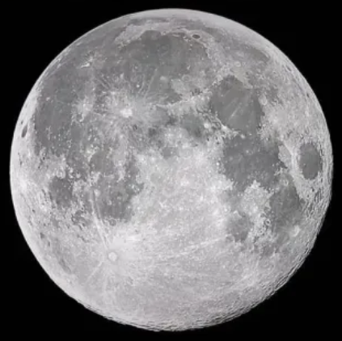
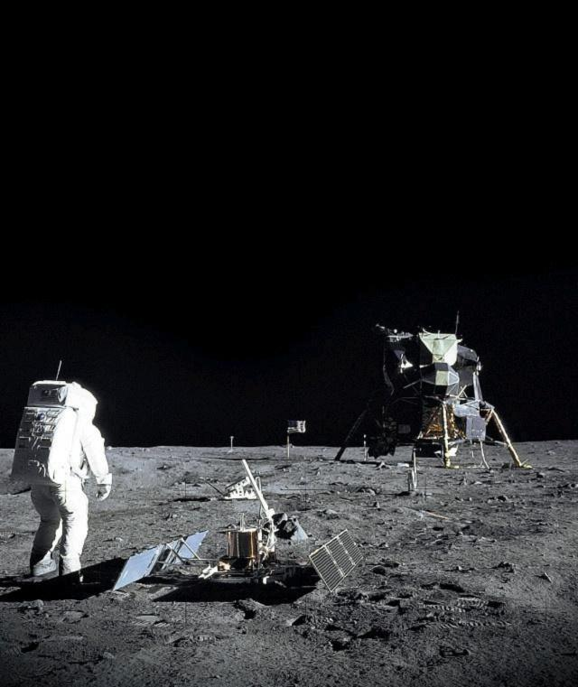
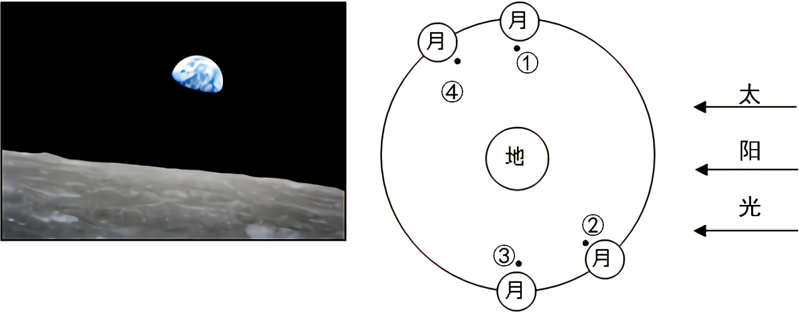
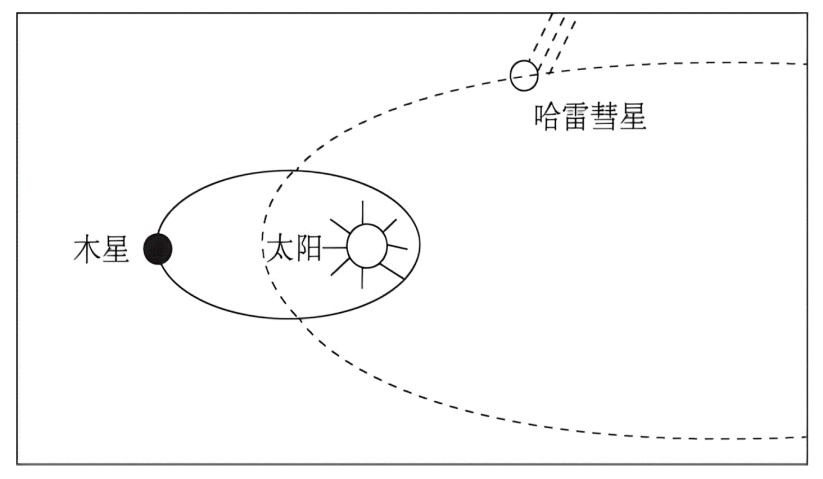

# TP00039

>科目：地理
>
>测试形式：选择题、简答题
>
>测试主题：**地球的宇宙环境**
>
>RAW：48
>
>试题：T0000770-T0000783

读火星、木星、天王星数据比较表（质量和体积以地球数据为1个单位），回答下面1-2小题。

|        | 质量   | 体积    | 公转周期 | 自转周期 |
| ------ | ------ | ------- | -------- | -------- |
| 火星   | 0.11   | 0.15    | 1.88年   | 1.03日   |
| 木星   | 317.83 | 1321.33 | 11.68年  | 0.42日   |
| 天王星 | 14.54  | 63.08   | 84.01年  | 0.72日   |

[T0000770] 地球、火星、木星、天王星四颗行星中密度最大的是（  ）

A．地球	B．火星	C．木星	D．天王星

[T0000771] 火星与地球最相近的是（  ）

A．质量	B．体积	C．自转周期	D．公转周期

2021年5月15日（农历四月初四），我国“天问一号”探测器在火星乌托邦平原南部着陆，在火星上首次留下中国印迹。完成下面3-4小题。

[T0000772] 以下说法正确的是（  ）

A．火星属于巨行星	B．火星自东向西公转

C．火星介于水星和地球之间	D．火星因大气稀薄表面温差大

[T0000773] 当天的月相形状为（  ）

A．满月	B．峨眉月	C．上弦月	D．下弦月

[T0000774] 超级月亮是指“近地点”的满月，北京时间2022年7月14日02：38出现了该年度最大超级月亮。下图为该日的超级月亮。完成此后一周月相变化规律为（  ）

 

A．渐盈上弦月	B．渐盈凸月	C．渐亏凸月	D．渐亏下弦月

[T0000775] 2021年5月15日7时18分，天问一号探测器成功着陆于火星乌托邦平原南部预选着陆区，我国首次火星探测任务着陆火星取得成功。下表“地球和火星部分特征对比表”，在八大行星中，人类首选火星作为探索生命起源和进化的行星，主要是因为火星上的一些地理现象与地球上的一些地理现象很相似，主要表现为（  ）

| 行星 | 质量（地球为1） | 体积（地球为1） | 公转周期 | 自转周期 | 赤道面与轨道面的交角 |
| ---- | --------------- | --------------- | -------- | -------- | -------------------- |
| 地球 | 1.00            | 1.00            | 1年      | 23时56分 | 23°26′               |
| 火星 | 0.11            | 0.15            | 1.9年    | 24时37分 | 23°59′               |

①火星和地球都被厚厚的大气层所包围	②火星和地球自转周期的长度都比较适中

③火星和地球与太阳的距离都比较适中	④火星上和地球上都有四季变化，且四季的长度一样

A．①④	B．②③	C．①③	D．②④

某科幻电影中有这样一个场景：人类为执行月盾拦截计划，在月球上建立基地并执行任务，宇航员需要穿着厚厚的宇航服在月球表面工作，虽是白昼，但背景却是漆黑一片，远处繁星点点。下图为该电影某一场景图。据此完成下面7-8小题。

 

[T0000776] 宇航员背后的点点繁星（  ）

A．多由固体岩石组成	B．体积质量一般较小

C．表面温度一般较低	D．通过核聚变反应发光

[T0000777] 月球白昼时，宇航员所穿宇航服的作用是（  ）

①减少外界热传递	②阻挡有害太阳辐射	③减少强沙尘袭击	④净化过滤呼吸气体

A．①②	B．①③	C．②④	D．③④

[T0000778] 左下图是“神舟十二号”登月飞船从宇宙空间传回的在近月球表面轨道拍摄的“凸地”照片。右下图中，拍摄位置与左图相符合的是（  ）

 

A．①	B．②	C．③	D．④

[T0000779] 2020年10月14日，天宇将上演”金星合月”天象，如果天气晴好，我国公众当日清晨将在东方天空，用肉眼清晰地看到一弯细小的月牙出现在亮如明珠的金星旁边。下列哪幅画正确表达”星月童话“天象（图中白点代表月球，黑点代表金星）（  ）

A．    B． 

C．    D.  

2021年5月15日我国首次火星探测着陆器和巡视器（祝融号火星车）组合体穿过火星大气层（火星大气95%是二氧化碳，还有3%的氮，大气密度约为地球大气的1%），稳稳地降落在火星表面上，预计一周之后，祝融号火星车将会行驶在火星上。据此完成下面11-12小题。

[T0000780] 火星暂时未发现有生命存在，其主要原因可能是（  ）

A．火星无法获得太阳稳定的光照	B．火星附近天体运动杂乱，时常与火星发生碰撞

C．火星自转和公转周期太长，温度日变化和年变化过大	D．大气层稀薄，水汽太少

[T0000781] 与月球探测相比，祝融号在火星面临的最大困难是（  ）

A．温差大	B．风沙强	C．辐射强	D．气压低

[T0000782] 下面左图为太阳系中八颗行星排列顺序示意图,右图为太阳系局部图（乙代表小行星带）。 读图回答下列问题。

 

（1）左图中 A ~ H 八颗行星绕日公转的运行轨道具有     、     、       的特征。

（2）右图中甲行星的名称是       。 丙行星对应左图中的       （填字母代号）。

（3）按照距日远近、质量、体积等特征分,B 行星属于       行星,F 行星属于       行星,H 行星属于     行星。

（4）如果人类想移居外行星,该行星自身需具备什么条件?

[T0000783] 阅读图文材料，完成下列要求。

彗星多由冰物质组成，其中也有碳、氢、氧、磷等组成生命有机体的重要元素。据研究，地质史上有多次彗星撞击地球的事件。当彗星靠近太阳时，冰物质会挥发，在太阳风的作用下，会形成一条云雾状的尾巴。哈雷彗星是太阳系中一颗体积较大的彗星，可以用肉眼直接观察到，其回归周期约为76年。下图为哈雷彗星、木星绕太阳公转示意图。

 

（1）图中体积最大的天体是        ；运行在木星和太阳之间的行星有        ；木星绕日公转方向是        ，其与哈雷彗星绕日公转方向        （一致/不一致）。

（2）哈雷彗星的彗尾会随着距离太阳的远近出现长短的变化，距离太阳越近，彗尾越         （长/短），哈雷彗星的体积随着时间的推移会变        （大/小）。

（3）说出彗星撞击地球对地球生命诞生可能带来的有利影响。

## 测试结果

### 要求：

### 状况：

### 补充：