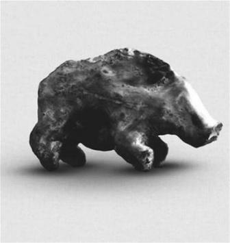
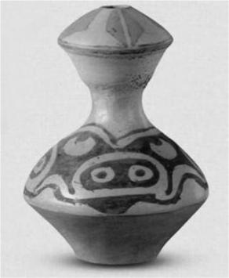
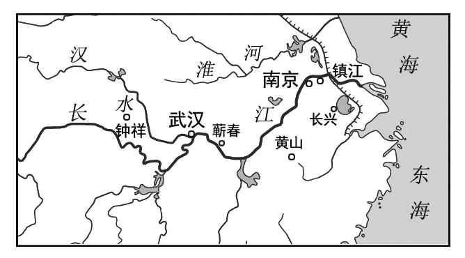
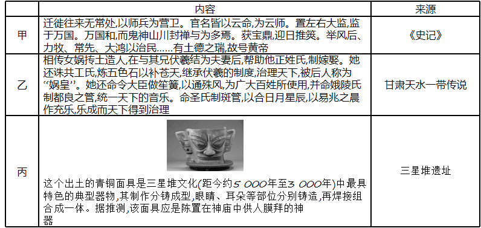

# TP00041

>科目：历史
>
>测试形式：选择题、简答题
>
>测试主题：**中华文明的起源与早期国家**
>
>RAW：60
>
>试题：T0000806-T0000823

[T0000806] 原始人类经历了从居无定所到定居，从采集到种植，从狩猎到饲养家畜

的演进过程，推动上述演进的主要因素是(    )

A.生产工具的改进 B.农业水平的提高

C.人工取火的发明	   D.建筑技术的进步

[T0000807] 下面两幅图分别为河姆渡文化遗址出土的陶猪和仰韶文化遗址出土的猪面纹彩陶壶,学者认为二者都体现了家猪的形象。由此可知,当时	(　　)

 

 

A.南北牧业经济交流密切  B.早期人类的生活具有单一性

C.先民原始审美意识萌生  D.畜牧业成为独立的经济部门

[T0000808] 江苏张家港东山村遗址是崧泽文化时期的遗存，遗址中有东、西两处墓群。东区都是些小墓，西区主要是规模较大、随葬品较多的大中型墓，大墓随葬品包括玉石饰件、石钺、石锛等。此文化遗存表明，当时已出现(    )

A.等级森严的丧葬礼制 	B.贫富分化的社会现象

C.精耕细作的生产模式 D.较为完备的管理机制

[T0000809] [2023福建厦门二模]考古工作者在石峁古城(初建于公元前2300年前后)发现了玉器、祭坛壁画等,并利用数字化技术对残存城墙进行测绘,确认古城以“皇城台”为中心,面积逾400万平方米。由此可见	(　　)

A.新技术可复原古代生活场景 B.夏文明的存在得以证实

C.私有制与阶级分化尚未形成 D.其可能具备国家的初始形态

[T0000810] [2023浙江1月·1]2019年7月,中国“良渚古城遗址”被列入《世界遗产名录》。良渚古城遗址代表了五千多年前中国史前稻作文化的伟大成就,也是早期城市文明的杰出典范,实证了中华五千年文明史,是中华民族的瑰宝,也是全人类共同的文化遗产。下列关于良渚古城遗址的表述,正确的有	(　　)

①属于夏文化的遗存　②已有私有制产生的实证　③出土了精美的玉器　④出现较大规模的祭坛和神庙

A.①②③	  B.①②④  C.①③④ D.②③④

[T0000811] [2023山东聊城一模]中国周边被海洋、草原、荒漠和高山环绕,形成一个与外界相对隔离的地理单元,其中最适宜农业发展、经济最发达的区域位于东半部。同时,北方欧亚大草原、陆上丝绸之路、南部多处山间河谷以及海上航路等诸多通道,使得中国在各个时期都与世界其他文明保持着一定的交流和联系。这可以用来说明中华文明	(　　)

A.兼收并蓄的特点与独特地理环境有关 

B.多元发展又密切交流互动的典型特征

C.最本质的特征是农业文明           

D.“重瓣花朵”式的向心格局

[T0000812] [2023辽宁葫芦岛一模]考古学家在辽宁西部牛河梁遗址中发现了女神庙遗迹,其周围分布着众多积石冢组成的墓群,积石冢间有一座石砌的三层祭坛。女神庙、祭坛、积石冢都是一种特权象征,这说明当时该地区	(　　)

A.原始先民的手工艺水平高超 B.代表新石器时代生产力水平

C.成为中华古代文明的发源地 D.产生了等级分化和神权观念

[T0000813] [2023河北邢台月考]在中国远古传说中，燧人氏发明钻木取火之法并教民熟食，伏羲氏教民田猎和捕鱼，神农氏教民使用农具，进行农业耕作活动。他们所处的时代可理解为自远古至农业产生的不同发展阶段。由此可知(    )

A.中华文明呈现多元一体特征	B.传说承载了一定的历史信息

C.农业是早期国家形成的基础	D.传说是研究远古的主要史料

[T0000814] [2023重庆巴蜀中学考试]据称,禹汇集诸侯(部落领袖)时,因防风氏迟到,即将其处死;《左传》里曾引春秋时晋人云“夏有乱政,而作《禹刑》”;《孟子》中也记载“夏后(君主)氏五十而贡”。上述历史记载可用于说明	(        )

A.夏朝的真实存在 B.早期国家的发展

C.分封制度的确立 D.君主专制的完善

[T0000815] 在二里头遗址中，主干道路划分出规整的功能区，其中祭祀区、宫殿区和官营作坊区这三个最重要的区域位于“九宫格”的中路，宫殿区位居中心，重要功能区拱卫在宫殿区的周围，这样的规划符合《吕氏春秋》所载“古之王者，择天下之中而立国，择国之中而立宫，择宫之中而立庙”的规划特点。由此可推断这样的布局(    )

A.体现了王权和神权的紧密结合 B.主要目的在于增强文化凝聚力

C.凸显了执政集团的高度集权	   D.反映出严格有序的社会分层

[T0000816] 夏朝建立了一套贯彻和维护王权的强制机关，使之成为取代联盟管理机关的专政机构。同时，在地方上分封夏后氏同姓和异姓方国诸侯，使他们与夏建立君臣名分的政治纽带，成为夏后氏家族的统治机器在全国各地的延伸。这说明(    )

A.父子相传已成为王位继承的定制	B.“家天下”的局面已出现

C.专制主义中央集权制度已经确立	D.奴隶制已经比较成熟

[T0000817] [2023天津和平区一模]商汤灭夏之后,称颂禹“久劳于外,其有功乎民”,并且继续祭祀夏朝确立的土神。周武王灭商之后,封武庚(纣王的儿子)于殷墟,以主殷商的祭祀。商汤和周武王这样做旨在	(　　)

A.减少政局动荡	B.承袭前代制度

C.构建政治认同	D.形成官僚政治

[T0000818] [2021全国乙·24]西周分封制下,周天子与诸侯国君将包括土地及人口的采邑赐给卿、大夫作为世禄。 西周中期以后,贵族所获采邑越来越多,到春秋时期,有的诸侯国一个大夫的采邑就多达数十个。这说明	(　　)

A.土地国有制度废除	B.分封体制不断强化

C.诸侯国君权力巩固	D.社会生产持续发展

[T0000819] [2022浙江1月·1]论及周王朝的统治模式,有学者指出,周王是家族中嫡长子一脉的首领,代表整个家族祭祀上天;诸侯国君主的排序反映了他们与周王嫡长子一脉的亲疏关系。下列项中,对这一“统治模式”解读正确的是	(　　)

①神权与王权结合

②中央对地方实行垂直管理

③以血缘关系为纽带形成国家政治结构

④标志着中国开始迈入早期国家起源的历史阶段

A.①②	B.①③

C.②④	D.③④

[T0000820] 近年来，南方许多地方出土了商周的青铜器，如下图。这意味着商周(    )

 

A.文化影响力已到达长江流域	   B.着重对江南地区进行开发

C.在南方建立了严密政治统治 D.注重对南方进行文化渗透

[T0000821] [2021湖北·1]“爵”通常被认为是饮酒器(下图),也是饮酒礼上尊卑关系的象征,进而被用来代表品位序列。大约从西周到春秋,“五等爵”制渐趋成熟。这反映了	(　　)

                                                                                      
A.冶炼技术的提高  B.铸造工艺的完善

C.等级制度的发展  D.宗法体系的崩溃

[T0000822] [2023山西临汾适应性考试]西周为避免“殷道衰，诸侯或不至”“殷复兴，诸侯归之”的局面再次出现，进行了“天下归周”“天下归宗”“天下归心”的制度设计。这样的制度设计(    )

A.为加强诸侯势力而设置	   B.蕴含着大一统思想

C.实现了权力的高度集中 	D.拓展了西周的疆域

[T0000823] （16分）阅读材料,回答问题。

材料　下表为某学习小组搜集的资料。

 

根据材料并结合所学知识,确定该学习小组的研究主题,并围绕研究主题对三则史料进行辨析。

## 测试结果

### 要求：

### 状况：

### 补充：