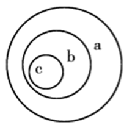
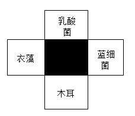
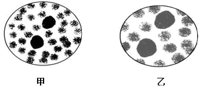
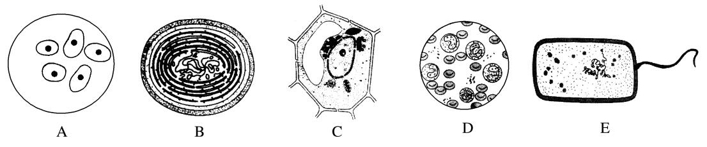
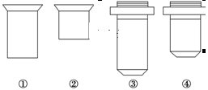
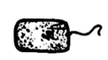
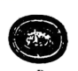

# TP00042

>科目：生物
>
>测试形式：选择题、简答题
>
>测试主题：**走近细胞**
>
>RAW：61
>
>试题：T0000824-T0000840

[T0000824] 细胞学说建立的过程是一个在科学探究中开拓、继承、修正和发展的过程，充满了耐人寻味的曲折。下列叙述错误的是

A．德国科学家魏尔肖对细胞学说的补充是“所有细胞来源于先前存在的细胞”

B．细胞学说的重要内容之一是动物和植物都是由细胞发育而来的

C．细胞学说认为细胞分为真核细胞和原核细胞

D．细胞学说揭示了动物和植物的统一性，从而阐明了生物界的统一性

[T0000825] 被恩格斯列人19世纪自然科学三大发现之一的细胞学说，作为生物学大厦的基石，赋予生物学不同于其他自然科学的独特韵味。下列相关细胞学说的叙述错误的是（  ）

A．细胞学说打破了植物学和动物学之间的壁垒

B．细胞学说为后来生物进化论的确立埋下了伏笔

C．细胞学说认为病毒是一种非常特殊的生物

D．细胞学说使生物学的研究进入细胞水平，并为后来进入分子水平打下基础

[T0000826] 下列不能说明生命活动离不开细胞的是

A．草履虫的运动和繁殖离不开细胞的运动和分裂

B．膝跳反射的完成离不开多种细胞的协调配合

C．一切生物都是由细胞构成的

D．人的生殖和发育离不开细胞的分裂和分化

[T0000827] 党的二十大明确提出发展海洋经济，保护海洋，加快建设海洋强国。习总书记强调“建设海洋强国是实现中华民族伟大复兴的重大战略任务”。下列叙述错误的是（  ）

A．海洋中一切动植物都由细胞和细胞产物所构成

B．引起赤潮的蓝细菌、甲藻和硅藻都是以DNA为遗传物质

C．禁止未经处理的污水排放到海洋可以降低赤潮出现的风险

D．海洋生态系统中存在非生命物质和成分，不属于生命系统

[T0000828] 从生命系统的结构层次来分析，池塘中的一只青蛙、池塘中的所有生物、池塘中的所有水绵和池塘各自对应的层次是

A．个体、种群、群落、生态系统	B．个体、群落、种群、生态系统

C．细胞、种群、群落、生态系统	D．细胞、群落、种群、生态系统

[T0000829] “竹外桃花三两枝，春江水暖鸭先知”这一千古名句生动形象地勾画出早春的秀丽景色。下列与其相关的生命系统的叙述，正确的是（  ）

A．桃花属于生命系统的器官层次

B．一片江水中的所有鱼构成一个种群

C．江水等非生物不参与生命系统的组成

D．一棵桃树的生命系统的结构层次由小到大依次为细胞、组织、器官、系统、个体

[T0000830] 若以图代表与生命系统相关概念的范围，其中正确的是（  ）

 

| 供选项 | a          | b    | c    |
| ------ | ---------- | ---- | ---- |
| A      | 生物大分子 | 细胞 | 组织 |
| B      | 个体       | 种群 | 群落 |
| C      | 生态系统   | 群落 | 种群 |
| D      | 组织       | 系统 | 器官 |

A．A	B．B	C．C	D．D

[T0000831] 流感病毒是引起流行性感冒的元凶，2018年1月，我国南方及北方大部分城市爆发了一次大面积的流行性感冒。下面有关流感病毒的说法，正确的是（  ）

A．流感病毒结构简单，仅含有核糖体一种细胞器

B．用细菌培养基可培养甲型H1N1病毒

C．流感病毒不可以在人体细胞外独立存活

D．病毒属于生命系统的最小结构层次

[T0000832] 沙眼衣原体是一类导致人患沙眼的病原体，通过电子显微镜观察其细胞结构，可以确定沙眼衣原体是原核生物。作为判断的主要依据是                                            （            ）

A.有细胞壁                            B.有细胞膜

C.没有线粒体                          D.没有以核膜包被的细胞核

[T0000833] 如图所示的四个方框代表细菌、衣藻、木耳和蓝藻，其中阴影部分表示它们都具有的某种物质或结构。下列各项不可能出现在阴影部分中的是（  ）

 

A．DNA	B．染色体	C．RNA	D．核糖体

[T0000834] 下面对①②③④四个框图内所包括生物的相关叙述，正确的是

 

A．框图①内的生物都是原核生物

B．框图②内的生物都属于异养生物

C．框图③内的生物都具有细胞结构，都是自养生物

D．框图④内的生物既属于细胞层次，又属于个体层次

[T0000835] 关于①猴痘病毒、②乳酸菌、③蓝细菌、④衣藻、⑤黑藻5种生物的共同特征，下列说法正确的是（  ）

A．①②③均是原核生物，且均能发生基因突变

B．②③④均是厌氧生物，且含DNA和RNA两种遗传物质

C．③④⑤均是自养型生物，且均只含核糖体一种细胞器

D．②③④⑤均有细胞结构，且都有细胞壁

[T0000836] 下列关于测量蚕豆叶下表皮保卫细胞长度的实验操作，错误的是（  ）

A．从低倍镜转到高倍镜时，两眼必须从显微镜侧面注视

B．从低倍镜转到高倍镜时，轻轻地转动物镜使高倍镜到位

C．在低倍镜视野中，需将进一步放大观察的物像移至视野中央

D．转换到高倍镜后，一般需用凹面镜、大光圈来调节亮度

[T0000837] 不同的放大倍数下，所呈现的视野分别为甲和乙（如图所示），下列相关叙述正确的是（  ）

 

A．若玻片右移，则甲的物像会右移而乙的物像左移

B．在甲中所观察到的细胞，在乙中均可被观察到

C．若使用相同的光圈，则甲比乙亮

D．若甲物像模糊，则改换成乙就可以看到清晰的物像

[T0000838] 观察细胞结构时，下列说法正确的是(　　)

A．低倍镜下物像清晰，换高倍镜后视野变暗，应首先调节细准焦螺旋

B．用光学显微镜观察神经细胞，可直接使用高倍显微镜

C．视野中有异物，转动目镜发现异物不动，移动装片也不动，则异物在物镜上

D．制作口腔上皮细胞装片时为防止产生气泡，首先在载玻片上滴加1～2滴清水，然后再盖上盖玻片

[T0000839] 如图是显微镜下观察到的几种细胞或组织图像（D中细胞取自猪的血液），请据图回答：

 

(1) 材料中各种生物形态差别很大，从结构来看，它们与病毒的最大区别是（        ）病毒它们的结构简单，由（        ）和（        ）组成，病毒只能生活在活的生物体细胞内，这种生活方式称为（        ）不能用普通培养基成功培育出病毒的理由是（        ）

(2) 材料所提及的生物中，科学家依据（        ）将细胞分为原核细胞和真核细胞，其中属于原核生物的是（        ）它在结构上最大的特点是（        ）与真核细胞的统一性表现在都具有（        ）

(3) 地球上最基本的生命系统是（        ）图中能表示生命系统个体层次的是（        ）（填标号）。

(4) 过量繁殖会引起“水华“的是（        ）该细胞中含有（        ）因此利用光能合成有机物， 故其代谢类型是（        ）型。

(5) 某同学用显微镜观察酵母菌时，已知一组镜头如下图，目镜标有5×和10×，物镜标有10×和40×。

 

视野中图像最暗的组合是（        ）(填序号)，视野中能观察到的细胞数目最多的组合是（        ）(填序号)。

[T0000840] 生物学实验中常用到普通光学显微镜，请回答下面相关问题：

（1）用10×的目镜和10×的物镜组合观察某细小物体，物像的面积为M，换用40x的物镜观察（目镜不变），物像的面积变为（        ）（填字母）。

A．M      B．4M    C．40M    D．16M

（2）在目镜为10×、物镜为8×的视野中，刚好能看到穿过视野中心的一行连续排列的10个完整细胞。若目镜不变，物镜换成40×，则在视野中看到的细胞直径与原来相比被放大（        ）倍，看到的细胞数目与原来相比少（        ）个。

（3）将低倍镜换成高倍镜时，要转动（        ）换成高倍镜后，若视野中物像模糊不清，应调节（        ）至物像清晰。

（4）若显微镜的视野中一片黑暗，调节光圈和反光镜都不起作用，则原因可能是（        ）

（5）如图所示是显微镜下观察到的不同生物体或细胞的图像（D为哺乳动物的平滑肌细胞），请据图回答问题：

A.  

B． 

C．

D． 

①科学家依据（        ）将细胞分为原核细胞和真核细胞，图中属于原核细胞的是（        ）（填字母）。

②图中能进行光合作用的是（        ）（填字母）。

③基本的生命系统是（        ）图中能表示生命系统个体层次的是（        ）（填字母）。

④从生命系统的结构层次来看，一个湖泊中所有的念珠蓝细菌构成（        ），湖泊中各种生物构成（        ）整个湖泊构成（        ）

## 测试结果

### 要求：

### 状况：

### 补充：

