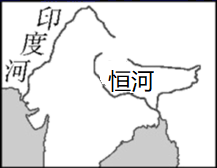
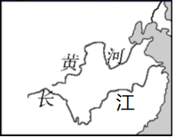
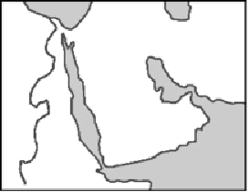
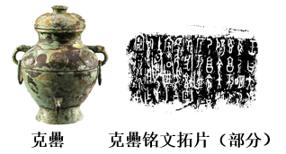

# TP00043

>科目：历史
>
>测试形式：选择题、简答题
>
>测试主题：**中华文明的起源与早期国家**
>
>RAW：62
>
>试题：T0000841-T0000863

[T0000841] 西周分封的一个重要原则是“受（授）民受（授）疆土”，使得诸侯之臣也成了周王之臣。这表明，分封制的推行（  ）

A．瓦解了诸侯国的宗法秩序	B．拓展了西周的统治疆域

C．强化了对各级贵族的监察	D．扩大了周天子统治权威

[T0000842] 西周时期，一些贵族大臣可以对周王“谏议”，平民也可以对朝政发表意见或评论，平民的意向影响周王的决策。这反映出当时

A．贵族等级制度开始瓦解	B．原始民主传统尚存

C．新兴地主阶级力量增强	D．周王失去共主地位

[T0000843] 分封制又叫“分土封侯制”，是古代中国帝王分封诸侯的制度。由此推断

A．分封制产生于东周

B．古代历朝都实行分封制

C．分封的核心是土地

D．封侯有义务保护周天子

[T0000844] 在中国古代历史上，“齐人”、“鲁人”、“楚人”、“燕人”等名称的出现，主要是因为

A．内外朝制	B．封邦建国制度	C．郡县制	D．行省制

[T0000845] 山西襄汾陶寺墓葬，属中原龙山文化。各墓随葬品差异巨大，占89%的小墓几乎没有随葬品，而8座大墓中发现了随葬品200多件。这一现象反映了当时该地区

A．部落中出现权贵阶层	B．已迈入母系氏族社会

C．通过战争来争夺财富	D．具备国家的成熟形态

[T0000846] 学者黄中业指出，分封一词源于《左传》，“指的是周初‘封建亲戚，以藩屏周’”，“分封一词中的‘分’字，是说受封的诸侯国是由西周中央王朝分出去的……封建一词中的‘建’字，是说由周王室派出的受封者建立国家”。这说明他

A．否认诸侯国对周王室的隶属关系

B．认可诸侯国具有相对独立性

C．肯定诸侯国是周王室的地方政权

D．主张建立若干独立的诸侯国家

[T0000847] 古代儒家思想认为统治者从规范外部行为和调控内心情绪出发，通过礼的规范，政的划一，刑的强制，再配以乐的感染，便能统一民心，成就王道。据此可知礼乐制

A．明确等级森严的尊卑秩序	B．直接为统治者而服务	C．通过道德教化以巩固统治	D．具有法律条文的效力

[T0000848] 山东素称“孔孟之乡，礼仪之邦”，也被称作齐鲁大地，其中“齐鲁”之称源于西周实行的

A．分封制	B．宗法制	C．郡县制	D．王位世袭制

[T0000849] 处在大河流域的文明古国都有着自己灿烂的文明。下面的大河流域简图与之相对应的文明是

 

 

 

 

A．楔形文字	B．甲骨文	C．汉谟拉比法典	D．种姓制度

[T0000850] 如图是1986年在北京房山琉璃河燕国遗址中出土的青铜器克罍，其上刻有铭文，据学者研究，大意为：周王满意于太保的供奉，封他的儿子克做燕地的君侯。该考古成果可用于研究（  ）

 

A．禅让制	B．分封制	C．礼乐制	D．井田制

[T0000851] 自2008年1月1日起，清明、端午、中秋节纳入国家法定节假日。追根溯源，这种珍惜亲情、渴望相聚情结的形成与下列哪一制度关系最密切

A．分封制

B．宗法制

C．郡县制

D．世袭制

[T0000852] 宗法制度是依据血缘关系确立的土地．财产．政治地位的分配和继承制度。宗法制度的表现形式不包括（ ）

A．家谱	B．宗祠	C．族规	D．授土

[T0000853] 史学家钱穆认为：“均田是郡县制度下的井田，而井田则是封建制度下的均田。”下面对这句话解读正确的是

A．均田就是井田，井田就是均田

B．井田比均田更能体现中央集权

C．均田比井田更能体现中央集权

D．两者都体现了国家对农民的重视

[T0000854] 古代典籍中，关于“宗”的解释是“尊祖庙也”，也就是说宗法的“宗”的本意是宗庙。这说明维系宗法制的纽带是

A．地域	B．信仰	C．财产	D．血缘

[T0000855] 在良渚遗址考古中，发现了都邑、宫殿、祭坛、大型水利系统等遗址及随葬品不等的墓地；出土大量的玉器、陶器、石器、漆器、竹木器等文物。这揭示了良渚文化（　　）

A．已经有了文字可考的信史	B．制定了完整的礼乐制度

C．开始了中华五千年文明史	D．具备了古国的初始形态

[T0000856] 作为长江上游文明中心的三星堆遗址（距今约3200年），最近考古发掘又取得了重大进展。此次出土了大量青铜器，有异于中原的青铜面具、人像，青铜神树（象征连接着神界、人界和冥界）；也有和中原类似的青铜礼器和大型仪仗用具等，一些专家学者认为巴蜀文明受到长江中游、鄂西川东地区文明以及中原文化的影响。以下选项对材料解读不正确的是

A．三星堆遗址历史久远，只有通过考古发现才能了解古蜀文明

B．发掘出来的文物可作为中华文明多元一体发展模式的实证

C．异于中原的青铜器有可能与当时的宗教信仰和崇拜有关

D．中原地区夏商王朝创造的礼制对周围方国文明影响深远

[T0000857] 商朝的神，始终不脱宗族神、部落神的性格，而西周却出现了一个超越部族性质的至高天神权威，甚至周王室自己的王权也必须在道德性的天命之前俯首。促成这一变化的原因是

A．天命观树立了君主权威	B．分封制扩大了统治疆域

C．宗法制维系了等级秩序	D．礼乐制加强了中央权力

[T0000858] 甲骨文卜辞中记载“神不歆非类，民不祀非族”；而《诗经·大雅·文王》记载“商之子孙……，其丽不亿……，无念尔祖，修聿阙德……”，即商朝的遗民亦可参与周朝的祭祖。祭祀的这种变化可以说明（  ）

A．神权王权进一步的结合	B．华夏共同体的逐渐形成

C．分封制强化了地方控制	D．商周政治制度前后相承

[T0000859] 宗法制度从周公创立之始，便随着分封制的发展，成为调整贵族内部关系的根本大法。下列关于宗法制的表述正确的是

A．用于解决贵族之间在权力、财产和土地继承上的矛盾

B．是把血缘纽带同政治关系割裂起来的一种制度

C．削弱了以大宗为代表的贵族特权地位

D．不利于维系统治阶级内部的秩序

[T0000860] 西周建立后，周王对王族、功臣和先代帝王的后代授土授民。这一做法

A．消除了地方对中央的威胁	B．强化了王室集权统治

C．解决了权力分配中的矛盾	D．加强了对地方的管理

[T0000861] 阅读下列材料，回答问题。

材料一：为稳定周初的政治形势，巩固疆土，周王根据血缘关系远近和功劳大小，将宗亲和功臣分封到各地，授予他们管理土地和人民的权力，建立诸侯国。通过逐级分封编织起由中央向四方扩散的控制网络，西周的影响不断扩大，密切了同周边各个少数民族的关系，推动了边远地区的经济开发和文化发展。

材料二：一个人起什么名字，往往打上了时代的烙印。春秋时期，许多人常常以“牛”“耕”作为名、字。例如，孔子弟子司马耕，字子牛；晋国大力士姓牛，字子耕。

材料三：凡是经过改革的国家，就其国内情况而论，建立了统一的中央集权的政权；但是就全中国来说，却出现了七个割据称雄的国家。为了夺取更多的土地、人口和租税，……七个强国之间的兼并战争进行得更剧烈了，战争的规模也越来越大了。

——杨宽《中国断代史系列·战国史》

（1）根据材料一并结合所学知识，指出周王实行这种制度的目的和作用是什么？

（2）材料二反映出当时的什么社会现象？

（3）根据材料三并结合所学知识，指出战国时期各诸侯国发动战争的目的是什么？如何评价战国时期的这些战争？

[T0000862] 阅读下列材料：

材料1：王者之制禄爵：公、侯、伯、子、男凡五等……天子之田方千里，公侯之田方百里，伯七十里，子男五十里。

——《礼记·王制篇》

材料2：天子适诸侯曰巡狩，诸侯朝与天子曰述职。不朝，则贬其爵；再不朝，则削其地；三不朝，则六师移之。

——《孟子·告子》

材料3：周王正妻所生之子称嫡子，其他妻室所生之子为庶子。周王的嫡长子、嫡长孙一系有继承王位的权利，称其为大宗。次子、庶子的后裔相对于大宗称为小宗。而次子、庶子的嫡长子、嫡长孙于本支又是大宗，其次子、庶子之后裔又是小宗。以此类推，形成一个庞大的宗族网。小宗必须服从大宗。

材料4：对于异姓有功的贵族，则通过联姻，成为甥舅，分封为诸侯，纳入宗法体系。……“亲亲”“尊尊”在这里获得完备的、严格的体现，成了宗法制的精神支柱，从而成为周礼的根本原则。

请回答：

(1)材料1、2反映了西周时期的哪种制度？依据这两段材料，指出为什么“周王先贬其爵”后“削其地”？

(2)材料3反映了西周时期的哪种制度？由材料看出，该制度的最大特点是什么？

(3)以上材料所反映的两种制度之间的关系如何？各有何积极作用？

[T0000863] 阅读材料，完成下列要求。

材料一 家谱是一种以表谱形式，记载一个以血缘关系为主体的家族世代繁衍和重要人物事迹的特殊图书体裁，是中国特有的文化遗产。流传至今的家谱至少仍有三万多种，其内容之丰，价值之高，很值得我们今天去了解与认识。“隐恶扬善”是修纂家谱的一条基本原则。

材料二 在现代的侨乡家谱中，都普遍记录了不同时代出洋人的姓名……出洋时间与原因……同故乡故国的联系与贡献等内容。有些还辟有专章、专传介绍，这就为他们的后裔寻根问祖提供了可靠的根据，也就更增加了他们对故国故乡的依恋之情。有人对福建省的家谱资料进行研究，了解到福建移居台湾的最早记载是两宋之交的苏姓。……从有关家谱中我们可以了解到移民的人数、成分、原因，他们的婚姻状况布特点及与大陆的关系等。

(1)材料中的家谱体现了我国古代什么政治制度？这一政治制度的最大特点是什么？这一制度有何影响？

(2)依据材料二，并结合现实，分析家谱在当今的作用。

## 测试结果

### 要求：

### 状况：

### 补充：